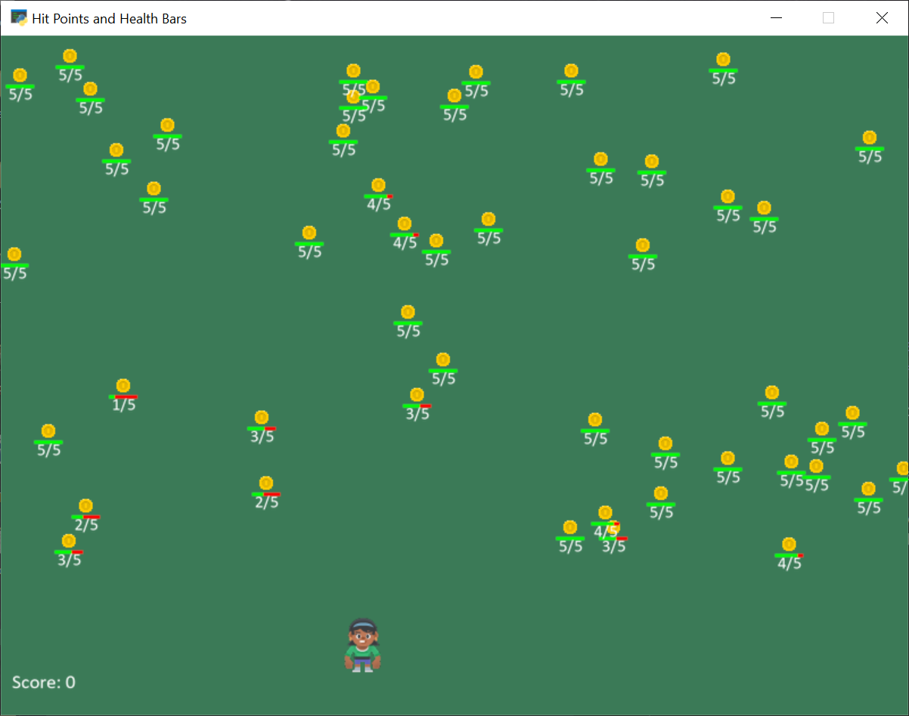

:orphan:

.. _sprite_health:

Hit Points and Health Bars
==========================

This example demonstrates how a enemy can shoot a bullet towards a player. Then if the bullet hits, the player's health
would visually decrease via an indicator bar displayed above the player.

.. literalinclude:: ../../arcade/examples/sprite_health.py
    :caption: sprite_health.py
    :linenos:
