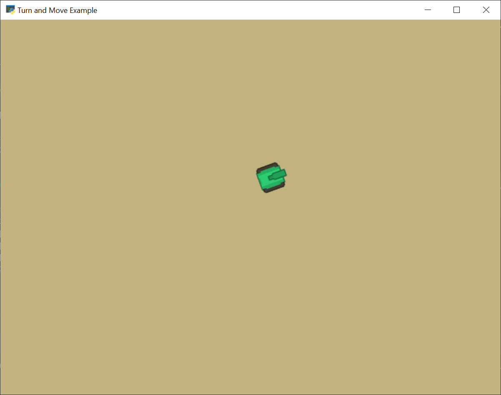

:orphan:

.. _turn_and_move:

Turn and Move
=============

In this example, the tank turns and moves towards where ever the user clicks
the mouse.

.. literalinclude:: ../../arcade/examples/turn_and_move.py
    :caption: turn_and_move.py
    :linenos:
