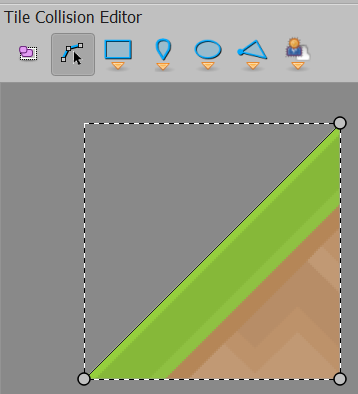
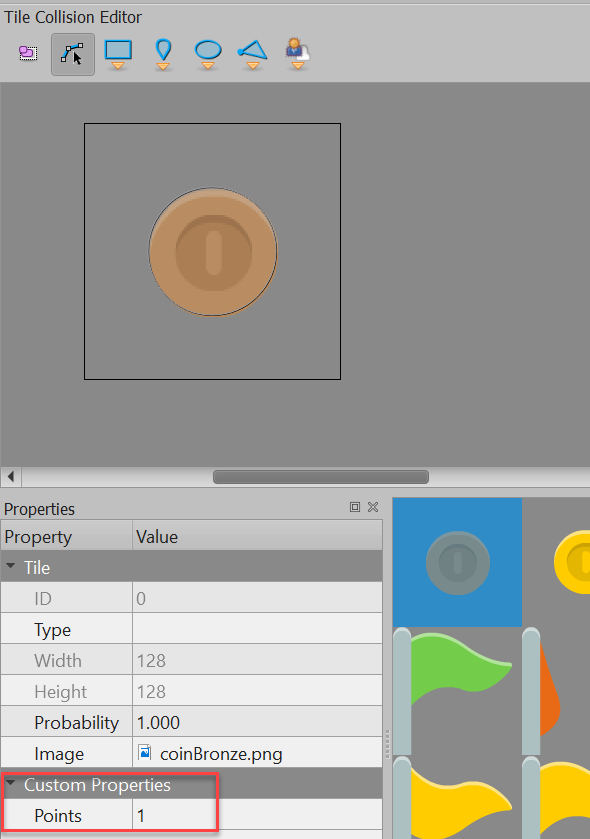
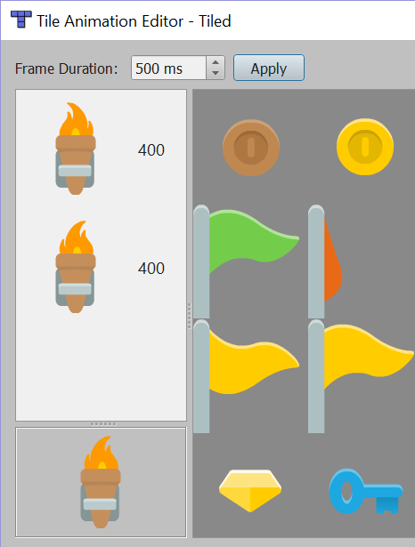
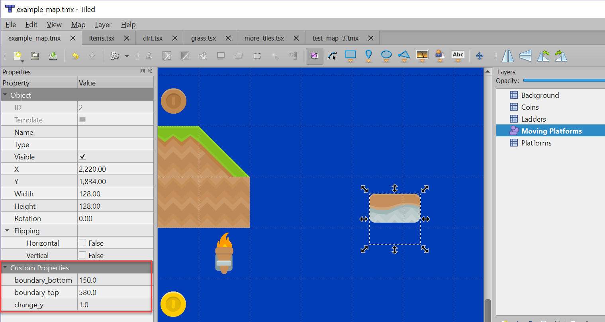

:orphan:

.. _updated_platformer_example:

Updated Platformer Tutorial
===========================

.. raw:: html

    <iframe width="560" height="315" src="https://www.youtube.com/embed/0CiZ4xVPP6g" frameborder="0" allow="accelerometer; autoplay; encrypted-media; gyroscope; picture-in-picture" allowfullscreen></iframe>

Hi, I'm looking to get your feedback on the API and the
feature-set for these new library features
for creating platformer games using Python.

Link for feedback: https://github.com/pvcraven/arcade/issues/362

If you haven't heard of it, the `Arcade <http://arcade.academy>`_ library is an
easy-to-use library cross-platform library for creating 2D games that uses
OpenGL 3.3+ support for sprite drawing.

Recently, Arcade added support for reading in the "TMX" maps created by the
`Tiled Map Editor`_.
BUT, the support was incomplete. We are redoing the API, and I'd like to get
it right this time. (Or at least pretty good.)

.. _Tiled Map Editor: https://www.mapeditor.org/

Upcoming Arcade Features
------------------------

Define hitboxes in `Tiled Map Editor`_ using polygons, ellipses, and rectangles.
In this example, polygons make the ramps. Rectangles are used for platforms
that don't take a full square, and ellipses are used for the coins.
Points, and rectangles/ellipses with no sizes are not supported. I'm not sure
why Tiled allows ellipses and rectangles with no size, but it does. Also,
only one hitbox can be defined per sprite.

You can use the Tiled Map Editor to specify properties for a tile or object. In
this case, we have bronze coins at one point, silver with five, gold worth ten,
and flags worth twenty-five.

Animated tiles are supported. You can specify multiple images, and times to rotate
through.

Moving tiles/platforms can be defined using an object layer. (Exact positioning of
the tile is important, because if it is placed at a non-integer location,
the drawing of the tile will have artifacts.)

The upcoming `Pytiled Parser <https://github.com/Beefy-Swain/pytiled_parser>`_
library will be used to parse the TMX files. It
is separate from Arcade so that it can be used in other libraries, such as Pyglet,
Pygame, etc.

To do List
----------

Currently, sprite sheets must be collections of individual images, rather than
actual sprite sheets. Sprite-sheet support needs to be added.

The Pytiled Parser library needs a release to PyPi so we can pip install.

The source is currently in the Arcade branch ``tmx_update_try_2``, and uses
`Pytiled Parser <https://github.com/Beefy-Swain/pytiled_parser>`_,
plus code in a pending pull request. All this needs to be sorted
out and mainstreamed it.

Non-platformer Work Being Done
------------------------------

* C-language implementation for low-level sprite operations: A lot of work
  has been done to make some sprite operations through C, rather than Python.
  This should speed things considerably, but it is not an easy thing to do.
* Sound support, particularly cross-platform management of ffmpeg libraries, needs
  work.
* I'd like to see some shaders that support lights and other cool effects.

What Does The Code Look Like?
-----------------------------

The current source for the tmx code is available here:
https://github.com/pvcraven/arcade/blob/tmx_update_try_2/arcade/tilemap.py

Here's the code that runs the example and demos some of the features:

.. literalinclude:: ../../arcade/examples/platform_tutorial/updated_platformer_example.py
    :caption: updated_platformer_example.py
    :linenos:
