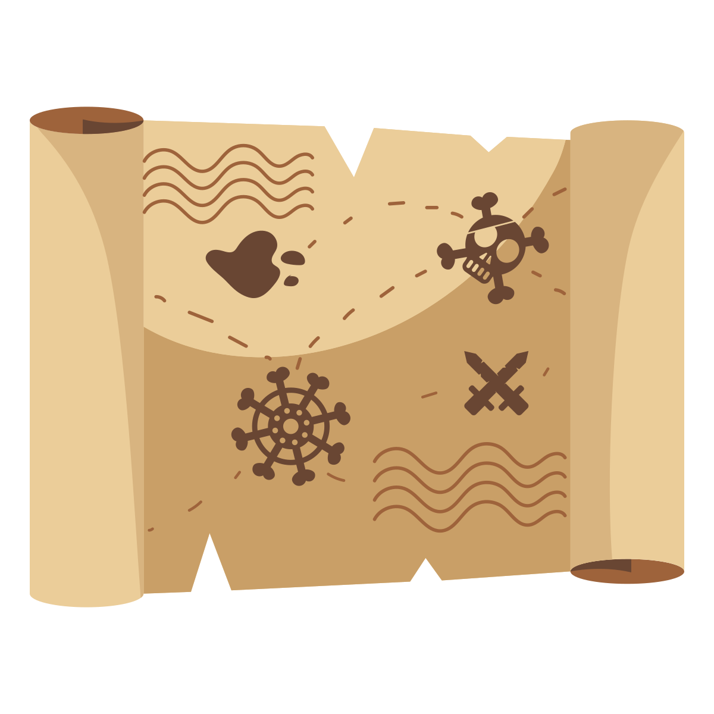

.. _get-started-here:

Get Started Here
================

Installation
------------
Arcade can be installed like any other Python
Package. Arcade needs support for OpenGL 3.3+. It does not run on Raspberry
Pi or Wayland. If on Linux, sound support needs at least GLIB 2.29+.
For detailed instructions see :ref:`installation-instructions`.

Starting Tutorials
------------------

If you are already familiar with basic Python programming, follow the
:ref:`platformer_tutorial` or
`Real Python article <https://realpython.com/arcade-python-game-framework/>`_.
If you are just learning how to program, see
the `Learn Arcade book <https://learn.arcade.academy>`_.

Arcade Skill Tree
-----------------

* Drawing -
  `How to Draw with Your Computer <https://learn.arcade.academy/chapters/05_drawing/drawing.html>`_,
  :ref:`drawing_primitives`

  * ShapeElementLists - Basic drawing commands are slow. Batch together thousands
    of drawing commands into one using a
    `ShapeElementList <arcade.html#arcade.ShapeElementList>`_. See examples in
    :ref:`shape-element-lists`.

* Sprites - Almost everything in Arcade is done with sprites.

  * `Basic Sprites and Collisions <https://learn.arcade.academy/chapters/18_sprites_and_collisions/sprites.html#basic-sprites-and-collisions>`_
  * `Individually place sprites <https://learn.arcade.academy/chapters/22_sprites_and_walls/sprites_and_walls.html#individually-placing-walls>`_
  * `Place sprites with a loop <https://learn.arcade.academy/chapters/22_sprites_and_walls/sprites_and_walls.html#placing-walls-with-a-loop>`_
  * `Place sprites with a list <https://learn.arcade.academy/chapters/22_sprites_and_walls/sprites_and_walls.html#placing-walls-with-a-list>`_

* Moving player sprites

  * Mouse - :ref:`sprite_collect_coins`
  * Keyboard - :ref:`sprite_move_keyboard`

    * Keyboard, slightly more complex but handles multiple keypresses better:
      :ref:`sprite_move_keyboard_better`
    * Keyboard with acceleration, deacceleration: :ref:`sprite_move_keyboard_accel`
    * Keyboard, rotate and move forward/back like a space ship: :ref:`sprite_move_angle`
  * Game Controller - :ref:`sprite_move_joystick`

    * Game controller buttons

* Sprite collision detection

  * Spatial hashing
  * Sprite drag-and-drop

* Drawing sprites in layers
* Sprite animation

  * Change texture on sprite when hit - :ref:`sprite_change_coins`

* Moving non-player sprites

  * Bouncing - :ref:`sprite_bouncing_coins`
  * Moving towards player - :ref:`sprite_follow_simple`
  * Moving towards player, but with a delay - :ref:`sprite_follow_simple_2`
  * Space-invaders style - :ref:`slime_invaders`
  * Can a sprite see the player?
  * A-star pathfinding - :ref:`astar_pathfinding`

* Sprite Hit boxes

  * Changing
  * Drawing

* Shooting

  * Player shoots straight up - :ref:`sprite_bullets`
  * Enemy shoots every *x* frames - :ref:`sprite_bullets_periodic`
  * Enemy randomly shoots *x* frames - :ref:`sprite_bullets_random`
  * Player aims - :ref:`sprite_bullets_aimed`
  * Enemy aims - :ref:`sprite_bullets_enemy_aims`
  * Multi-hit

* Physics Engines

  * SimplePhysicsEngine - Platformer tutorial :ref:`platformer_part_three`,
    Learn Arcade Book `Simple Physics Engine <https://learn.arcade.academy/chapters/22_sprites_and_walls/sprites_and_walls.html#physics-engine>`_,
    Example :ref:`sprite_move_walls`
  * PlatformerPhysicsEngine
  * Using the physics engine on multiple sprites
  * Pymunk top-down
  * Pymunk platformer
  * Pymunk shooting

* View management

  * Minimal example of using views - :ref:`view_screens_minimal`
  * Using views to add a pause screen - :ref:`view_pause_screen`
  * Using views to add an instruction and game over screen - :ref:`view_instructions_and_game_over`

* Window management

  * Scrolling - :ref:`sprite_move_scrolling`
  * Add full screen support - :ref:`full_screen_example`
  * Allow user to resize the window - :ref:`resizable_window`

* Map Creation

  * Programmatic creation

    * `Individually place sprites <https://learn.arcade.academy/chapters/22_sprites_and_walls/sprites_and_walls.html#individually-placing-walls>`_
    * `Place sprites with a loop <https://learn.arcade.academy/chapters/22_sprites_and_walls/sprites_and_walls.html#placing-walls-with-a-loop>`_
    * `Place sprites with a list <https://learn.arcade.academy/chapters/22_sprites_and_walls/sprites_and_walls.html#placing-walls-with-a-list>`_

  * Procedural Generation
  * TMX map creation

    * Layers
    * Levels
    * Object Layer
    * Hit-boxes
    * Animated Tiles

* Sound

  * :ref:`background_music`
  * Spatial sound :ref:`sound_demo`

* Particles
* GUI

  * Buttons
  * Text boxes

* Frame buffers

  * Lights
  * Wrap-around
  * Mini-map
  * Bloom/glow effect
