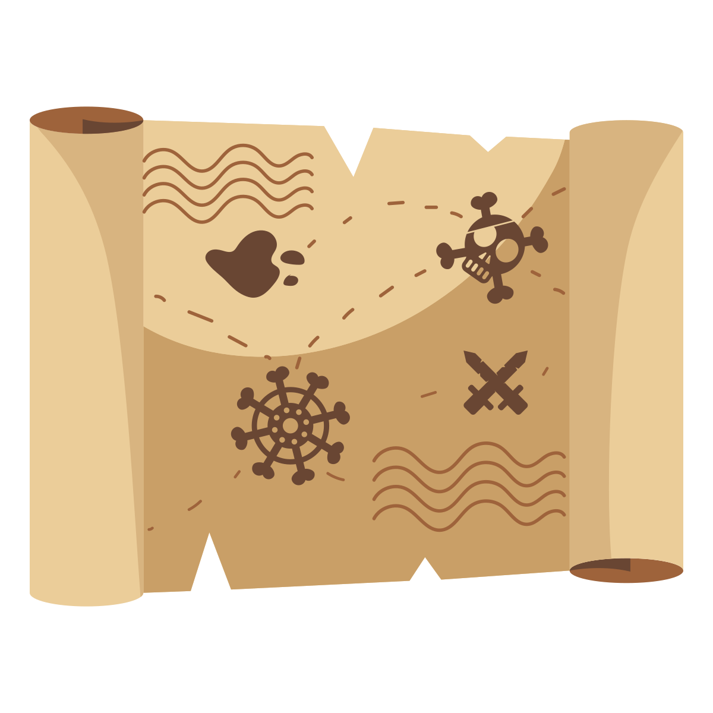
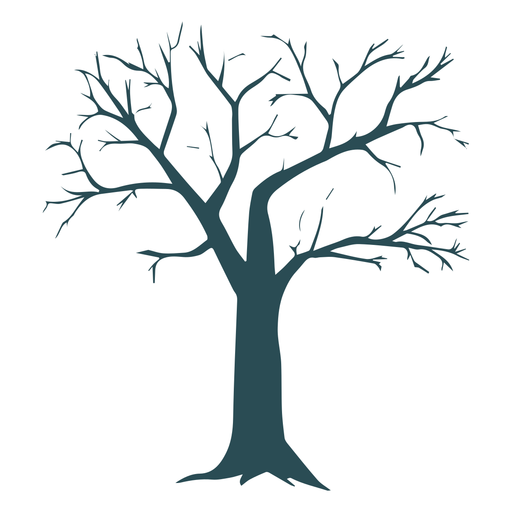

.. _get-started-here:

Start Here
==========

Installation
------------
Arcade can be installed like any other Python
Package. Arcade needs support for OpenGL 3.3+.
If you are familiar with Python package management you can just
"pip install" Arcade.
For more detailed instructions see :ref:`installation-instructions`.

Getting Help
------------

If you get stuck, you can always ask for help! See the page on
:ref:`how-to-get-help` for more information.

Tutorials
---------

If you are already familiar with basic Python programming, follow the
:ref:`platformer_tutorial` as a quick way to get up and running.
If you are just learning how to program, see
the `Learn Arcade book <https://learn.arcade.academy>`_.

Arcade Skill Tree
-----------------

* Basic Drawing Commands -
  See `How to Draw with Your Computer <https://learn.arcade.academy/en/latest/chapters/05_drawing/drawing.html>`_,
  :ref:`drawing_primitives`

  * ShapeElementLists - Batch together thousands
    of drawing commands into one using a
    :class:`arcade.ShapeElementList`. See examples in
    :ref:`shape-element-lists`.

* Sprites - Almost everything in Arcade is done with the :class:`arcade.Sprite` class.

  * `Basic Sprites and Collisions <https://learn.arcade.academy/en/latest/chapters/21_sprites_and_collisions/sprites.html#basic-sprites-and-collisions>`_
  * `Individually place sprites <https://learn.arcade.academy/en/latest/chapters/25_sprites_and_walls/sprites_and_walls.html#individually-placing-walls>`_
  * `Place sprites with a loop <https://learn.arcade.academy/en/latest/chapters/25_sprites_and_walls/sprites_and_walls.html#placing-walls-with-a-loop>`_
  * `Place sprites with a list <https://learn.arcade.academy/en/latest/chapters/25_sprites_and_walls/sprites_and_walls.html#placing-walls-with-a-list>`_

* Moving player sprites

  * Mouse - :ref:`sprite_collect_coins`
  * Keyboard - :ref:`sprite_move_keyboard`

    * Keyboard, slightly more complex but handles multiple key presses better:
      :ref:`sprite_move_keyboard_better`
    * Keyboard with acceleration, de-acceleration: :ref:`sprite_move_keyboard_accel`
    * Keyboard, rotate and move forward/back like a space ship: :ref:`sprite_move_angle`
  * Game Controller - :ref:`sprite_move_controller`

    * Game controller buttons - *Supported, but documentation needed.*

* Sprite collision detection

  * Basic detection -
    `Learn arcade book on collisions <https://learn.arcade.academy/en/latest/chapters/21_sprites_and_collisions/sprites.html#the-update-method>`_,
    :ref:`sprite_collect_coins`
  * Understanding collision detection and spatial hashing: :ref:`collision_detection_performance`
  * Sprite Hit boxes

    * Detail amount - :class:`arcade.Sprite`
    * Changing -:class:`arcade.Sprite.hit_box`
    * Drawing - :class:`arcade.Sprite.draw_hit_box`

  * Avoid placing items on walls - :ref:`sprite_no_coins_on_walls`
  * Sprite drag-and-drop - See the :ref:`solitaire_tutorial`.

* Drawing sprites in layers
* Sprite animation

  * Change texture on sprite when hit - :ref:`sprite_change_coins`

* Moving non-player sprites

  * Bouncing - :ref:`sprite_bouncing_coins`
  * Moving towards player - :ref:`sprite_follow_simple`
  * Moving towards player, but with a delay - :ref:`sprite_follow_simple_2`
  * Space-invaders style - :ref:`slime_invaders`
  * Can a sprite see the player? - :ref:`line_of_sight`
  * A-star pathfinding - :ref:`astar_pathfinding`

* Shooting

  * Player shoots straight up - :ref:`sprite_bullets`
  * Enemy shoots every *x* frames - :ref:`sprite_bullets_periodic`
  * Enemy randomly shoots *x* frames - :ref:`sprite_bullets_random`
  * Player aims - :ref:`sprite_bullets_aimed`
  * Enemy aims - :ref:`sprite_bullets_enemy_aims`

* Physics Engines

  * SimplePhysicsEngine - Platformer tutorial :ref:`platformer_part_three`,
    Learn Arcade Book `Simple Physics Engine <https://learn.arcade.academy/en/latest/chapters/25_sprites_and_walls/sprites_and_walls.html#physics-engine>`_,
    Example :ref:`sprite_move_walls`
  * PlatformerPhysicsEngine - From the platformer tutorial: :ref:`platformer_part_four`,

    * :ref:`sprite_moving_platforms`
    * Ladders - Platformer tutorial :ref:`platformer_part_ten`

  * Using the physics engine on multiple sprites - *Supported, but documentation needed.*
  * Pymunk top-down - *Supported, needs docs*
  * Pymunk physics engine for a platformer - :ref:`pymunk_platformer_tutorial`

* View management

  * Minimal example of using views - :ref:`view_screens_minimal`
  * Using views to add a pause screen - :ref:`view_pause_screen`
  * Using views to add an instruction and game over screen - :ref:`view_instructions_and_game_over`

* Window management

  * Scrolling - :ref:`sprite_move_scrolling`
  * Add full screen support - :ref:`full_screen_example`
  * Allow user to resize the window - :ref:`resizable_window`

* Map Creation

  * Programmatic creation

    * `Individually place sprites <https://learn.arcade.academy/en/latest/chapters/25_sprites_and_walls/sprites_and_walls.html#individually-placing-walls>`_
    * `Place sprites with a loop <https://learn.arcade.academy/en/latest/chapters/25_sprites_and_walls/sprites_and_walls.html#placing-walls-with-a-loop>`_
    * `Place sprites with a list <https://learn.arcade.academy/en/latest/chapters/25_sprites_and_walls/sprites_and_walls.html#placing-walls-with-a-list>`_

  * Procedural Generation

    * :ref:`maze_depth_first`
    * :ref:`maze_recursive`
    * :ref:`procedural_caves_bsp`
    * :ref:`procedural_caves_cellular`

  * TMX map creation - Platformer tutorial: :ref:`platformer_part_eight`

    * Layers - Platformer tutorial: :ref:`platformer_part_eight`
    * Multiple Levels - :ref:`sprite_tiled_map_with_levels`
    * Object Layer - *Supported, but documentation needed.*
    * Hit-boxes - *Supported, but documentation needed.*
    * Animated Tiles - *Supported, but documentation needed.*

* Sound - `Learn Arcade book sound chapter <https://learn.arcade.academy/en/latest/chapters/20_sounds/sounds.html>`_

  * :ref:`music_control_demo`
  * Spatial sound :ref:`sound_demo`

* Particles - :ref:`particle_systems`
* GUI

  * Concepts - :ref:`gui_concepts`
  * Examples - :ref:`gui_concepts`

* OpenGL

  * Read more about using OpenGL in Arcade with :ref:`open_gl_notes`.
  * Lights - :ref:`light_demo`
  * Writing shaders using "ShaderToy"

    * :ref:`shader_toy_tutorial_glow`
    * :ref:`shader_toy_tutorial_particles`
    * Learn how to ray-cast shadows in the :ref:`raycasting_tutorial`.
    * Make your screen look like an 80s monitor in :ref:`crt_filter`.
    * Study the `Asteroids Example Code <https://github.com/pythonarcade/asteroids>`_.

  * Rendering onto a sprite to create a mini-map - :ref:`minimap`
  * Bloom/glow effect - :ref:`bloom_defender`
  * Learn to do a compute shader in :ref:`compute_shader_tutorial`.

* :ref:`Logging`
