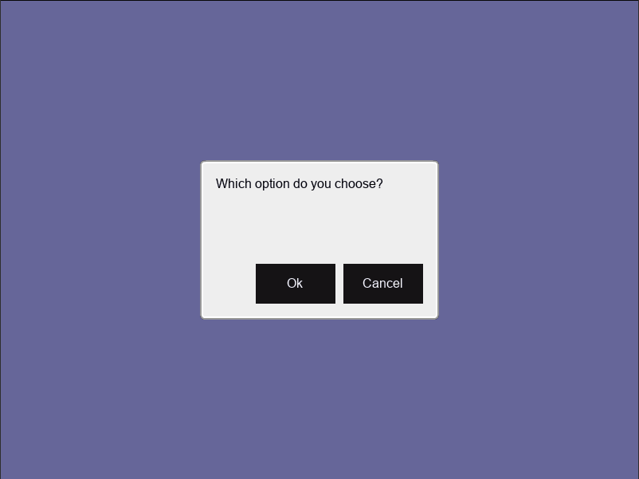

.. _gui:

GUI
===

.. figure:: ../example_code/how_to_examples/thumbs/gui_flat_button.png
   :figwidth: 170px

   :ref:`gui_flat_button`

.. figure:: ../example_code/how_to_examples/gui_widgets.png
   :figwidth: 170px

   :ref:`gui_widgets`

   :ref:`gui_ok_messagebox`

.. figure:: ../example_code/how_to_examples/gui_scrollable_text.png
   :figwidth: 170px

   :ref:`gui_scrollable_text`

Arcade's GUI module provides you classes to interact with the user using buttons, labels and much more.

Using those classes is way easier if the general concepts are known.
It is recommended to read through them.

.. toctree::
   :maxdepth: 1

   concept
   style
   troubleshooting

