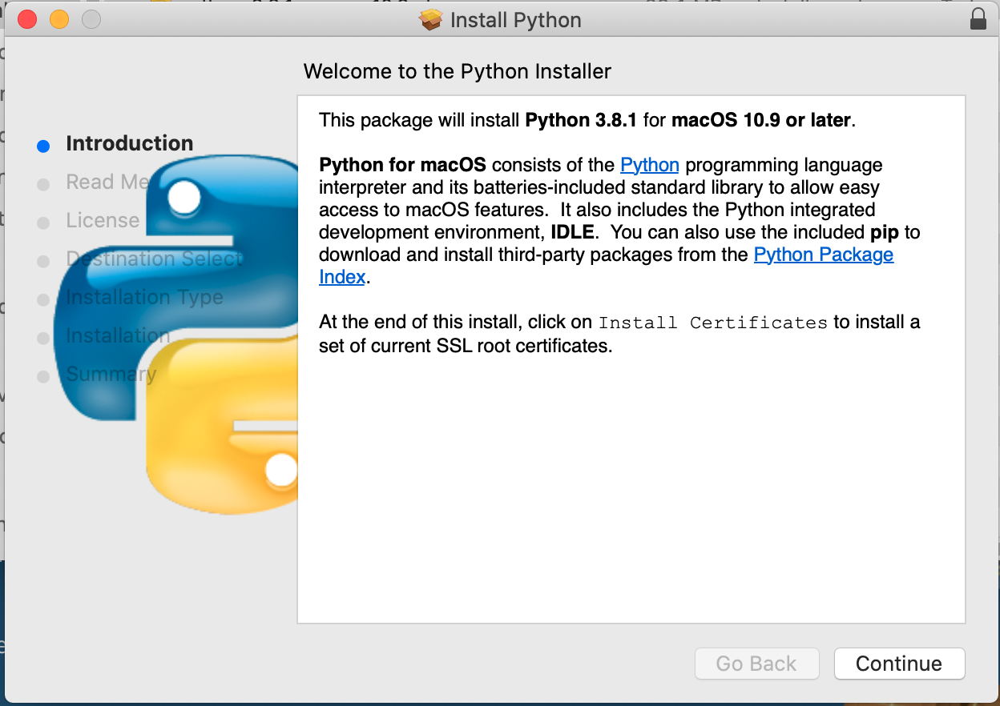
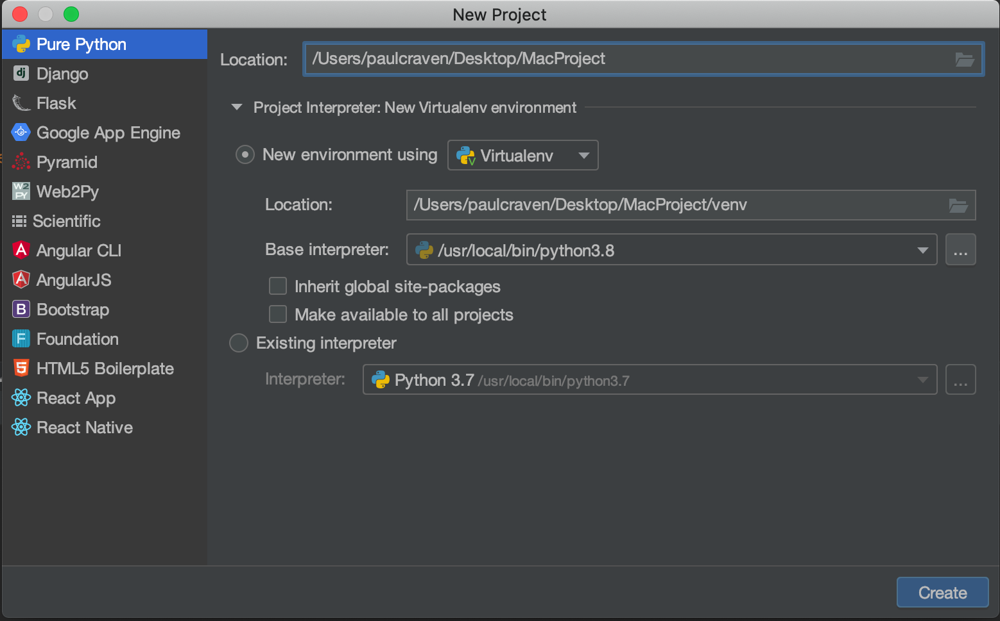
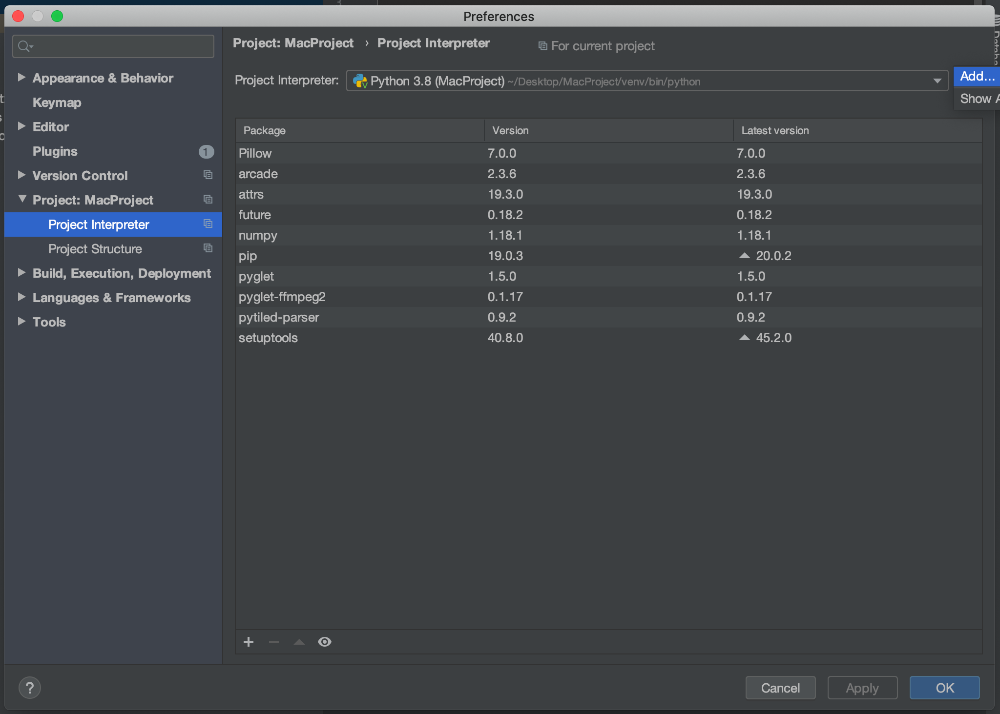
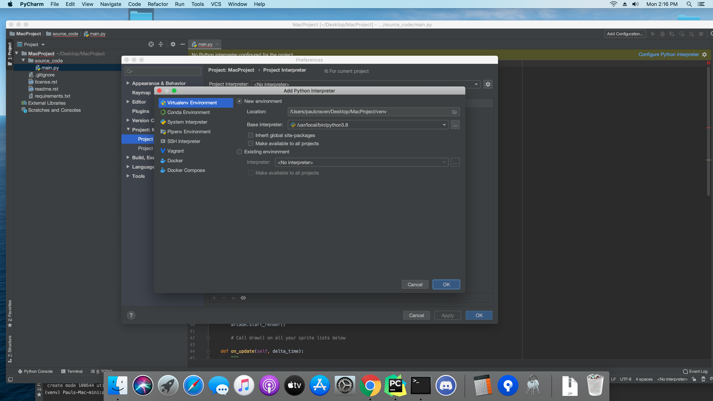

Installation on the Mac
=======================

Go to the `Python website <https://www.python.org/downloads/>`_ and download Python.

.. image:: images/mac1.png

Then install it:

Download and install `PyCharm <https://www.jetbrains.com/pycharm/>`_.
The community edition is free, and WAY better than IDLE.

Download the zip file (or use git) for the Arcade template file.

https://github.com/pythonarcade/template

.. image:: images/mac5.png

After you've downloaded it, open up the zip file, and pull out the template folder
to your desktop or whereever you'd like to save it. Then rename it to your
project name.

Start PyCharm, and select File...Open and select the folder you just created.

When creating opening the new project, create a virtual environment like so:

If that doesn't work, (sometimes PyCharm seems to ignore that, or maybe that
step got skipped)
go into PyCharm...settings, then "Project interpreter" on the right side,
click the easy-to-miss gear icon and "Add"

...Then set it like so:

You should get a warning at the top of the screen that 'arcade' is not installed.
Go ahead and install it. Then try running the starting template.
