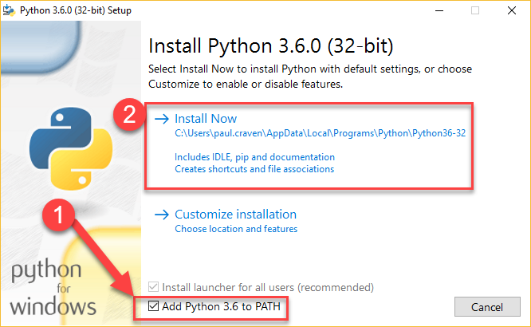
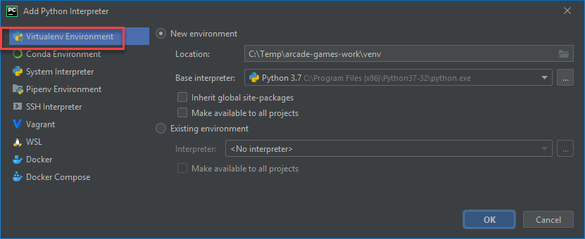
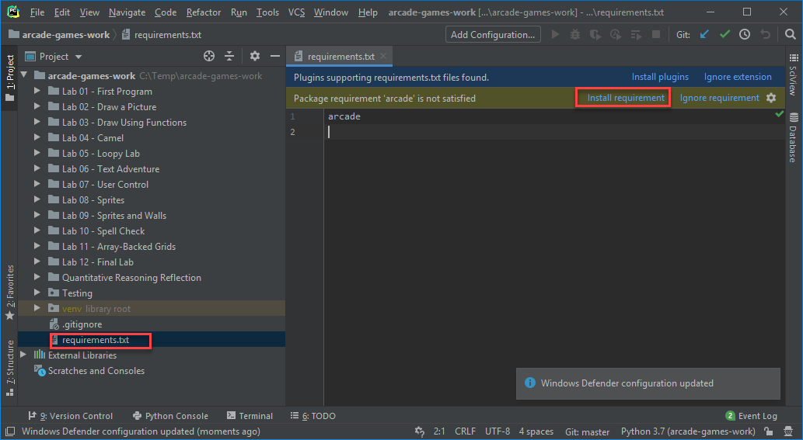

Installation on Windows
=======================

To develop with the Arcade library, we need to install Python, then install
Arcade.

Step 1: Install Python
----------------------

Install Python from the official Python website:

https://www.python.org/downloads/

.. warning::

    As of Mar-30-2020, it is easiest to get Arcade working with Python 3.7.x.
    Arcade uses two other libraries "Numpy" and "Pillow" which are difficult to install
    on Python 3.8.x, particularly under PyCharm. If you wish to use Python 3.8,
    see additional instructions in the note at the end of this page.

When installing Python, make sure to add Pthon to the path (1) before clicking the Install button (2).

After that, you can just close the dialog. There's no need to increase the path length, although it
doesn't hurt anything if you do.

.. image:: images/setup_windows_2.png
    :width: 450px

Step 2: Install The Arcade Library
----------------------------------

If you install Arcade as a pre-built library, there are two options on
how to do it. The best way is to use a "virtual environment." This is
a collection of Python libraries that only apply to your particular project.
You don't have to worry about libraries for other projects conflicting
with your project. You also don't need "administrator" level privileges to
install libraries.

Install Arcade with PyCharm and a Virtual Environment
^^^^^^^^^^^^^^^^^^^^^^^^^^^^^^^^^^^^^^^^^^^^^^^^^^^^^

If you are using PyCharm, setting up a virtual environment is easy. Once you've
got your project, open up the settings:

.. image:: images/venv_setup_1.png
    :width: 300px

Select project interpreter:

.. image:: images/venv_setup_2.png
    :width: 650px

Create a new virtual environment. Make sure the venv is inside your
project folder.

Now you can install libraries. PyCharm will automatically ask to add them
if you have a file called `requirements.txt` that lists the required libraries.

.. note::

   If you are using Python 3.8, the "Numpy" and "Pillow" libraries might try
   to build themselves from scratch, which will probably error out.
   To fix, we can manually update "pip" by opening a
   a PyCharm terminal, and then typing the following into the terminal:

   ``python -m pip install -U --force-reinstall pip``

   Restart PyCharm (or exit and restart the terminal)
   and then attempt to install Arcade again.

Install Arcade using the command line interface
^^^^^^^^^^^^^^^^^^^^^^^^^^^^^^^^^^^^^^^^^^^^^^^

If you prefer to use the command line interface (CLI), 
then you can install arcade directly using pip:

``pip3 install arcade``

If you happen to be using pipenv, then the appropriate command is:

``python3 -m pipenv install arcade``

.. _PyCharm: https://www.jetbrains.com/pycharm/
.. _Sublime: https://www.sublimetext.com/
.. _Wing: https://wingware.com/
.. _Wing 101: http://wingware.com/downloads/wingide-101
.. _Anaconda: http://damnwidget.github.io/anaconda/

