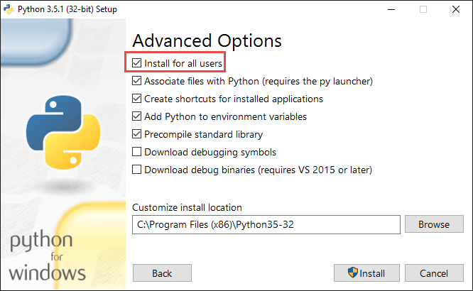
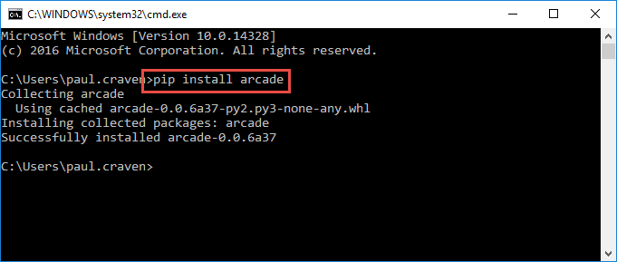

Installation on Windows
=======================

To develop with the Arcade library, we need to install Python, then install
Arcade, and finally install a development environment.

Step 1: Install Python
----------------------

Install Python from the official Python website:

https://www.python.org/downloads/

The website gives you the option of downloading two different versions:
Version 3.x.x or version 2.x.x. The Arcade library requires Python
beginning with 3.x.x.

When installing Python, make sure to customize the installation and add
Python to the path:

.. image:: images/setup_windows_1.png
    :width: 400px

The defaults on the next screen are fine:

.. image:: images/setup_windows_2.png
    :width: 400px

Then install Python for all users:

A video of the installation is below:

.. raw:: html

    <iframe width="560" height="315" src="https://www.youtube.com/embed/KbA6zbUXXP4" frameborder="0" allowfullscreen></iframe>

Step 2: Install The Arcade Library
----------------------------------

Install Arcade The Easy Way
^^^^^^^^^^^^^^^^^^^^^^^^^^^

Click the Window button in the lower left of your screen (or hit the window
button on your keyboard) and start typing ``command prompt``.

Don't just run the Command Prompt, but instead right-click on it and run as
administrator.

.. image:: images/setup_windows_4.png
    :width: 350px

Next, type ``pip install arcade`` at the command prompt:

The video below steps through the process:

.. raw:: html

    <iframe width="560" height="315" src="https://www.youtube.com/embed/6ZU8kNoATRo" frameborder="0" allowfullscreen></iframe>

Install Arcade The Hard Way
^^^^^^^^^^^^^^^^^^^^^^^^^^^

If you successfully installed Arcade the easy way, skip this section. If
you'd rather download the Arcade library directly off PyPi you can at:

https://pypi.python.org/pypi/arcade

Or you can get the source code for the library from GitHub:

https://github.com/pvcraven/arcade

Step 3: Install A Development Environment
-----------------------------------------

Get and set up one of these development environments:

#. PyCharm_. Arguably the most popular option. But with so many features it can
   be overwhelming when getting started.
#. Sublime_. This is more complex to set up for Python, but by far my favorite
   editor. Spend 20 minutes to watch tutorial videos and you will save a lot of
   time later.
   Anaconda_ is a great Sublime_ plug-in for doing Python development.
#. Wing_ (costs money) or `Wing 101`_ (free but less powerful)
#. Or pick your own environment

.. _PyCharm: https://www.jetbrains.com/pycharm/
.. _Sublime: https://www.sublimetext.com/
.. _Wing: https://wingware.com/
.. _Wing 101: http://wingware.com/downloads/wingide-101
.. _Anaconda: http://damnwidget.github.io/anaconda/
