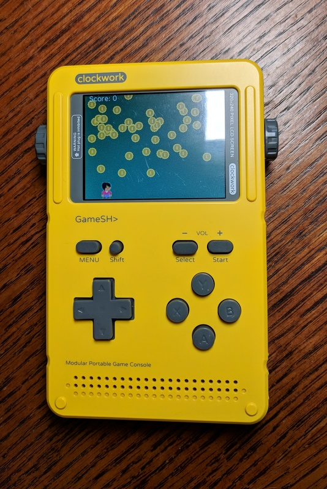
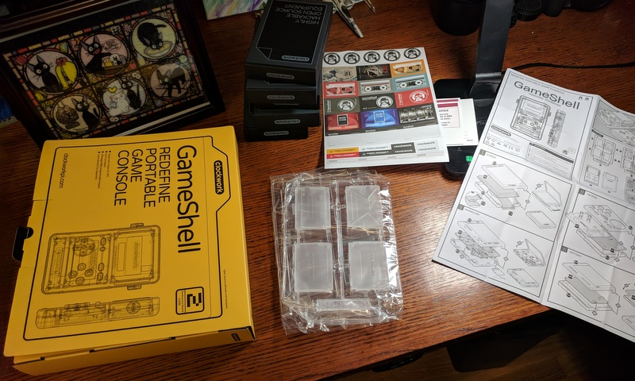

.. _gameshell:

GameShell
=========

GameShell is a retro hand-held gaming console. If you liked the GameBoy, you'll
probably like GameShell. It is a small "Clockwork Pi" computer with a
320x240 screen, battery, speakers, and gaming keypad.

Best of all, you can run Arcade games on it!

You need to assemble the GameShell. At least, the one I was sent needed
assembly. It was an easy snap-together process that didn't take long.
I do recommend using a file or some sandpaper to get off
the extra plastic.

For more info about the GameShell see:

* `GameShell Kickstarter <https://www.kickstarter.com/projects/954662076/gameshell-redefine-retro-game-console>`_
* `Clockwork Pi website <https://www.clockworkpi.com/>`_

To learn how to get a game up and going using Arcade, see:

* `GameShell Template for Arcade Library <https://github.com/pvcraven/gameshell_template>`_

At the time of this writing, I haven't gotten sound to work yet.

**Disclaimer:** I was sent a free GameShell to get the Arcade library up and
running.