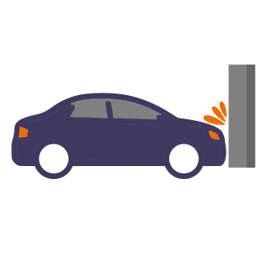

.. _performance:

Performance
===========

The three areas where a game
might experience the greatest slowdowns are collision detection,
drawing primitive performance, and sprite drawing performance.

.. _collision_detection_performance:

Collision detection performance
-------------------------------

Detecting collisions between sprites can take a while.
If you have a map with 50,000 sprites making up walls, then every frame you
have to make 50,000 checks.
(An O(N) operation, if you are familiar with **Big O** notation.)
If your game includes multiple things that need to
check for collisions (enemies, bullets, etc.) then each of those need to do
checks. That can take long enough a game can start slowing below 60 FPS.

How can we speed things up? Arcade can use a technique called **spatial hashing**.

Spatial Hashing
^^^^^^^^^^^^^^^

Arcade divides the screen up into a grid. We track which grid location(s) each sprite
overlaps, and put them in a **hash map**. For each grid location, we can quickly pull
the sprites in that grid in a fast O(1) operation.
When looking for sprites that collide with our target sprite, we only look at sprites
in sharing its grid location. This can reduce checks from 50,000 to just 3 or 4.

There is a drawback. If the sprite moves, we have to recalculate and re-hash its location.
This takes time. This doesn't mean we can't *ever* move the sprite! But it does mean
we have to make a choice around using spatial hashing or not:

* Only have a few sprites? Less than 100? Then it is too small to matter what you pick.
* Do we not need to check for collisions with a sprite list? Spatial hashing off.
* Do all the sprites in our sprite list move every frame? Spatial hashing off.
* Are the sprites platforms? Most of them not moving? Spatial hashing on.

Arcade defaults to no spatial hashing. Spatial hashing can be turned on by:

.. code-block::

    self.my_sprite_list = arcade.SpriteList(use_spatial_hashing=True)

Compute Shader
^^^^^^^^^^^^^^

Currently on the drawing board, is the use of a **compute shader** on your graphics card
to detect collisions. This has the speed advantages of spatial hashing, without the speed
penalty.

Drawing primitive performance
-----------------------------

Drawing lines, rectangles, and circles can
be slow. Every drawing command is sent individually to the graphics card 60 times
per second. If you are drawing hundreds or thousands of lines/boxes then
performance will be terrible.

If you are encountering this, you can speed things up by using
:class:`arcade.ShapeElement` lists where you batch together the drawing commands.
If you can group items together, than drawing a complex tree can be done with just
one command.

For more information see: :ref:`shape_list_demo`.

Sprite drawing performance
--------------------------

Sprite drawing is done in batches via the :class:`arcade.SpriteList` class.
Sprites are loaded to the graphics card and drawn in a batch. Sprites that
don't move can be re-drawn incredibly fast. Sprites that do move only need their
position updated. Sprite drawing with Arcade is incredibly fast, and requires
rarely needs any extra effort from the programmer.

Text drawing performance
------------------------

Arcade's :meth:`arcade.draw_text` can be quite slow. To speed things up, use
text objects. See :ref:`drawing_text_objects`.