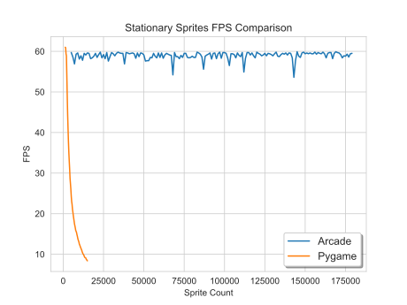
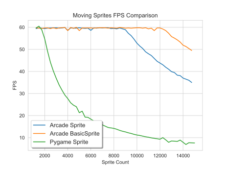
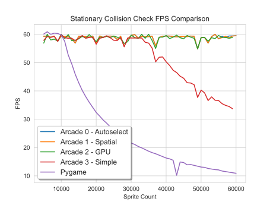
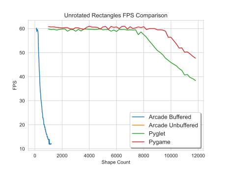
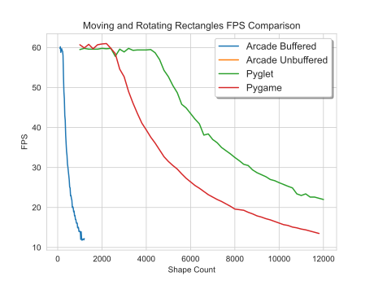

.. _pygame-comparison:

Pygame Comparison
=================

Both Pygame and Arcade are Python libraries for making it easy to create 2D games.
Pygame is raster-graphics based. It is very fast at manipulating individual pixels and can run on almost
anything.
Arcade uses OpenGL. It is very fast at drawing sprites and off-loads functions such as rotation
and transparency to the graphics card.

In 2023 Pygame split between the `Original Pygame <https://github.com/pygame/>`_ and the
`Pygame Community Edition <https://github.com/pygame-community/pygame-ce>`_ (Pygame-ce).
At this point, the code bases are still pretty similar.

Library Information
-------------------

.. list-table:: Library Information
   :widths: 25 25 25 25
   :header-rows: 1

   * - Feature
     - Arcade
     - Pygame Original
     - Pygame CE
   * - Website
     - https://arcade.academy
     - https://www.pygame.org
     - https://pyga.me/
   * - API Docs
     - :ref:`API Docs<quick_index>`
     - `API Docs <https://www.pygame.org/docs/>`__
     - `API Docs <https://pyga.me/docs/>`__
   * - Example code
     - :ref:`Arcade Examples<example-code>`
     - `Pygame Examples <https://github.com/pygame/pygame/tree/main/examples>`_
     - `Pygame-ce Examples <https://github.com/pygame-community/pygame-ce/tree/main/examples>`_
   * - License
     - `MIT License`_
     - LGPL_
     - LGPL_
   * - Back-end graphics engine
     - OpenGL 3.3+ and `Pyglet <http://pyglet.org/>`_
     - `SDL 2 <https://www.libsdl.org/>`_
     - `SDL 2 <https://www.libsdl.org/>`_
   * - Back-end audio engine
     - ffmpeg via Pyglet_
     - `SDL 2 <https://www.libsdl.org/>`_ and SDL_mixer
     - `SDL 2 <https://www.libsdl.org/>`_ and SDL_mixer
   * - Example Projects
     - :ref:`sample_games`
     - `Games Made With Pygame <https://www.pygame.org/tags/all>`_
     -
   * - First Started
     - 2016
     - Before 2000
     - Branched 2023

Feature Comparison
------------------

Here are some comparisons between Arcade 3.0 and Pygame 2.2.0 ce:

.. list-table:: Feature Comparison
   :widths: 33 33 33
   :header-rows: 1

   * - Feature
     - Arcade
     - Pygame
   * - Drawing primitives support rotation
     - Yes
     - No [#f1]_
   * - Sprites support rotation
     - Yes
     - No [#f1]_
   * - Sprites support scaling
     - Yes
     - No [#f1]_
   * - Texture atlas [#f2]_
     - Yes
     - No
   * - Type Hints
     - Yes
     - Yes
   * - Transparency support
     - Yes
     - Yes
   * - Camera support
     - `Yes <api/camera.html>`__
     - No
   * - Android support
     - No
     - Yes
   * - Raspberry Pi support
     - No
     - Yes
   * - Batch drawing
     - Via GPU
     - Via Surface [#f3]_
   * - Default Hitbox
     - .. image:: images/hitbox_simple.png
          :width: 30%
     - .. image:: images/hitbox_none.png
          :width: 50%
   * - Tiled Map Support
     - `Yes <examples/platform_tutorial/step_09.html>`_
     - No
   * - Physics engines
     - `Simple <examples/platform_tutorial/step_04.html>`_,
       `platformer <examples/platform_tutorial/step_05.html>`_, and
       `PyMunk <tutorials/pymunk_platformer/index.html>`_
     - None
   * - Event Management
     - Pyglet-based, write functions to handle events
     - Write your own event loop. Can get around this by add-ons like `Pygame Zero <https://pygame-zero.readthedocs.io/en/stable/>`_)
   * - View Support
     - `Yes <tutorials/views/index.html>`__
     - No
   * - Light Support
     - `Yes <tutorials/lights/index.html>`__
     - No
   * - GUI Support
     - `Yes <gui/index.html>`__
     - No (or add `pygame-gui <https://pygame-gui.readthedocs.io/en/latest/>`_)
   * - GPU Shader Support
     - `Yes <tutorials/gpu_particle_burst/index.html>`__
     - No
   * - Built-in Resources
     - `Yes <resources.html>`__
     - No

.. [#f1] To support rotation and/or scaling, Pygame programs transform Surfaces on the CPU. This can be an expensive
         operation. Arcade off-loads these operations to the graphics card. See for more information.
.. [#f2] When creating a sprite from an image, Pygame will load the image from the disk every time unless the user
         caches the image with their own code for better performance. Arcade will create an atlas of textures, so that
         multiple sprites with the same image will just reference the same atlas location.
.. [#f3] A programmer can achieve a similar result by drawing to a surface, then draw the surface to the screen.

.. _pygame_comparison_performance:

Performance Comparison
----------------------

These performance tests were done on an Intel Core i7-9700F with GeForce GTX 980 Ti. Source code for tests available at:

* https://craven-performance-testing.s3-us-west-2.amazonaws.com/index.html
* https://github.com/pythonarcade/performance_tests

Sprite Drawing
^^^^^^^^^^^^^^

How fast can the graphics libraries draw sprites that don't move?
This graph shows the Frames Per Second (FPS) the computer can maintain vs. the number of sprites being drawn
each frame:

Why is Arcade so fast?
Arcade loads the sprites to the GPU and can redraw stationary sprites with almost no CPU effort. This allows
it to scale drawing of stationary sprites to even 1 million plus, and still keep 60 FPS.

While Pygame's speed may drop off fast, there's still a few thousand sprites that can be drawn on the screen
before FPS drops off. For many games that's plenty.
Also, for sprites that don't move, Pygame programs can draw the sprites to a 'surface' at the start of a game.
A program can then use that surface to the screen in one operation.

How fast can we draw moving sprites?
Moving sprites are more challenging to draw, as we can't simply use what we did in the prior frame.

Arcade only updates the changed location of the sprite, keeping the dimensions and image on the GPU
allowing it to still have fast updates.

Arcade also has two sprite classes available. The full-featured :py:class:`arcade.Sprite` class
and the smaller and faster :py:class:`arcade.BasicSprite` class. If you don't need collision detection
or physics support, the ``BasicSprite`` class works great.

Collision Processing
^^^^^^^^^^^^^^^^^^^^

Another time-critical component in games is the time it takes to figure out if sprites collide:

Normally collision detection is an O(N) operation. That is, if are checking to see if a sprite collides with
any of 1,000 other sprites, we have 1,000 checks to do. If there are a lot of sprites, this takes time.

Arcade has two ways to speed this up.

1. Spatial Hashing. If we know those 1,000 sprites aren't going to move at all (or very much) we can set up a
   grid. We figure out what grid location the player is in. Then we only check the player against whichever
   of the 1,000 sprites are in the same grid location. This works great for tiled maps where the platforms, ramps,
   etc. don't move. It gets us closer to O(1) time.
2. Off-load to the GPU. As there are 1,000s of processors on your graphics card, we can calculate collisions there.
   However it takes time to set up the GPU. This is only faster if we have more than 1500 or so sprites to check.
3. "Simple" checks everything. There are still a lot of tricks used to make this faster, and particularly with
   Python 3.11 code, it runs fine for most cases.

Arcade has multiple modes that allow you to select these collision options.

Shapes
^^^^^^

Aside from sprites, how fast can a library draw various graphical shapes? Rectangle, circles, arcs, and more?

This next benchmark looks at drawing rectangles. Important things to keep in mind:

* Pygame uses memory bliting which is crazy fast and why it comes out in first-place. This doesn't work as well
  if you are drawing anything but unrotated rectangles.
* Arcade's shapes are easy, but crazy-slow.
  Thankfully you can use Pyglet shapes in the same program as Arcade.
  For anything more than a dozen or so shapes, a program should do that.
* Arcade has a Sprite class for solid-color rectangles. If you needed rectangles the `SpriteSolidColor`
  would be a high performance option not shown here.

What if a shape needs to be rotated? Pyglet can offload this to the GPU and this allows it to perform
faster than Pygame that relies on the CPU.

.. _MIT License: https://github.com/pythonarcade/arcade/blob/development/license.rst
.. _LGPL: https://github.com/pygame/pygame/blob/main/docs/LGPL.txt
