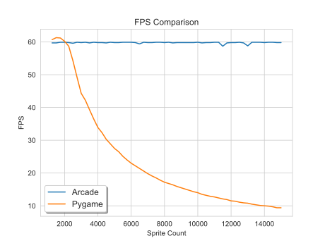
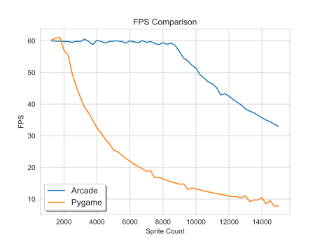

.. _pygame-comparison:

Pygame Comparison
=================

Both Pygame and Arcade are Python libraries for making it easy to create 2D games.
Pygame is raster-graphics based. It is very fast at manipulating individual pixels and can run on almost
anything.
Arcade uses OpenGL. It is very fast at drawing sprites and off-loads functions such as rotation
and transparency to the graphics card.

Here are some comparisons between Arcade 2.6 and Pygame 2.0.1:

.. list-table:: Library Information
   :widths: 33 33 33
   :header-rows: 1

   * - Feature
     - Arcade
     - Pygame
   * - Website
     - https://arcade.academy
     - https://www.pygame.org
   * - API Docs
     - `API Docs <https://arcade.academy/quick_index.html>`__
     - `API Docs <https://www.pygame.org/docs/>`__
   * - Example code
     - `Example code <https://arcade.academy/examples/index.html>`_
     - N/A
   * - License
     - `MIT License`_
     - LGPL_
   * - Back-end graphics engine
     - OpenGL 3.3+ and `Pyglet <http://pyglet.org/>`_
     - `SDL 2 <https://www.libsdl.org/>`_
   * - Back-end audio engine
     - ffmpeg via Pyglet_
     - `SDL 2 <https://www.libsdl.org/>`_
   * - Example Projects
     - :ref:`sample_games`
     - `Games Made With Pygame <https://www.pygame.org/tags/all>`_

.. list-table:: Feature Comparison
   :widths: 33 33 33
   :header-rows: 1

   * - Feature
     - Arcade
     - Pygame
   * - Drawing primitives support rotation
     - Yes
     - No [#f1]_
   * - Sprites support rotation
     - Yes
     - No [#f1]_
   * - Sprites support scaling
     - Yes
     - No [#f1]_
   * - Sprite image caching [#f2]_
     - Yes
     - No
   * - Type Hints
     - Yes
     - No
   * - Transparency support
     - Yes
     - Must specify transparent colorkey
   * - Camera support
     - `Yes <api/camera.html>`__
     - No
   * - Android support
     - No
     - Yes
   * - Raspberry Pi support
     - No
     - Yes
   * - Batch drawing
     - Via GPU
     - Via Surface [#f5]_
   * - Default Hitbox
     - .. image:: images/hitbox_simple.png
          :width: 30%
     - .. image:: images/hitbox_none.png
          :width: 50%
   * - Tiled Map Support
     - `Yes <examples/platform_tutorial/step_09.html>`_
     - No
   * - Physics engines
     - `Simple <examples/platform_tutorial/step_04.html>`_,
       `platformer <examples/platform_tutorial/step_05.html>`_, and
       `PyMunk <tutorials/pymunk_platformer/index.html>`_
     - None
   * - Event Management
     - Pyglet-based
     - No (or add `Pygame Zero <https://pygame-zero.readthedocs.io/en/stable/>`_)
   * - View Support
     - `Yes <tutorials/views/index.html>`__
     - No
   * - Light Support
     - `Yes <tutorials/lights/index.html>`__
     - No
   * - GUI Support
     - `Yes <gui/index.html>`__
     - No (or add `pygame-gui <https://pygame-gui.readthedocs.io/en/latest/>`_)
   * - GPU Shader Support
     - `Yes <tutorials/gpu_particle_burst/index.html>`__
     - No
   * - Built-in Resources
     - `Yes <resources.html>`__
     - No

.. list-table:: Performance Comparison [#f6]_
   :widths: 33 33 33
   :header-rows: 1

   * - Feature
     - Arcade
     - Pygame
   * - Draw 50,000 stationary sprites
     - 0.001 seconds
     - 0.425 seconds
   * - Move 5,000 sprites
     - 0.010 seconds
     - 0.003 seconds
   * - # sprites program can move + draw
       before FPS drops below 55
     - 8500
     - 2000
   * - Collision detection 50,000 sprites
     - | 0.044 seconds no spatial hashing [#f3]_
       | 0.005 seconds with spatial hashing
     - 0.004 seconds [#f4]_
   * - Draw 5,000 plain rectangles [#f7]_
     - 0.081 seconds
     - 0.008 seconds
   * - Draw 5,000 rotated rectangles [#f8]_
     - 0.081 seconds
     - 0.029 seconds

    FPS comparison of programs drawing **stationary** sprites.

    FPS comparison of programs drawing **moving** sprites.

.. [#f1] To support rotation and/or scaling, PyGame programs must write the image to a surface, transform the surface,
         then create a sprite out of the surface. This takes a lot of CPU. Arcade off-loads all these operations to the
         graphics card.
.. [#f2] When creating a sprite from an image, Pygame will load the image from the disk every time. The user must
         cache the image with their own code for better performance. Arcade does this automatically.
.. [#f5] A programmer can achieve a similar result by drawing to a surface, then drawing the surface to the screen.
.. [#f6] Performance tests done on an Intel Core i7-9700F with GeForce GTX 980 Ti. Source code for tests available at
         https://github.com/pythonarcade/performance_tests and more detailed results at
         https://craven-performance-testing.s3-us-west-2.amazonaws.com/index.html
.. [#f3] Polygon hit box, rotation allowed
.. [#f4] Rectangular hit box, no rotation allowed
.. [#f7] Why is Arcade so slow here? With PyGame, most of the drawing is done on the **CPU** side. Bitmaps
         are created and manipulated by the CPU. It is pretty fast. With Arcade, most of the drawing happens
         on the **GPU** side. Sprites and drawings are batched together, and we just tell the GPU what we want
         to change. Or better yet, we write a "shader" program that runs completely on the GPU.
         This is *incredibly* fast. But
         if instead a CPU program runs commands to draw individual GPU items one-by-one, both sets
         of processors wait for a synchronous communication.
         That is horribly slow. Drawing individual rects and bits like
         PyGame does, won't work well at all on Arcade. Use sprites, shaders, or batch-drawing to
         get fast performance.
.. [#f8] Scaling and rotation must be done by the programmer drawing to a surface, transforming the surface,
         then blit'ing the surface to the screen. Arcade uses the GPU for these operations and needs no
         additional code or performance hits.

.. _MIT License: https://github.com/pythonarcade/arcade/blob/development/license.rst
.. _LGPL: https://github.com/pygame/pygame/blob/main/docs/LGPL.txt
.. _type hinting: https://docs.python.org/3/library/typing.html
.. _moiré pattern: http://stackoverflow.com/questions/10148479/artifacts-when-drawing-primitives-with-pygame
.. _2.0: https://github.com/pygame/pygame/releases/tag/2.0.0
