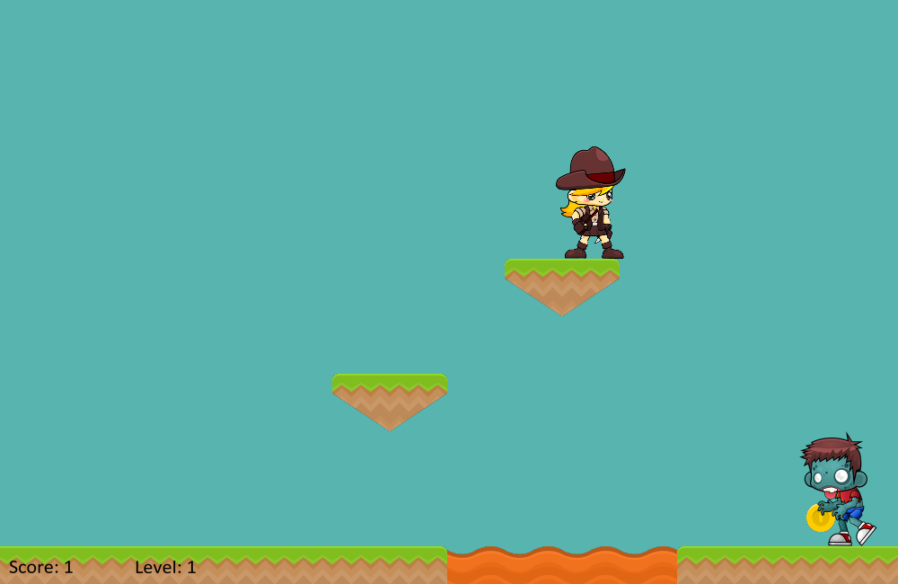
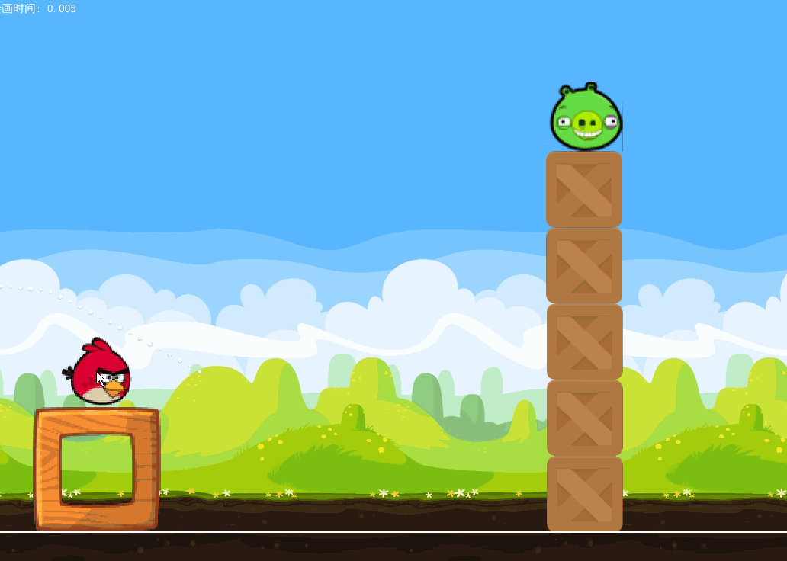
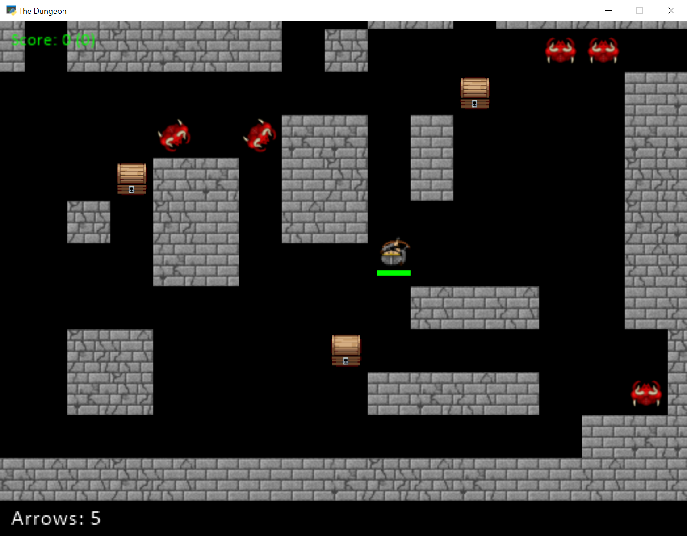

Sample Games Made With The Arcade Library
=========================================

Have a sample game you'd like to share here? E-mail
paul@cravenfamily.com.

GitHub Projects
---------------

Battle Bros
~~~~~~~~~~~

.. image:: https://raw.githubusercontent.com/njbittner/battle-bros-pyarcade/master/battlebros.gif
   :width: 50%

`Battle Bros <https://github.com/njbittner/battle-bros-pyarcade>`_ Mortal Kombat style game.

Rabbit Herder
~~~~~~~~~~~~~

.. image:: https://raw.githubusercontent.com/ryancollingwood/arcade-rabbit-herder/master/resources/static/preview.gif
   :width: 50%

`Rabbit Herder <https://github.com/ryancollingwood/arcade-rabbit-herder>`_,
use carrots and potions to herd a rabbit through a maze.

The Great Skeleton War
~~~~~~~~~~~~~~~~~~~~~~

.. raw:: html

	<iframe width="560" height="315" src="https://www.youtube.com/embed/4yRxBYXP_Eo" frameborder="0" gesture="media" allow="encrypted-media" allowfullscreen></iframe>

`The Great Skeleton War`_, an intense tower defense game, where there's always something new to discover.

.. _The Great Skeleton War: https://github.com/BlakeDalmas/Python/tree/master/The%20Great%20Skeleton%20War

Python Knife Hit
~~~~~~~~~~~~~~~~

.. figure:: images/python_knife_hit.png
	:width: 50%

https://github.com/akmalhakimi1991/python-knife-hit

Kayzee
~~~~~~

	`Kayzee Game <https://github.com/wamiqurrehman093/Kayzee>`_

lixingqiu Games
~~~~~~~~~~~~~~~

.. figure:: images/eight_planet.gif
	:width: 50%

	An `Eight planet simulation <https://github.com/lixingqiu/eight_planet>`_

.. figure:: images/midway.png
	:width: 50%

	`Midway Island War <https://github.com/lixingqiu/python3_arcade_midway_island_war_simple_simulate>`_

	`Angry Bird <https://github.com/lixingqiu/python_arcade_simple_angry_bird>`_

.. figure:: images/octopus.gif
	:width: 50%

	`Octopus <https://github.com/lixingqiu/Python-arcade-Octopus-animation-demo>`_

Space Typer
~~~~~~~~~~~

.. image:: images/space_typer.png

`Space Typer`_ - A typing game

.. _Space Typer: https://github.com/thecodeah/space-typer

FlapPy Bird
~~~~~~~~~~~

.. image:: https://camo.githubusercontent.com/f0e9f79d083289e7385a9af79231ba9cc07a10dd/68747470733a2f2f692e706f7374696d672e63632f665678394b736b672f53637265656e5f53686f745f323031382d30392d32375f61745f31322e31312e31395f414d2e706e67

`FlapPy-Bird`_ - A bird-game clone.

.. _FlapPy-Bird: https://github.com/iJohnMaged/FlapPy-Bird

PyOverheadGame
~~~~~~~~~~~~~~

.. image:: images/PyOverheadGame.png

PyOverheadGame_, a 2D overhead game where you go through several rooms and pick up keys and other objects.

.. _PyOverheadGame: https://github.com/albertz/PyOverheadGame

Dungeon
~~~~~~~

Dungeon_, explore a maze picking up arrows and coins.

.. _Dungeon: https://github.com/BlakeDalmas/Python/tree/master/Dungeon%20Game

Two Worlds
~~~~~~~~~~

`Two Worlds`_, a castle adventure with a dungeon and caverns underneath it.

.. _Two Worlds: https://github.com/pvcraven/two_worlds

Games from Simpson College Spring 2017 CMSC 150 Course
------------------------------------------------------

These games were created by first-semester programming students.

.. raw:: html

	<iframe width="560" height="315" src="https://www.youtube.com/embed/Hjx4aSadeBQ" frameborder="0" allowfullscreen></iframe>

.. raw:: html

	<iframe width="560" height="315" src="https://www.youtube.com/embed/JMg7j-1e6SY" frameborder="0" allowfullscreen></iframe>

.. raw:: html

	<iframe width="560" height="315" src="https://www.youtube.com/embed/qU1Wguc0pDE" frameborder="0" allowfullscreen></iframe>

.. raw:: html

	<iframe width="560" height="315" src="https://www.youtube.com/embed/08dgcomrB68" frameborder="0" allowfullscreen></iframe>

.. raw:: html

	<iframe width="560" height="315" src="https://www.youtube.com/embed/q_7_R4qa6K0" frameborder="0" allowfullscreen></iframe>

.. raw:: html

	<iframe width="560" height="315" src="https://www.youtube.com/embed/BCtW0G00zxM" frameborder="0" allowfullscreen></iframe>

.. raw:: html

	<iframe width="560" height="315" src="https://www.youtube.com/embed/Qjc-6sck7e4" frameborder="0" allowfullscreen></iframe>

.. raw:: html

	<iframe width="560" height="315" src="https://www.youtube.com/embed/aqPQIKYswNQ" frameborder="0" allowfullscreen></iframe>

.. raw:: html

	<iframe width="560" height="315" src="https://www.youtube.com/embed/pymhs2zTGjY" frameborder="0" allowfullscreen></iframe>\

.. raw:: html

	<iframe width="560" height="315" src="https://www.youtube.com/embed/_yLNYDVeQ5g" frameborder="0" allowfullscreen></iframe>

.. raw:: html

	<iframe width="560" height="315" src="https://www.youtube.com/embed/TPm-SMJ5cwg" frameborder="0" allowfullscreen></iframe>

.. raw:: html

	<iframe width="560" height="315" src="https://www.youtube.com/embed/Q65Sc8SLHho" frameborder="0" allowfullscreen></iframe>

.. raw:: html

	<iframe width="560" height="315" src="https://www.youtube.com/embed/Kog417X313Y" frameborder="0" allowfullscreen></iframe>

