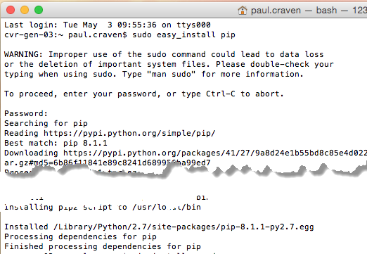

Installation on the Mac
=======================

The Mac has a "terminal" window where a user can type in commands. This is how
computers used to be operated before we had graphics. It is still very useful.
To start the Mac's terminal, go to the Finder and open up your applications.
Inside of applications is a folder called Utilities. The Terminal program is in
there.

.. image:: images/run_mac_terminal.png

At this point you need to choose to use version 3.x of Python (recommended) or
use version 2.x. Pick one of the two, and follow the instructions below.

Option 1: Use Python 3.x
------------------------

Download and install Python 3.x from the official Python website:

https://www.python.org/downloads/

Start the Terminal application. This must be done AFTER you finish installing
Python, or next command won't work. In the Terminal window type:

``sudo pip3 install numpy pillow pyglet arcade``

This will install the Arcade library and the libraries it depends on.

Option 2: Use Python 2.x
------------------------

Start the Terminal program.

At the terminal, type ``sudo easy_install pip``. The computer will ask for
your password, and then install a command called ``pip``.

After this, type:

``sudo pip install numpy pillow pyglet arcade``

Installing AVbin
================

For sound, Arcade relies on a library called AVbin. This needs to be installed
next.

To download AVbin, go to: https://avbin.github.io/AVbin/Download.html and click
the AVbin 10 for OSX link. Download and install.

If your security setting prevent you from running the installer, find the
downloaded file in your Finder. Control-Click the file and select "Open". Then
click past the warning and install it anyway.

Installing PyCharm
==================

Go to JetBrains and download PyCharm for the Mac. The Community edition
is fine:

https://www.jetbrains.com/pycharm/download/

Because the Mac often has multiple versions of Python installed on it, when
cerating a project make sure to select version 2.7 or version 3.5 (recommended)
depending on what version of Python you want to create.

.. image:: images/pycharm_mac_select_python.png
