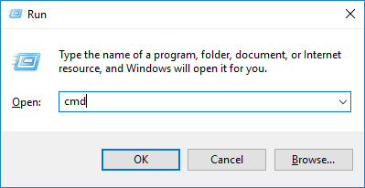

Installation on Windows
=======================

Step 1: Install Python
----------------------

Install Python from the official Python website:

https://www.python.org/downloads/

The website gives you the option of downloading two different versions:
Version 3.x.x or version 2.x.x. If you aren't sure which you want, pick the
version that begins with 3.

Step 2: Install The Arcade Library
----------------------------------

THE EASY WAY
^^^^^^^^^^^^

Click the Window button in the lower left of your screen (or hit the window
button on your keyboard) and type ``run``. Then hit enter.

Type ``cmd`` and hit enter.

Next, type ``pip install arcade`` at the command prompt:

.. image:: images/pip_install_arcade_windows.png

THE HARD WAY
^^^^^^^^^^^^

If you successfully installed Arcade the easy way, skip this section. If
you'd rather download the Arcade library directly off PyPi you can at:

https://pypi.python.org/pypi/arcade

Or you can get the source code for the library from GitHub:

https://github.com/pvcraven/arcade

Step 3: Install A Development Environment
-----------------------------------------

Get and set up one of these development environments:

#. PyCharm_. Arguably the most popular option. But with so many features it can
   be overwhelming when getting started.
#. Sublime_. This is more complex to set up for Python, but by far my favorite
   editor. Spend 20 minutes to watch tutorial videos and you will save a lot of
   time later.
   Anaconda_ is a great Sublime_ plug-in for doing Python development.
#. Wing_ (costs money) or `Wing 101`_ (free but less powerful)
#. Or pick your own environment

.. _PyCharm: https://www.jetbrains.com/pycharm/
.. _Sublime: https://www.sublimetext.com/
.. _Wing: https://wingware.com/
.. _Wing 101: http://wingware.com/downloads/wingide-101
.. _Anaconda: http://damnwidget.github.io/anaconda/
=======
Installation on Windows
=======================

Step 1: Install Python
----------------------

Install Python from the official Python website:

https://www.python.org/downloads/

The website gives you the option of downloading two different versions:
Version 3.x.x or version 2.x.x. If you aren't sure which you want, pick the
version that begins with 3.

Step 2: Install The Arcade Library
----------------------------------

Option 1: The Easy Way
^^^^^^^^^^^^^^^^^^^^^^

Click the Window button in the lower left of your screen (or hit the window
button on your keyboard) and type ``run``. Then hit enter.

Type ``cmd`` and hit enter.

Next, type ``pip install arcade`` at the command prompt:

.. image:: images/pip_install_arcade_windows.png

Option 2: The Hard Way
^^^^^^^^^^^^^^^^^^^^^^

If you successfully installed Arcade the easy way, skip this section. If
you'd rather download the Arcade library directly off PyPi you can at:

https://pypi.python.org/pypi/arcade

Or you can get the source code for the library from GitHub:

https://github.com/pvcraven/arcade

If you are picking "the hard way" we assume you will know
how to take it from here.

Step 3: Install a Development Environment
-----------------------------------------

Get and set up one of these development environments:

#. PyCharm_. Arguably the most popular option. But with so many features it can
   be overwhelming when getting started.
#. Sublime_. This is more complex to set up for Python, but by far my favorite
   editor. Spend 20 minutes to watch tutorial videos and you will save a lot of
   time later.
   Anaconda_ is a great Sublime_ plug-in for doing Python development.
#. Wing_ (costs money) or `Wing 101`_ (free but less powerful)
#. Or pick your own environment!

.. _PyCharm: https://www.jetbrains.com/pycharm/
.. _Sublime: https://www.sublimetext.com/
.. _Wing: https://wingware.com/
.. _Wing 101: http://wingware.com/downloads/wingide-101
.. _Anaconda: http://damnwidget.github.io/anaconda/
