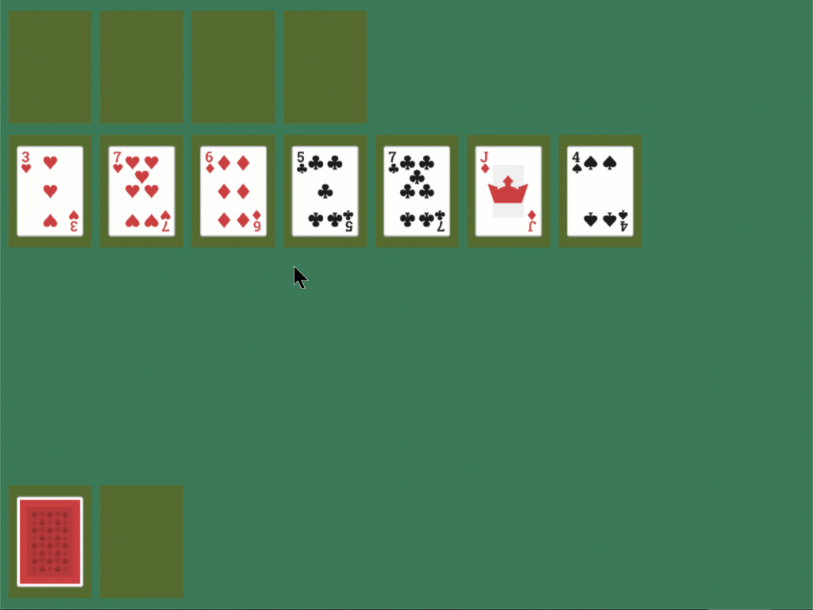
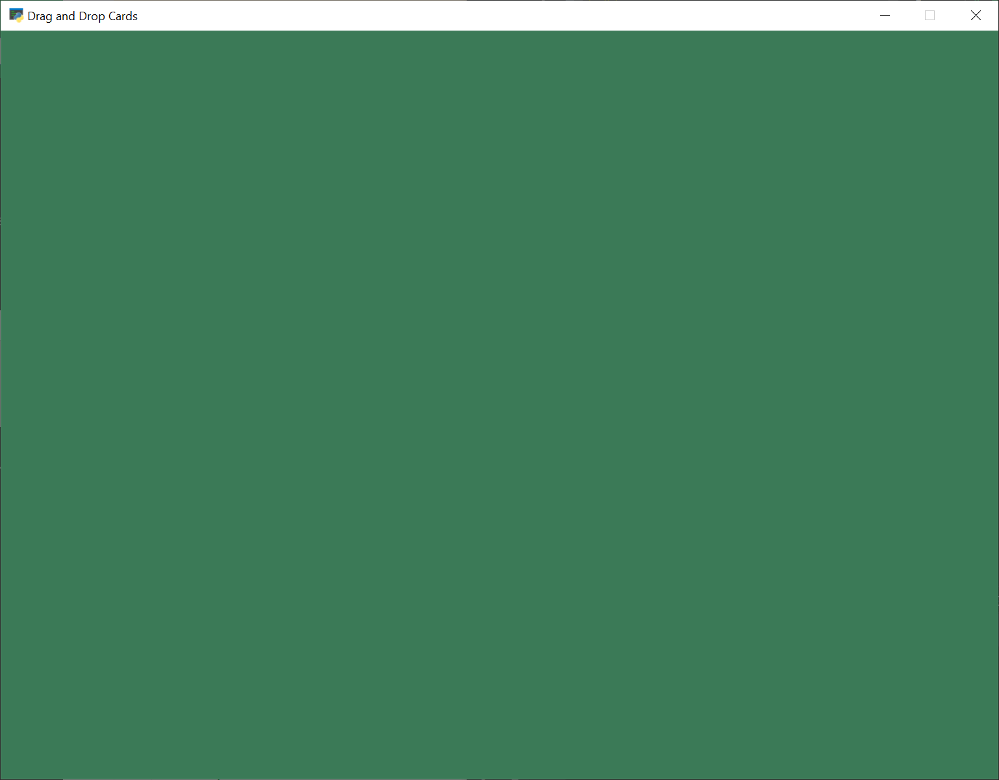
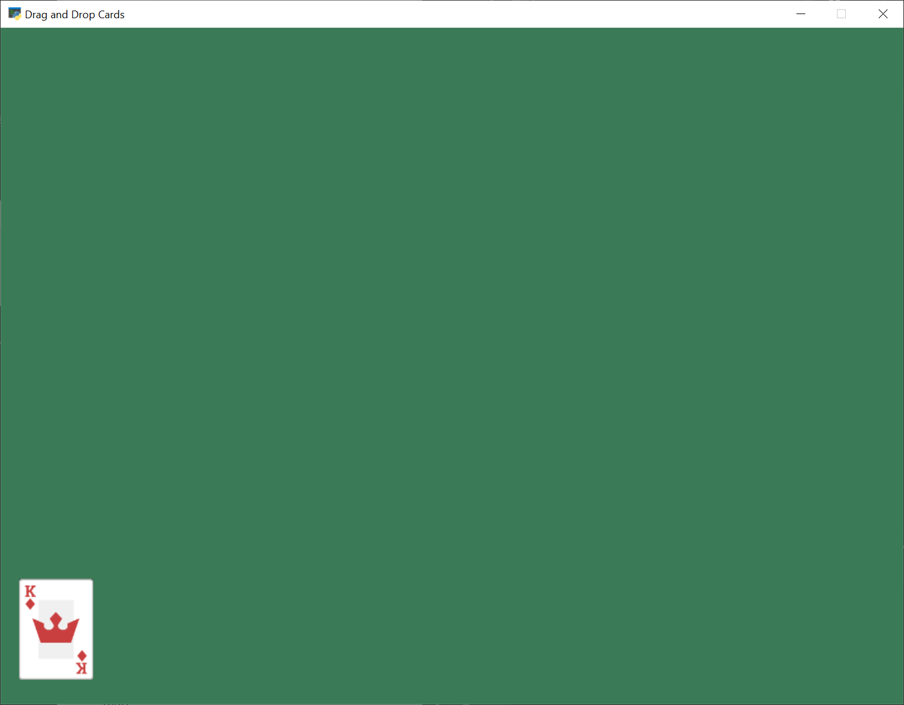
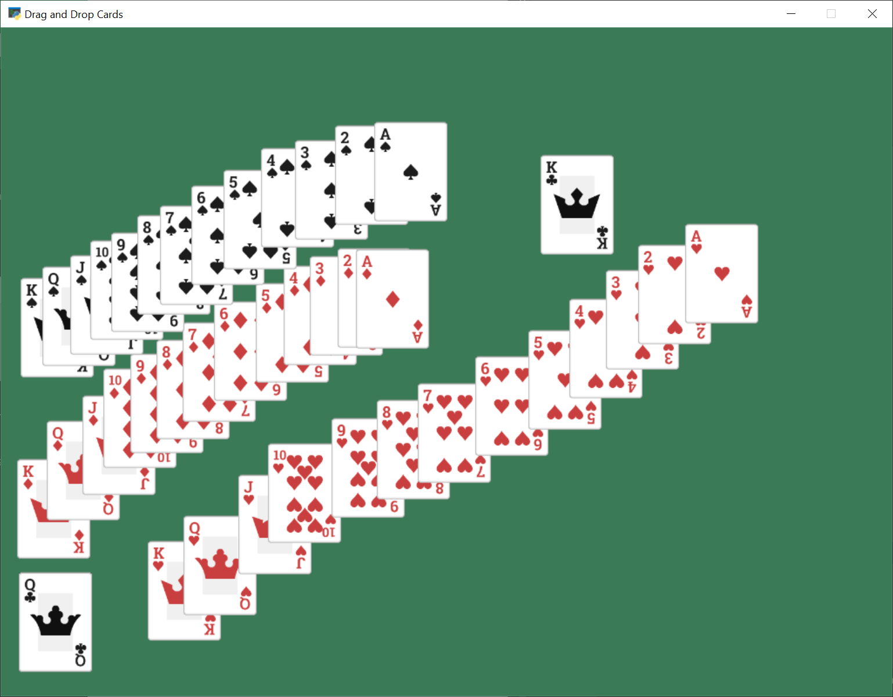
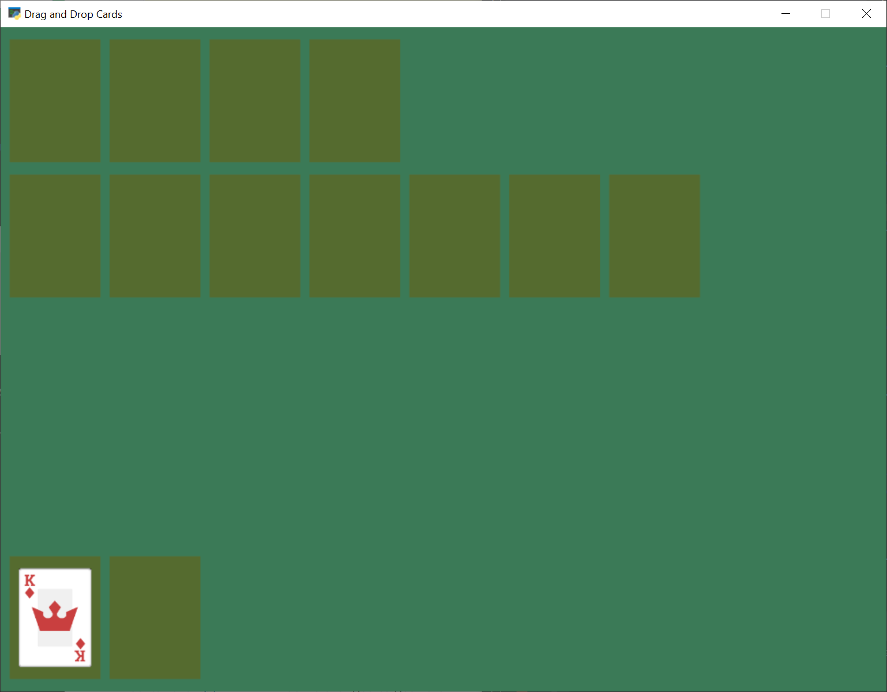
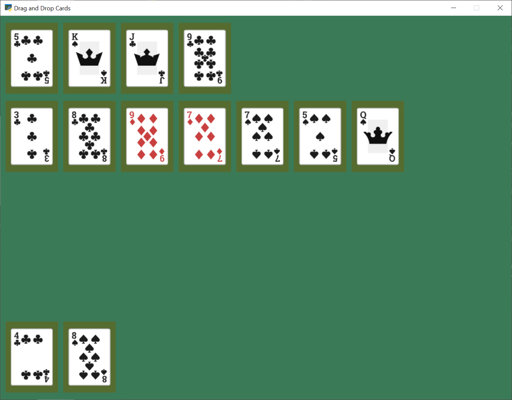
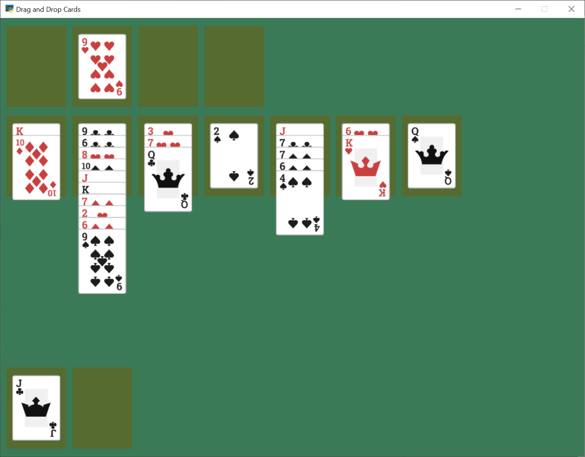
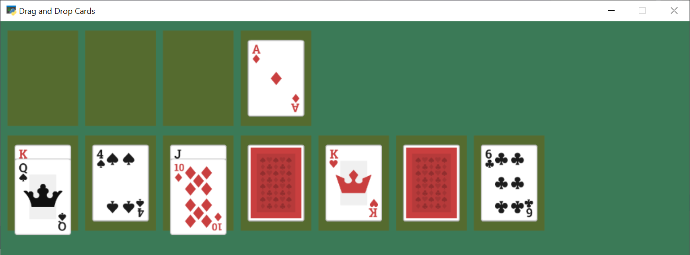

.. include:: <isonum.txt>

.. _solitaire_tutorial:

Solitaire
=========

This solitaire tutorial takes you though the basics of creating a card game, and
doing extensive drag/drop work.

Open a Window
-------------

To begin with, let's start with a program that will use Arcade to open a blank
window. The listing below also has stubs for methods we'll fill in later.

Get started with this code and make sure you can run it.
It should pop open a green window.

.. literalinclude:: solitaire_01.py
    :caption: Starting Program
    :linenos:

Create Card Sprites
-------------------

Our next step is the create a bunch of sprites, one for each card.

Constants
~~~~~~~~~

First, we'll create some constants used in positioning the cards, and keeping
track of what card is which.

We could just hard-code numbers, but I like to calculate things out. The "mat"
will eventually be a square slightly larger than each card that tracks where
we can put cards. (A mat where we can put a pile of cards on.)

.. literalinclude:: solitaire_02.py
    :caption: Create constants for positioning
    :linenos:
    :lines: 11-36

Card Class
~~~~~~~~~~

Next up, we'll create a card class. The card class is a subclass of
``arcade.Sprite``. It will have attributes for the suit and value of the
card, and auto-load the image for the card based on that.

We'll use the entire image as the hit box, so we don't need to go through the
time consuming hit box calculation. Therefore we turn that off. Otherwise loading
the sprites would take a long time.

.. literalinclude:: solitaire_02.py
    :caption: Create card sprites
    :linenos:
    :pyobject: Card

Creating Cards
~~~~~~~~~~~~~~

We'll start by creating an attribute for the ``SpriteList`` that will hold all
the cards in the game.

.. literalinclude:: solitaire_02.py
    :caption: Create card sprites
    :linenos:
    :pyobject: MyGame.__init__
    :emphasize-lines: 4-5

In ``setup`` we'll create the list and the cards. We don't do this in ``__init__``
because by separating the creation into its own method, we can easily restart the
game by calling ``setup``.

.. literalinclude:: solitaire_02.py
    :caption: Create card sprites
    :linenos:
    :pyobject: MyGame.setup
    :emphasize-lines: 4-12

Drawing Cards
~~~~~~~~~~~~~

Finally, draw the cards:

.. literalinclude:: solitaire_02.py
    :caption: Create card sprites
    :linenos:
    :pyobject: MyGame.on_draw
    :emphasize-lines: 6-7

You should end up with all the cards stacked in the lower-left corner:

* :ref:`solitaire_02` |larr| Full listing of where we are right now
* :ref:`solitaire_02_diff` |larr| What we changed to get here

Implement Drag and Drop
-----------------------

Next up, let's add the ability to pick up, drag, and drop the cards.

Track the Cards
~~~~~~~~~~~~~~~

First, let's add attributes to track what cards we are moving. Because we can
move multiple cards, we'll keep this as a list. If the user drops the card in
an illegal spot, we'll need to reset the card to its original position. So we'll
also track that.

Create the attributes:

.. literalinclude:: solitaire_03.py
    :caption: Add attributes to __init__
    :linenos:
    :pyobject: MyGame.__init__
    :emphasize-lines: 9-14

Set the initial values (an empty list):

.. literalinclude:: solitaire_03.py
    :caption: Create empty list attributes
    :linenos:
    :pyobject: MyGame.setup
    :emphasize-lines: 4-9

Pull Card to Top of Draw Order
~~~~~~~~~~~~~~~~~~~~~~~~~~~~~~

When we click on the card, we'll want it to be the last card drawn, so it
appears on top of all the other cards. Otherwise we might drag a card underneath
another card, which would look odd.

.. literalinclude:: solitaire_03.py
    :caption: Pull card to top
    :linenos:
    :pyobject: MyGame.pull_to_top

Mouse Button Pressed
~~~~~~~~~~~~~~~~~~~~

When the user presses the mouse button, we will:

* See if they clicked on a card
* If so, put that card in our held cards list
* Save the original position of the card
* Pull it to the top of the draw order

.. literalinclude:: solitaire_03.py
    :caption: Pull card to top
    :linenos:
    :pyobject: MyGame.on_mouse_press

Mouse Moved
~~~~~~~~~~~

If the user moves the mouse, we'll move any held cards with it.

.. literalinclude:: solitaire_03.py
    :caption: Pull card to top
    :linenos:
    :pyobject: MyGame.on_mouse_motion

Mouse Released
~~~~~~~~~~~~~~

When the user releases the mouse button, we'll clear the held card list.

.. literalinclude:: solitaire_03.py
    :caption: Pull card to top
    :linenos:
    :pyobject: MyGame.on_mouse_release

Test the Program
~~~~~~~~~~~~~~~~

You should now be able to pick up and move cards around the screen.
Try it out!

* :ref:`solitaire_03` |larr| Full listing of where we are right now
* :ref:`solitaire_03_diff` |larr| What we changed to get here

Draw Pile Mats
--------------

Next, we'll create sprites that will act as guides to where the piles of cards
go in our game. We'll create these as sprites, so we can use collision detection
to figure out of we are dropping a card on them or not.

Create Constants
~~~~~~~~~~~~~~~~

First, we'll create constants for the middle row of seven piles, and for the
top row of four piles. We'll also create a constant for how far apart each pile
should be.

Again, we could hard-code numbers, but I like calculating them so I can change
the scale easily.

.. literalinclude:: solitaire_04.py
    :caption: Add constants
    :linenos:
    :lines: 34-41

Create Mat Sprites
~~~~~~~~~~~~~~~~~~

Create an attribute for the mat sprite list:

.. literalinclude:: solitaire_04.py
    :caption: Create the mat sprites
    :linenos:
    :pyobject: MyGame.__init__
    :emphasize-lines: 16-17

Then create the mat sprites in the ``setup`` method

.. literalinclude:: solitaire_04.py
    :caption: Create the mat sprites
    :linenos:
    :pyobject: MyGame.setup
    :emphasize-lines: 11-35

Draw Mat Sprites
~~~~~~~~~~~~~~~~

Finally, the mats aren't going to display if we don't draw them:

.. literalinclude:: solitaire_04.py
    :caption: Draw the mat sprites
    :linenos:
    :pyobject: MyGame.on_draw
    :emphasize-lines: 6-7

Test the Program
~~~~~~~~~~~~~~~~

Run the program, and see if the mats appear:

* :ref:`solitaire_04` |larr| Full listing of where we are right now
* :ref:`solitaire_04_diff` |larr| What we changed to get here

Snap Cards to Piles
-------------------

Right now, you can drag the cards anywhere. They don't have to go onto a
pile. Let's add code that "snaps" the card onto a pile. If we don't drop
on a pile, let's reset back to the original location.

.. literalinclude:: solitaire_05.py
    :caption: Snap to nearest pile
    :linenos:
    :pyobject: MyGame.on_mouse_release
    :emphasize-lines: 9-29

* :ref:`solitaire_05` |larr| Full listing of where we are right now
* :ref:`solitaire_05_diff` |larr| What we changed to get here

Shuffle the Cards
-----------------

Having all the cards in order is boring. Let's shuffle them in the ``setup``
method:

.. literalinclude:: solitaire_06.py
    :caption: Shuffle Cards
    :linenos:
    :pyobject: MyGame.setup
    :lines: 49-52

Don't forget to ``import random`` at the top.

Run your program and make sure you can move cards around.

* :ref:`solitaire_06` |larr| Full listing of where we are right now
* :ref:`solitaire_06_diff` |larr| What we changed to get here

Track Card Piles
----------------

Right now we are moving the cards around. But it isn't easy to figure out what
card is in which pile. We could check by position, but then we start fanning
the cards out, that will be very difficult.

Therefore we will keep a separate list for each pile of cards. When we move
a card we need to move the position, and switch which list it is in.

Add New Constants
~~~~~~~~~~~~~~~~~

To start with, let's add some constants for each pile:

.. literalinclude:: solitaire_07.py
    :caption: New Constants
    :linenos:
    :lines: 48-65

Create the Pile Lists
~~~~~~~~~~~~~~~~~~~~~

Then in our ``__init__`` add a variable to track the piles:

.. literalinclude:: solitaire_07.py
    :caption: Init Method Additions
    :linenos:
    :pyobject: MyGame.__init__
    :lines: 19-20

In the ``setup`` method, create a list for each pile. Then, add all the cards
to the face-down deal pile. (Later, we'll add support for face-down cards.
Yes, right now all the cards in the face down pile are up.)

.. literalinclude:: solitaire_07.py
    :caption: Setup Method Additions
    :linenos:
    :pyobject: MyGame.setup
    :lines: 54-59

Card Pile Management Methods
~~~~~~~~~~~~~~~~~~~~~~~~~~~~

Next, we need some convenience methods we'll use elsewhere.

First, given a card, return the index of which pile that card belongs to:

.. literalinclude:: solitaire_07.py
    :caption: get_pile_for_card method
    :linenos:
    :pyobject: MyGame.get_pile_for_card

Next, remove a card from whatever pile it happens to be in.

.. literalinclude:: solitaire_07.py
    :caption: remove_card_from_pile method
    :linenos:
    :pyobject: MyGame.remove_card_from_pile

Finally, move a card from one pile to another.

.. literalinclude:: solitaire_07.py
    :caption: move_card_to_new_pile method
    :linenos:
    :pyobject: MyGame.move_card_to_new_pile

Dropping the Card
~~~~~~~~~~~~~~~~~

Next, we need to modify what happens when we release the mouse.

First, see if we release it onto the same pile it came from. If so, just reset
the card back to its original location.

.. literalinclude:: solitaire_07.py
    :caption: on_mouse_release method
    :linenos:
    :pyobject: MyGame.on_mouse_release
    :lines: 1-22
    :emphasize-lines: 16-22

What if it is on a middle play pile? Ugh, that's a bit complicated. If the mat
is empty, we need to place it in the middle of the mat. If there are cards on the
mat, we need to offset the card so we can see a spread of cards.

While we can only pick up one card at a time right now, we need to support
dropping multiple cards for once we support multiple card carries.

.. literalinclude:: solitaire_07.py
    :caption: on_mouse_release method
    :linenos:
    :pyobject: MyGame.on_mouse_release
    :lines: 24-45

What if it is released on a top play pile? Make sure that we only have one
card we are holding. We don't want to drop a stack up top. Then move the card
to that pile.

.. literalinclude:: solitaire_07.py
    :caption: on_mouse_release method
    :linenos:
    :pyobject: MyGame.on_mouse_release
    :lines: 47-55

If the move is invalid, we need to reset all held cards to their initial location.

.. literalinclude:: solitaire_07.py
    :caption: on_mouse_release method
    :linenos:
    :pyobject: MyGame.on_mouse_release
    :lines: 57-64

Test
~~~~

Test out your program, and see if the cards are being fanned out properly.

.. note::

    The code isn't enforcing any game rules. You can stack cards in any
    order. Also, with long stacks of cards, you still have to drop the card
    on the mat. This is counter-intuitive when the stack of cards extends
    downwards past the mat.

    We leave the solutions to these issues as an exercise for the reader.

* :ref:`solitaire_07` |larr| Full listing of where we are right now
* :ref:`solitaire_07_diff` |larr| What we changed to get here

Pick Up Card Stacks
-------------------

How do we pick up a whole stack of cards? When the mouse is pressed, we need
to figure out what pile the card is in.

Next, look at where in the pile the card is that we clicked on. If there are
any cards later on on the pile, we want to pick up those cards too. Add them
to the list.

.. literalinclude:: solitaire_08.py
    :caption: on_mouse_release method
    :linenos:
    :pyobject: MyGame.on_mouse_press
    :emphasize-lines: 12-13,22-28

After this, you should be able to pick up a stack of cards from the middle piles
with the mouse and move them around.

* :ref:`solitaire_08` |larr| Full listing of where we are right now
* :ref:`solitaire_08_diff` |larr| What we changed to get here

Deal Out Cards
--------------

We can deal the cards into the seven middle piles by adding some code to the
``setup`` method. We need to change the list each card is part of, along with
its position.

.. literalinclude:: solitaire_09.py
    :caption: Setup Method Additions
    :linenos:
    :pyobject: MyGame.setup
    :lines: 61-73

* :ref:`solitaire_09` |larr| Full listing of where we are right now
* :ref:`solitaire_09_diff` |larr| What we changed to get here

Face Down Cards
---------------

We don't play solitaire with all the cards facing up, so let's add face-down
support to our game.

New Constants
~~~~~~~~~~~~~

First define a constant for what image to use when face-down.

.. literalinclude:: solitaire_10.py
    :caption: Face Down Image Constant
    :linenos:
    :lines: 51-52

Updates to Card Class
~~~~~~~~~~~~~~~~~~~~~

Next, default each card in the ``Card`` class to be face up. Also, let's add
methods to flip the card up or down.

.. literalinclude:: solitaire_10.py
    :caption: Updated Card Class
    :linenos:
    :pyobject: Card
    :emphasize-lines: 13-29

Flip Up Cards On Middle Seven Piles
~~~~~~~~~~~~~~~~~~~~~~~~~~~~~~~~~~~

Right now every card is face down. Let's update the ``setup`` method so the
top cards in the middle seven piles are face up.

.. literalinclude:: solitaire_10.py
    :caption: Flip Up Cards
    :linenos:
    :pyobject: MyGame.setup
    :lines: 75-77

Flip Up Cards When Clicked
~~~~~~~~~~~~~~~~~~~~~~~~~~

When we click on a card that is face down, instead of picking it up, let's flip
it over:

.. literalinclude:: solitaire_10.py
    :caption: Flip Up Cards
    :linenos:
    :pyobject: MyGame.on_mouse_press
    :emphasize-lines: 15-18

Test
~~~~

Try out your program. As you move cards around, you should see face down cards
as well, and be able to flip them over.

* :ref:`solitaire_10` |larr| Full listing of where we are right now
* :ref:`solitaire_10_diff` |larr| What we changed to get here

Restart Game
------------

We can add the ability to restart are game any type we press the 'R' key:

.. literalinclude:: solitaire_11.py
    :caption: Flip Up Cards
    :linenos:
    :pyobject: MyGame.on_key_press

Flip Three From Draw Pile
-------------------------

The draw pile at the bottom of our screen doesn't work right yet. When we
click on it, we need it to flip three cards to the bottom-right pile. Also,
if the have gone through all the cards in the pile, we need to reset the pile
so we can go through it again.

.. literalinclude:: solitaire_11.py
    :caption: Flipping of Bottom Deck
    :linenos:
    :pyobject: MyGame.on_mouse_press
    :emphasize-lines: 15-33, 56-71

Test
~~~~

Now we've got a basic working solitaire game! Try it out!

.. image:: solitaire_11.png
    :width: 80%

* :ref:`solitaire_11` |larr| Full listing of where we are right now
* :ref:`solitaire_11_diff` |larr| What we changed to get here

Conclusion
----------

There's a lot more that could be added to this game, such as enforcing rules,
adding animation to 'slide' a dropped card to its position, sound, better graphics,
and more. Or this could be adapted to a different card game.

Hopefully this is enough to get you started on your own game.