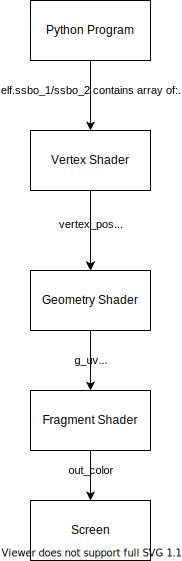

.. _compute_shader_tutorial:

Compute Shader
==============

.. raw:: html

   
<iframe src="https://streamable.com/e/ab8d87" frameborder="0" width="100%" height="100%" allowfullscreen style="width: 100%; height: 100%; position: absolute;"></iframe>

For certain types of calculations, compute shaders on the GPU can be
thousands of times faster than on the CPU alone.

In this tutorial, we will simulate a star field using an 'N-Body simulation'. Each
star is affected by the gravity of every other star. For 1,000 stars, this means we have
1,000 x 1,000 = 1,000,000 million calculations to perform for each frame.
The video has 65,000 stars, requiring 4.2 billion gravity force calculations per frame.
On high-end hardware it can still run at 60 fps!

How does this work?
There are three major parts to this program:

* The Python code, which allocates buffers & glues everything together
* The visualization shaders, which let us see the data in the buffers
* The compute shader, which moves everything

Buffers
-------

We need a place to store the data we'll visualize. To do so, we'll create
two **Shader Storage Buffer Objects** (SSBOs) of floating point numbers from
within our Python code. One will hold the previous frame's star positions,
and the other will be used to store calculate the next frame's positions.

Each buffer must be able to store the following for each star:

1. The x, y, and radius of each star stored
2. The velocity of the star, which will be unused by the visualization
3. The floating point RGBA color of the star

Generating Aligned Data
^^^^^^^^^^^^^^^^^^^^^^^

To avoid issues with GPU memory alignment quirks, we'll use the function
below to generate well-aligned data ready to load into the SSBO. The
docstrings & comments explain why in greater detail:

.. literalinclude:: main.py
    :language: python
    :caption:  Generating Well-Aligned Data to Load onto the GPU
    :lines: 25-70

Allocating the Buffers
^^^^^^^^^^^^^^^^^^^^^^

.. literalinclude:: main.py
    :language: python
    :caption: Allocating the Buffers & Loading the Data onto the GPU
    :lines: 88-116

Visualization Shaders
---------------------

Now that we have the data, we need to be able to visualize it. We'll do
it by applying vertex, geometry, and fragment shaders to convert the
data in the SSBO into pixels. For each star's 12 floats in the array, the
following flow of data will take place:

Vertex Shader
^^^^^^^^^^^^^

In this tutorial, the vertex shader will be run for each star's 12 float
long stretch of raw padded data in ``self.ssbo_current``. Each execution
will output clean typed data to an instance of the geometry shader.

Data is read in as follows:

* The x, y, and radius of each star are accessed via ``in_vertex``
* The floating point RGBA color of the star, via ``in_color``

.. literalinclude:: shaders/vertex_shader.glsl
    :language: glsl
    :caption: shaders/vertex_shader.glsl
    :linenos:

The variables below are then passed as inputs to the geometry shader:

* ``vertex_pos``
* ``vertex_radius``
* ``vertex_color``

Geometry Shader
^^^^^^^^^^^^^^^

The **geometry shader** converts a single point into a quad, in this
case a square, which the GPU can render. It does this by emitting four
points centered on the input point.

.. literalinclude:: shaders/geometry_shader.glsl
    :language: glsl
    :caption: shaders/geometry_shader.glsl
    :linenos:

Fragment Shader
^^^^^^^^^^^^^^^

A **fragment shader** runs for each pixel in a quad. It converts a UV
coordinate within the quad to a float RGBA value. In this tutorial's
case, the shader produces the soft glowing circle on the surface of each
star's quad.

.. literalinclude:: shaders/fragment_shader.glsl
    :language: glsl
    :caption: shaders/fragment_shader.glsl
    :linenos:

Compute Shader
--------------

Now that we have a way to display data, we should update it.

We created pairs of buffers earlier. We will use one SSBO as an
**input buffer** holding the previous frame's data, and another
as our **output** buffer to write results to.

We then swap our buffers each frame after drawing, using the output
as the input of the next frame, and repeat the process until the program
stops running.

.. literalinclude:: shaders/compute_shader.glsl
    :language: glsl
    :caption: shaders/compute_shader.glsl
    :linenos:

The Finished Python Program
---------------------------

The code includes thorough docstrings and annotations explaining how it works.

.. literalinclude:: main.py
    :caption: main.py
    :linenos:

An expanded version of this tutorial whith support for 3D is available at:
https://github.com/pvcraven/n-body