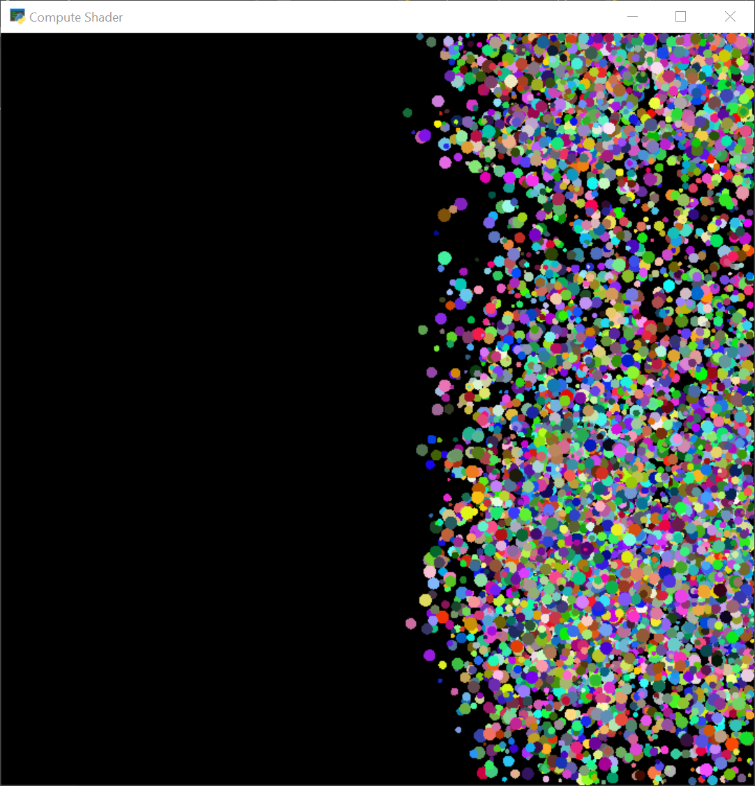

.. _compute_shader_tutorial:

Compute Shader Tutorial
=======================

   :ref:`compute_shader`

Using the compute shader, you can use the GPU to perform calculations.

In this example the balls are not moved by the CPU, but instead by the GPU.
This can be hundreds or thousands of times faster than CPU calculations.

.. literalinclude:: compute_ssbo.py
    :caption: Compute Shader Demo
    :linenos:
