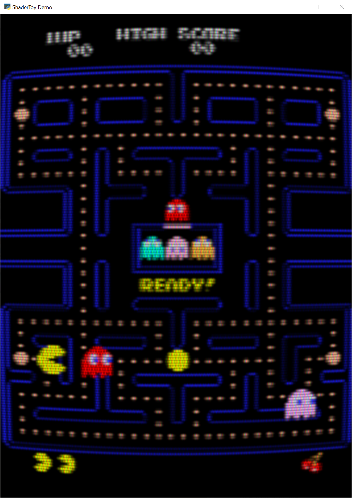
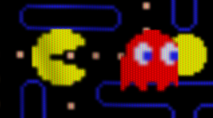
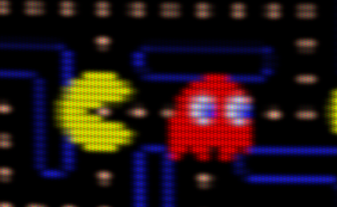

.. _crt_filter:

CRT Filter
==========

If you'd like an 80s feel to your games, you can use the built-in CRT filter.

You can create a CRT filter with code like this:

.. code-block:: python

    # Create the crt filter
    self.crt_filter = CRTFilter(width, height,
                                resolution_down_scale=6.0,
                                hard_scan=-8.0,
                                hard_pix=-3.0,
                                display_warp = Vec2(1.0 / 32.0, 1.0 / 24.0),
                                mask_dark=0.5,
                                mask_light=1.5)

You can play around with the parameters to get an idea of what they do.
For example:

**Resolution Down Sampling**

   resolution_down_scale = 1

   resolution_down_scale = 6

To use the CRT Filter, your ``on_draw`` method should first draw everything to the
CRT filter. At this point, nothing draws to the screen, we are just drawing to an
internal frame buffer.

Then, once everything is drawn to the CRT filter, render that filter to the screen.

.. code-block:: python

    # Draw our stuff into the CRT filter instead of on screen
    self.crt_filter.use()
    self.crt_filter.clear()
    self.sprite_list.draw()

    # Next, switch back to the screen and dump the contents of the CRT filter
    # to it.
    self.use()
    self.clear()
    self.crt_filter.draw()

Full Example Code
-----------------

The example code just animates a Pac-Man image. You can toggle the CRT filter on
or off by hitting the space bar.

Images to run this example can be found here:
https://github.com/pythonarcade/arcade/tree/development/doc/tutorials/crt_filter

.. literalinclude:: crt_filter_example.py

