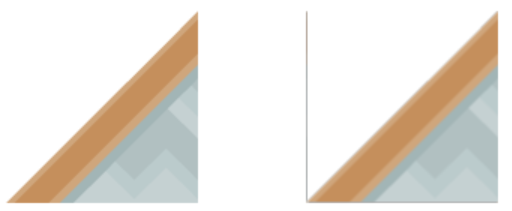
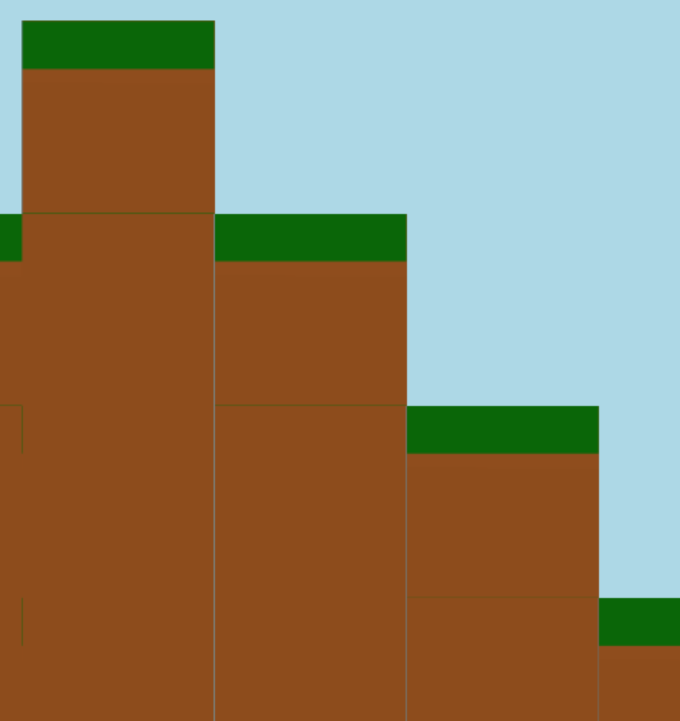

.. _edge_artifacts:

Edge Artifacts
==============

When working with images, particularly ones with transparency, graphics cards can
create graphic artifacts on their edges. Images can have 'borders' where they
aren't wanted. For example, here there's a line on the top and left:

.. image:: p0.png
    :width: 20%

Why does this happen? How do we fix it?

Why Edge Artifacts Appear
-------------------------

This happens when the edge of an image does not fall cleanly onto an image.

Edge Mis-Alignment
^^^^^^^^^^^^^^^^^^

Typically edge artifacts happen when the edge of an image doesn't land on an exact
pixel boundary.
Below in Figure 1, the left image is 128 pixels square
and drawn at (100, 100), and looks fine. The image on the right is drawn with a
center of (100, 300.5) and has an artifact that shows up as a line on the left edge.
That artifact will not appear if the sprite is drawn at
(100, 300) instead of (100, 300.5)

    Figure 1: Edge artifacts caused by images that aren't on integer pixel
    boundaries.

The left edge falls on a coordinate of 300.5 - (128/2) = 236.5. The computer tries
to select a color that's an average between 236 and 237, but since there is no
237 we get a dark color. Typically this only happens if the edge is transparent.

A shape that has a height or width that is not evenly divisible by two can also
cause artifacts. If the shape is
15 pixels wide, then the center will fall between the 7th and 8th pixel making
it harder to line up the pixels to the screen.

Scaling
^^^^^^^

Scaling an image can also cause artifacts. In Figure 2, the second sprite is scaled down
by two-thirds. Since 128 pixels doesn't evenly scale down by two-thirds, we end
up with edge artifacts. If we had scaled down by one-half, that is possible to do
with 128 pixels (to 64), so there would be no artifacts.

The third image in Figure 2 is scaled up by a factor of two. The edge spans
two pixels and we end up with a line artifact as well. (Scaling down by two usually
works if the image is divisible by four. Scaling up typically doesn't.)

.. figure:: p2.png
    :width: 90%

    Figure 2: Edge artifacts caused by scaling.

Rotating
^^^^^^^^

With rotation, it can be very difficult to get pixels lined up, and edge artifacts
are common.

Improper Viewport
^^^^^^^^^^^^^^^^^

If a window is 800 wide, and the viewport is set to 799 or 801, then lines can
also appear. Alternatively, if a viewport left or right edge is set to a non-integer
number such as 23.5, this can cause the artifacts to appear.

    Figure 3: Incorrect viewport

Solutions
---------

Keeping sprite sizes to a power of
two will help. For pixel-art types of games, using the ``GL_NEAREST`` filter can
also help.

Use The Power of Two
^^^^^^^^^^^^^^^^^^^^

Keep all sprite dimensions a power of two. Such as 2, 4, 8, 16, 32, 64, 128, 256,
etc. It is ok if they aren't square, such as a 32x64 pixel is fine.

Don't scale up, only scale down. Also, only scale down in powers of two.

Aligning to the Nearest Pixel
^^^^^^^^^^^^^^^^^^^^^^^^^^^^^

By default, Arcade draws sprites with a filter called "linear" which makes for
smoother scaling and lines. If instead you want a pixel-look, you can use a different
filter called "nearest." This filter also reduces issues with edge artifacts.
First, import the filters at the top of your program:

.. code-block:: python

    from pyglet.gl import GL_NEAREST
    from pyglet.gl import GL_LINEAR

Then, in your ``on_draw`` update the drawing of your sprites with the filter:

.. code-block:: python

    def on_draw(self):
        self.my_sprite_list.draw(filter=GL_NEAREST)

Double-Check Viewport Code
^^^^^^^^^^^^^^^^^^^^^^^^^^

Double-check your viewport code to make sure the edges are only set to integers
and the size of the window matches up exactly, without any off-by-one errors.
