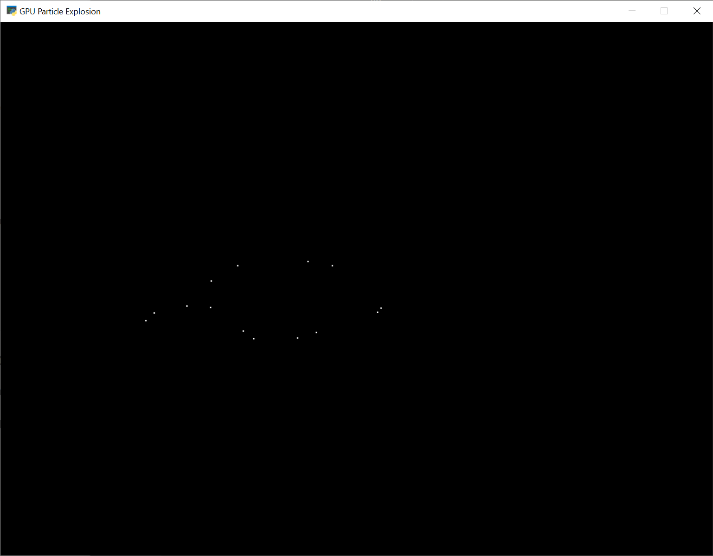
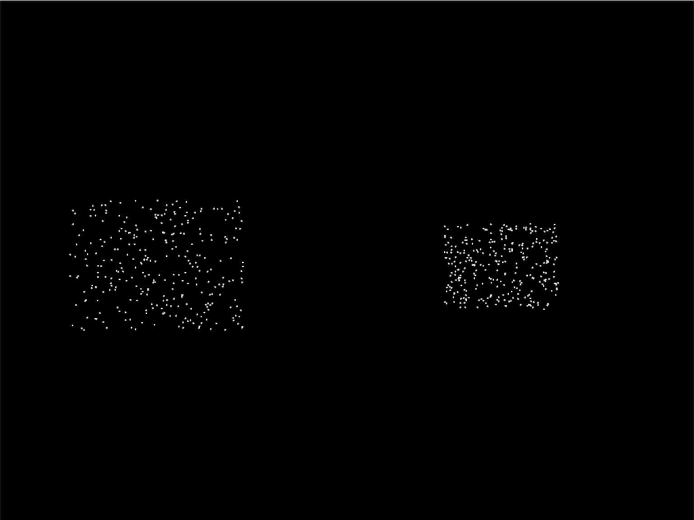
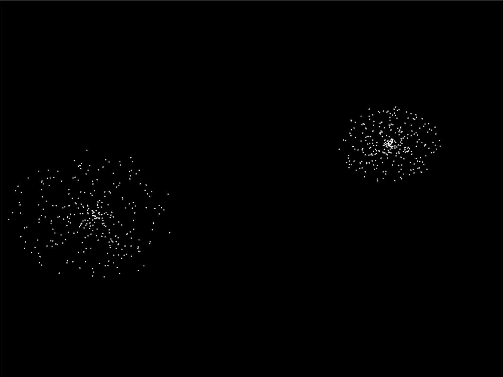
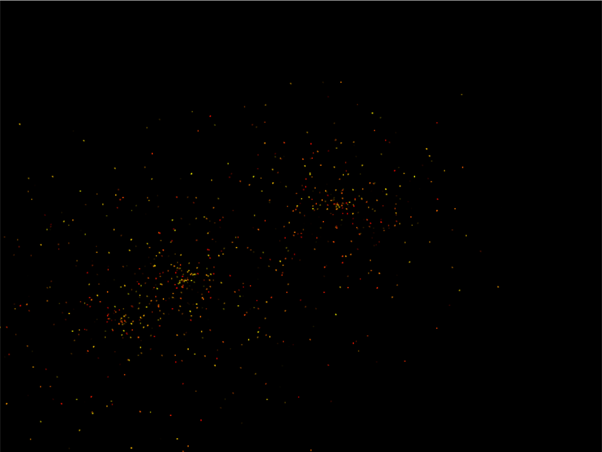
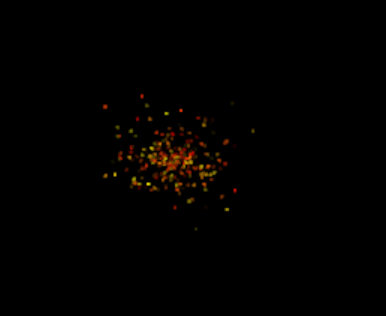

.. include:: <isonum.txt>

.. _gpu_particle_burst:

GPU Particle Burst
==================

.. image:: explosions.gif
    :width: 80%

In this example, we show how to create explosions using particles. The particles
are tracked by the GPU, significantly improving the performance.

Step 1: Open a Blank Window
---------------------------

First, let's start with a blank window.

.. literalinclude:: gpu_particle_burst_01.py
    :caption: gpu_particle_burst_01.py
    :linenos:

Step 2: Create One Particle For Each Click
------------------------------------------

For this next section, we are going to draw a dot each time the user clicks
their mouse on the screen.

For each click, we are going to create an instance of a ``Burst`` class that will eventually
be turned into a full explosion. Each burst instance will be added to a list.

Imports
~~~~~~~

First, we'll import some more items for our program:

.. literalinclude:: gpu_particle_burst_02.py
    :lines: 4-8

Burst Dataclass
~~~~~~~~~~~~~~~

Next, we'll create a dataclass to track our data for each burst. For each burst
we need to track a Vertex Array Object (VAO) which stores information about
our burst. Inside of that, we'll have a Vertex Buffer Object (VBO) which will
be a high-speed memory buffer where we'll store locations, colors, velocity, etc.

.. literalinclude:: gpu_particle_burst_02.py
    :pyobject: Burst

Init method
~~~~~~~~~~~

Next, we'll create an empty list attribute called ``burst_list``. We'll also
create our OpenGL shader program. The program will be a collection of two
shader programs. These will be stored in separate files, saved in the same
directory.

.. note::

    In addition to loading the program via the `load_program()` method of
    `ArcadeContext` shown, it is also possible to keep the GLSL programs in triple-
    quoted string by using `program()` of `Context`.

.. literalinclude:: gpu_particle_burst_02.py
    :pyobject: MyWindow.__init__
    :caption: MyWindow.__init__

.. _open_gl_shaders:

OpenGL Shaders
~~~~~~~~~~~~~~

The OpenGL Shading Language (GLSL) is C-style language that runs on your
graphics card (GPU) rather than your CPU. Unfortunately a full explanation
of the language is beyond the scope of this tutorial. I hope, however,
the tutorial can get you started understanding how it works.

We'll have two shaders. A **vertex shader**, and a **fragment shader**.
A vertex shader runs for each vertex point of the geometry we are rendering,
and a fragment shader runs for each pixel.
For example, vertex shader might run four times for each point on a
rectangle, and the fragment shader would run for each pixel on the screen.

The vertex shader takes in the position of our vertex.
We'll set ``in_pos`` in our Python program, and pass that data to this shader.

The vertex shader outputs the color of our vertex.
Colors are in Red-Green-Blue-Alpha (RGBA) format, with floating-point numbers
ranging from 0 to 1.
In our program below case, we set the color to (1, 1, 1) which is white,
and the fourth 1 for completely opaque.

.. literalinclude:: vertex_shader_v1.glsl
   :language: glsl
   :linenos:
   :caption: vertex_shader_v1.glsl

There's not much to the fragment shader, it just takes in ``color`` from the vertex
shader and passes it back out as the pixel color. We'll use the same fragment
shader for every version in this tutorial.

.. literalinclude:: fragment_shader.glsl
   :language: glsl
   :linenos:
   :caption: fragment_shader.glsl

Mouse Pressed
~~~~~~~~~~~~~

Each time we press the mouse button, we are going to create a burst at that
location.

The data for that burst will be stored in an instance of the ``Burst`` class.

The ``Burst`` class needs our data buffer. The data buffer contains
information about each particle. In this case, we just have one particle and
only need to store the x, y of that particle in the buffer. However, eventually
we'll have hundreds of particles, each with a position, velocity, color, and
fade rate. To accommodate creating that data, we have made a generator
function ``_gen_initial_data``. It is totally overkill at this point, but we'll
add on to it in this tutorial.

The ``buffer_description`` says that each vertex has two floating data points (``2f``)
and those data points will come into the shader with the reference name ``in_pos``
which we defined above in our :ref:`open_gl_shaders`

.. literalinclude:: gpu_particle_burst_02.py
    :pyobject: MyWindow.on_mouse_press
    :caption: MyWindow.on_mouse_press

Drawing
~~~~~~~

Finally, draw it.

.. literalinclude:: gpu_particle_burst_02.py
    :pyobject: MyWindow.on_draw
    :caption: MyWindow.on_draw

Program Listings
~~~~~~~~~~~~~~~~

* :ref:`fragment_shader` |larr| Where we are right now
* :ref:`vertex_shader_v1` |larr| Where we are right now
* :ref:`gpu_particle_burst_02` |larr| Where we are right now
* :ref:`gpu_particle_burst_02_diff` |larr| What we changed to get here

Step 3: Multiple Moving Particles
---------------------------------

Next step is to have more than one particle, and to have the particles move.
We'll do this by creating the particles, and calculating where they should
be based on the time since creation. This is a bit different than the way
we move sprites, as they are manually repositioned bit-by-bit during each
update call.

Imports
~~~~~~~

First, we'll add imports for both the ``random`` and ``time`` libraries:

.. literalinclude:: gpu_particle_burst_03.py
    :lines: 4-5

Constants
~~~~~~~~~

Then we need to create a constant that contains the number of particles to create:

.. literalinclude:: gpu_particle_burst_03.py
    :lines: 16

Burst Dataclass
~~~~~~~~~~~~~~~

We'll need to add a time to our burst data. This will be a floating point
number that represents the start-time of when the burst was created.

.. literalinclude:: gpu_particle_burst_03.py
    :pyobject: Burst
    :emphasize-lines: 6

.. _update_burst:

Update Burst Creation
~~~~~~~~~~~~~~~~~~~~~

Now when we create a burst, we need multiple particles, and each particle
also needs a velocity. In ``_gen_initial_data`` we add a loop for each particle,
and also output a delta x and y.

Note: Because of how we set delta x and delta y, the particles will expand into
a rectangle rather than a circle. We'll fix that on a later step.

Because we added a velocity, our buffer now needs two pairs of floats ``2f 2f``
named ``in_pos`` and ``in_vel``. We'll update our shader in a bit to work with the
new values.

Finally, our burst object needs to track the time we created the burst.

.. literalinclude:: gpu_particle_burst_03.py
    :pyobject: MyWindow.on_mouse_press
    :emphasize-lines: 6-12, 28-29, 35
    :linenos:

Set Time in on_draw
~~~~~~~~~~~~~~~~~~~

When we draw, we need to set "uniform data" (data that is the same for all
points) that says how many seconds it has been since the burst started. The
shader will use this to calculate particle position.

.. literalinclude:: gpu_particle_burst_03.py
    :pyobject: MyWindow.on_draw
    :emphasize-lines: 11-12

Update Vertex Shader
~~~~~~~~~~~~~~~~~~~~

Our vertex shader needs to be updated. We now take in a ``uniform float`` called
time. Uniform data is set once, and each vertex in the program can use it.
In our case, we don't need a separate copy of the burst's start time for each
particle in the burst, therefore it is uniform data.

We also need to add another vector of two floats that will take in our velocity.
We set ``in_vel`` in :ref:`update_burst`.

Then finally we calculate a new position based on the time and our particle's
velocity. We use that new position when setting ``gl_Position``.

.. literalinclude:: vertex_shader_v2.glsl
    :language: glsl
    :caption: vertex_shader_v2.glsl
    :linenos:
    :emphasize-lines: 3-4, 9-10, 20-21, 24

Program Listings
~~~~~~~~~~~~~~~~

* :ref:`vertex_shader_v2` |larr| Where we are right now
* :ref:`vertex_shader_v2_diff` |larr| What we changed to get here
* :ref:`gpu_particle_burst_03` |larr| Where we are right now
* :ref:`gpu_particle_burst_03_diff` |larr| What we changed to get here

Step 4: Random Angle and Speed
------------------------------

Step 3 didn't do a good job of picking a velocity, as our particles expanded
into a rectangle rather than a circle. Rather than just pick a random delta
x and y, we need to pick a random direction and speed. Then calculate delta x
and y from that.

Update Imports
~~~~~~~~~~~~~~

Import the math library so we can do some trig:

.. literalinclude:: gpu_particle_burst_04.py
    :lines: 6

Update Burst Creation
~~~~~~~~~~~~~~~~~~~~~

Now, pick a random direction from zero to 2 pi radians. Also, pick a random
speed. Then use sine and cosine to calculate the delta x and y.

.. literalinclude:: gpu_particle_burst_04.py
    :pyobject: MyWindow.on_mouse_press
    :linenos:
    :emphasize-lines: 7-10
    :lines: 1-15

Program Listings
~~~~~~~~~~~~~~~~

* :ref:`gpu_particle_burst_04` |larr| Where we are right now
* :ref:`gpu_particle_burst_04_diff` |larr| What we changed to get here

Step 5: Gaussian Distribution
-----------------------------

.. image:: gpu_particle_burst_05.png
    :width: 50%

Setting speed to a random amount makes for an expanding circle.
Another option is to use a gaussian function to produce more of a 'splat'
look:

.. literalinclude:: gpu_particle_burst_05.py
    :lines: 69

Program Listings
~~~~~~~~~~~~~~~~

* :ref:`gpu_particle_burst_05` |larr| Where we are right now
* :ref:`gpu_particle_burst_05_diff` |larr| What we changed to get here

Step 6: Add Color
-----------------

So far our particles have all been white. How do we add in color? We'll
need to generate it for each particle. Shaders take colors in the form of
RGB floats, so we'll generate a random number for red, and add in some green
to get our yellows. Don't add more green than red, or else you get a green tint.

Finally, make sure to update the shader buffer description (VBO) to accept
the three color channel floats (``3f``) under the name ``in_color``.

.. literalinclude:: gpu_particle_burst_06.py
    :pyobject: MyWindow.on_mouse_press
    :linenos:
    :emphasize-lines: 11-13, 18-20, 36-37

Then, update the shader to use the color instead of always using white:

.. literalinclude:: vertex_shader_v3.glsl
    :language: glsl
    :caption: vertex_shader_v3.glsl
    :linenos:
    :emphasize-lines: 12-13, 20-21

Program Listings
~~~~~~~~~~~~~~~~

* :ref:`vertex_shader_v3` |larr| Where we are right now
* :ref:`vertex_shader_v3_diff` |larr| What we changed to get here
* :ref:`gpu_particle_burst_06` |larr| Where we are right now
* :ref:`gpu_particle_burst_06_diff` |larr| What we changed to get here

Step 7: Fade Out
----------------

Right now the explosion particles last forever. Let's get them to fade out.
Once a burst has faded out, let's remove it from ``burst_list``.

Constants
~~~~~~~~~

First, let's add a couple constants to control the minimum and maximum times
to fade a particle:

.. literalinclude:: gpu_particle_burst_07.py
    :lines: 19-20

Update Init
~~~~~~~~~~~

Next, we need to update our OpenGL context to support alpha blending. Go
back to the ``__init__`` method and update the ``enable_only`` call to:

.. code-block:: python

    self.ctx.enable_only(self.ctx.BLEND)

Add Fade Rate to Buffer
~~~~~~~~~~~~~~~~~~~~~~~

Next, add the fade rate float to the VBO:

.. literalinclude:: gpu_particle_burst_07.py
    :pyobject: MyWindow.on_mouse_press
    :linenos:
    :emphasize-lines: 14-15, 24, 40-41

Update Shader
~~~~~~~~~~~~~

Update the shader. Calculate the alpha. If it is less that 0, just use 0.

.. literalinclude:: vertex_shader_v4.glsl
    :language: glsl
    :caption: vertex_shader_v4.glsl
    :linenos:
    :emphasize-lines: 15-16, 23-25, 28

Remove Faded Bursts
~~~~~~~~~~~~~~~~~~~

Once our burst has completely faded, no need to keep it around. So in our
``on_update`` remove the burst from the burst_list after it has been faded.

.. literalinclude:: gpu_particle_burst_07.py
    :pyobject: MyWindow.on_update
    :linenos:
    :emphasize-lines: 4-10

Program Listings
~~~~~~~~~~~~~~~~

* :ref:`vertex_shader_v4` |larr| Where we are right now
* :ref:`vertex_shader_v4_diff` |larr| What we changed to get here
* :ref:`gpu_particle_burst_07` |larr| Where we are right now
* :ref:`gpu_particle_burst_07_diff` |larr| What we changed to get here

Step 8: Add Gravity
-------------------

You could also add come gravity to the particles by adjusting the velocity
based on a gravity constant. (In this case, 1.1.)

.. code-block:: glsl

    // Adjust velocity based on gravity
    vec2 new_vel = in_vel;
    new_vel[1] -= time * 1.1;

    // Calculate a new position
    vec2 new_pos = in_pos + (time * new_vel);

Program Listings
~~~~~~~~~~~~~~~~

* :ref:`vertex_shader_v5` |larr| Where we are right now
* :ref:`vertex_shader_v5_diff` |larr| What we changed to get here

