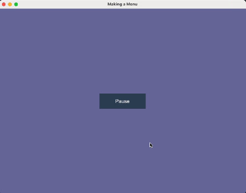
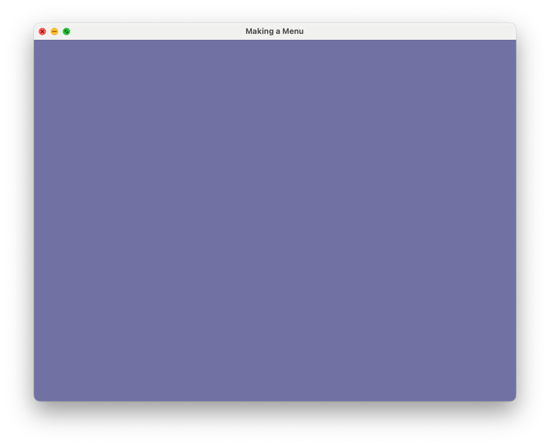
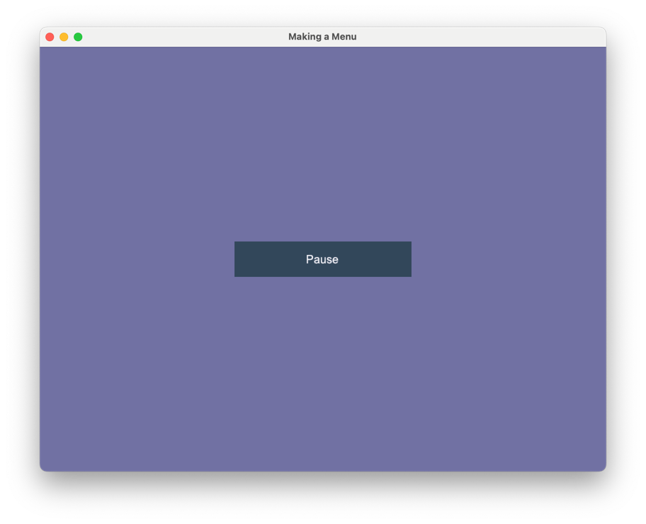
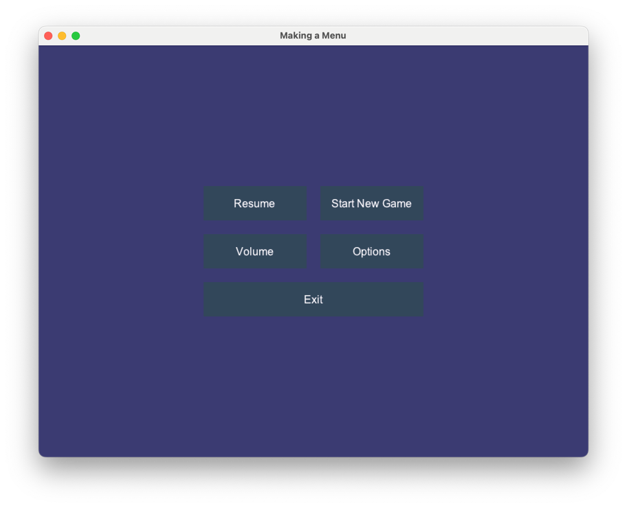
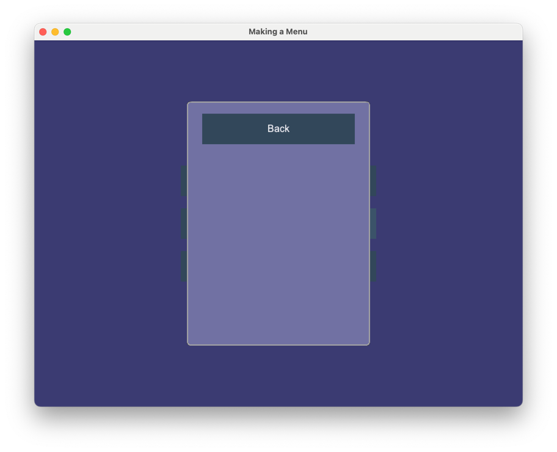
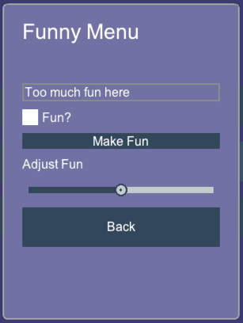

.. include:: <isonum.txt>

.. _menu_tutorial:

Making a Menu with Arcade's GUI
===============================

This tutorial shows how to use most of Arcade's gui's widgets.

Step 1: Open a Window
---------------------

First, let's start a blank window with a view.

.. literalinclude:: menu_01.py
    :caption: Opening a Window
    :linenos:

Step 2: Switching to Menu View
-------------------------------

For this section we will switch the current view of the window to the menu view.

Imports
~~~~~~~

First we will import the Arcade gui:

.. literalinclude:: menu_02.py
    :caption: Importing arcade.gui
    :lines: 6-8
    :emphasize-lines: 3

Modify the MainView
~~~~~~~~~~~~~~~~~~~~

We are going to add a button to change the view. For drawing a button we would
need a ``UIManager``.

.. literalinclude:: menu_02.py
    :caption: Initialising the Manager
    :lines: 19-22
    :emphasize-lines: 3

After initialising the manager we need to enable it when the view is shown and
disable it when the view is hidden.

.. literalinclude:: menu_02.py
    :caption: Enabling the Manager
    :pyobject: MainView.on_show_view
    :emphasize-lines: 6

.. literalinclude:: menu_02.py
    :caption: Disabling the Manager
    :pyobject: MainView.on_hide_view
    :emphasize-lines: 3

We also need to draw the children of the menu in ``on_draw``.

 .. literalinclude:: menu_02.py
    :caption: Drawing UI on screen
    :pyobject: MainView.on_draw
    :emphasize-lines: 7

Now we have successfully setup the manager, we can now add a button to the view.
We are using ``UIAnchorLayout`` to position the button. We also setup a function
which is called when the button is clicked.

  .. literalinclude:: menu_02.py
    :pyobject: MainView.__init__
    :caption: Initialising the Button
    :emphasize-lines: 8-12

Initialise the Menu View
~~~~~~~~~~~~~~~~~~~~~~~~

We make a boiler plate view just like we did in Step-1 for switiching the view 
when the pause button is clicked.

.. literalinclude:: menu_02.py
    :caption: Initialise the Menu View
    :pyobject: MenuView

Program Listings
~~~~~~~~~~~~~~~~

* :ref:`menu_02` |larr| Where we are right now
* :ref:`menu_02_diff` |larr| What we changed to get here

Step 3: Setting Up the Menu View
--------------------------------

In this step we will setup the display buttons of the actual menu. The code
written in this section is written for ``MenuView``

Initialising the Buttons
~~~~~~~~~~~~~~~~~~~~~~~~

First we setup buttons for resume, starting a new game, volume, options and exit.

.. literalinclude:: menu_03.py
    :caption: Initialising the Buttons
    :pyobject: MenuView.__init__
    :emphasize-lines: 6-11
    :lines: 1-12

Displaying the Buttons in a Grid
~~~~~~~~~~~~~~~~~~~~~~~~~~~~~~~~

After setting up the buttons we add them to ``UIGridLayout``, so that they can
displayed in a grid like manner.

.. literalinclude:: menu_03.py
    :caption: Setting up the Grid
    :pyobject: MenuView.__init__
    :emphasize-lines: 14-23
    :lines: 1-24

Final code for the ``__init__`` method after these.

.. literalinclude:: menu_03.py
    :caption: __init__
    :pyobject: MenuView.__init__

Program Listings
~~~~~~~~~~~~~~~~

* :ref:`menu_03` |larr| Where we are right now
* :ref:`menu_03_diff` |larr| What we changed to get here

Step 4: Configuring the Menu Buttons
------------------------------------

We basically add event listener for ``on_click`` for buttons.

Adding ``on_click`` Callback for Resume, Start New Game and Exit
~~~~~~~~~~~~~~~~~~~~~~~~~~~~~~~~~~~~~~~~~~~~~~~~~~~~~~~~~~~~~~~~

First we will add the event listener to resume, start_new_game and exit button
as they don't have much to explain.

.. literalinclude:: menu_04.py
    :caption: Adding callback for button events 1
    :lines: 98-113

Adding ``on_click`` Callback for Volume and Options
~~~~~~~~~~~~~~~~~~~~~~~~~~~~~~~~~~~~~~~~~~~~~~~~~~~

Now we need to implement an actual menu for volume and options, for that we have
to make a class that acts like a window. Using ``UIMouseFilterMixin`` we catch
all the events happening for the parent and respond nothing to them. Thus
making it act like a window/view.

.. literalinclude:: menu_04.py
    :caption: Making a Fake Window.
    :pyobject: SubMenu

We have got ourselves a fake window currently. We now, pair it up with the
volume and options button to trigger it when they are clicked.

.. literalinclude:: menu_04.py
    :caption: Adding callback for button events 2
    :lines: 113-123

Program Listings
~~~~~~~~~~~~~~~~

* :ref:`menu_04` |larr| Where we are right now
* :ref:`menu_04_diff` |larr| What we changed to get here

Step 5: Finalising the Fake Window aka the Sub Menu
---------------------------------------------------

We finalise the menu or you can call it the last step!

Editing the Parameters for the Sub Menu
~~~~~~~~~~~~~~~~~~~~~~~~~~~~~~~~~~~~~~~

We will edit the parameters for the sub menu to suit our needs. Will explain
later why are those parameters needed.

.. literalinclude:: menu_05.py
    :caption: Editing parameters
    :lines: 161-168

We also need to change accordingly the places where we have used this class i.e
options and volume ``on_click`` event listener. The layer parameter being set
1, means that this layer is always drawn on top i.e.its the first layer.

.. literalinclude:: menu_05.py
    :caption: Editing arguments
    :lines: 115-136

Now you might be getting a little idea why we have edited the parameters but
 follow on to actually know the reason.

Adding a Title label
--------------------

We will be adding a ``UILabel`` that explains the menu. ``UISpace`` is a widget
that can be used to add space around some widget, you can set its color to the
background color so it appears invisible.

.. literalinclude:: menu_05.py
    :caption: Adding title label
    :lines: 193-195

Adding it to the widget layout.

.. literalinclude:: menu_05.py
    :caption: Adding title label to the layout
    :lines: 238-239

Adding a Input Field
~~~~~~~~~~~~~~~~~~~~~

We will use ``UIInputText`` to add an input field. The ``with_border()``
function creates a border around the widget with color(default argument is
black) black and thickness(default argument is 2px) 2px. Add this just below
the title label.

.. literalinclude:: menu_05.py
    :caption: Adding input field
    :lines: 197

Adding it to the widget layout.

.. literalinclude:: menu_05.py
    :caption: Adding input field to the layout
    :lines: 240

If you paid attention when we defined the ``input_text`` variable we passed the
``text`` parameter with our ``input_text_default`` argument. We basically added
those parameters in our sub menu so that it can be used by both volume and
options button, with texts respecting their names. We will repeat this again
in the last also for those of you who are skipping through this section :P.

Adding a Toggle Button
~~~~~~~~~~~~~~~~~~~~~~

Don't go on the section title much, in Arcade the ``UITextureToggle`` is not
really a button it switches between two textures when clicked. Yes, it
functions like a button but by "is not really a button" we meant that it
doesn't inherits the button class. We also pair it up horizontally with the
toggle label.

.. literalinclude:: menu_05.py
    :caption: Adding toggle button
    :lines: 199-216

Adding it to the widget layout. Add this line after you have added the input
field.

.. literalinclude:: menu_05.py
    :caption: Adding toggle button to the layout
    :lines: 241

Adding a Dropdown
~~~~~~~~~~~~~~~~~

We add a dropdown by using ``UIDropdown``.

.. literalinclude:: menu_05.py
    :caption: Adding dropdown
    :lines: 219-221

Adding it to the widget layout.

.. literalinclude:: menu_05.py
    :caption: Adding dropdown to the layout
    :lines: 242

Adding a Slider
~~~~~~~~~~~~~~~

The final widget. In Arcade you can use ``UISlider`` to implement a slider. 
Theres a functionality to style the slider, this is also present for 
``UIFlatButton`` and ``UITextureButton``.

.. literalinclude:: menu_05.py
    :caption: Adding slider
    :lines: 223-235

Adding it to the widget layout.

.. literalinclude:: menu_05.py
    :caption: Adding slider to the layout
    :lines: 243-244

Finishing touches
~~~~~~~~~~~~~~~~~

As we mentioned earlier, to explain the use of those parameters to the class.
We basically used them so it can be used by both options and volume as we
wanted to have different text for both.
For those who have read the full tutorial line-by-line;
'They will never know'. :D.
We also recommend to see the full code for this section.

Program Listings
~~~~~~~~~~~~~~~~

* :ref:`menu_05` |larr| Where we are right now
* :ref:`menu_05_diff` |larr| What we changed to get here
