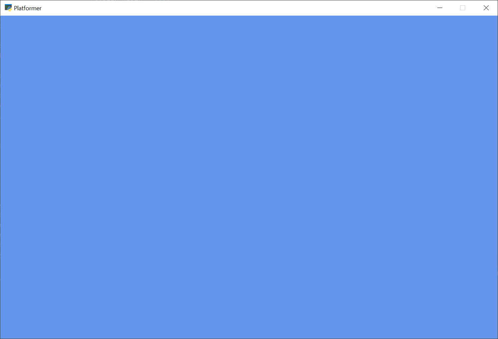

.. _platformer_part_one:

Step 1 - Install and Open a Window
----------------------------------

Our first step is to make sure everything is installed, and that we can at least
get a window open.

Installation
~~~~~~~~~~~~
* Make sure Python is installed. `Download Python here <https://www.python.org/downloads/>`_
  if you don't already have it.

* Make sure the `Arcade library <https://pypi.org/project/arcade/>`_ is installed.

  * You should first setup a virtual environment (venv) and activate it.
  * Install Arcade with ``pip install arcade``.
  * Here are the longer, official :ref:`install`.

Open a Window
~~~~~~~~~~~~~

The example below opens up a blank window. Set up a project and get the code
below working.

.. note::

  This is a fixed-size window. It is possible to have  a
  :ref:`resizable_window` or a :ref:`full_screen_example`, but there are more
  interesting things we can do first. Therefore we'll stick with a fixed-size
  window for this tutorial.

.. literalinclude:: ../../../arcade/examples/platform_tutorial/01_open_window.py
    :caption: 01_open_window.py - Open a Window
    :linenos:

You should end up with a window like this:

Once you get the code working, try figuring out how to adjust the code so you can:

* Change the screen size(or even make the Window resizable or fullscreen)
* Change the title
* Change the background color

  * See the documentation for :ref:`color`
  * See the documentation for :ref:`csscolor`

* Look through the documentation for the :class:`arcade.Window`
  class to get an idea of everything it can do.

Run This Chapter
~~~~~~~~~~~~~~~~

.. code-block::

  python -m arcade.examples.platform_tutorial.01_open_window
