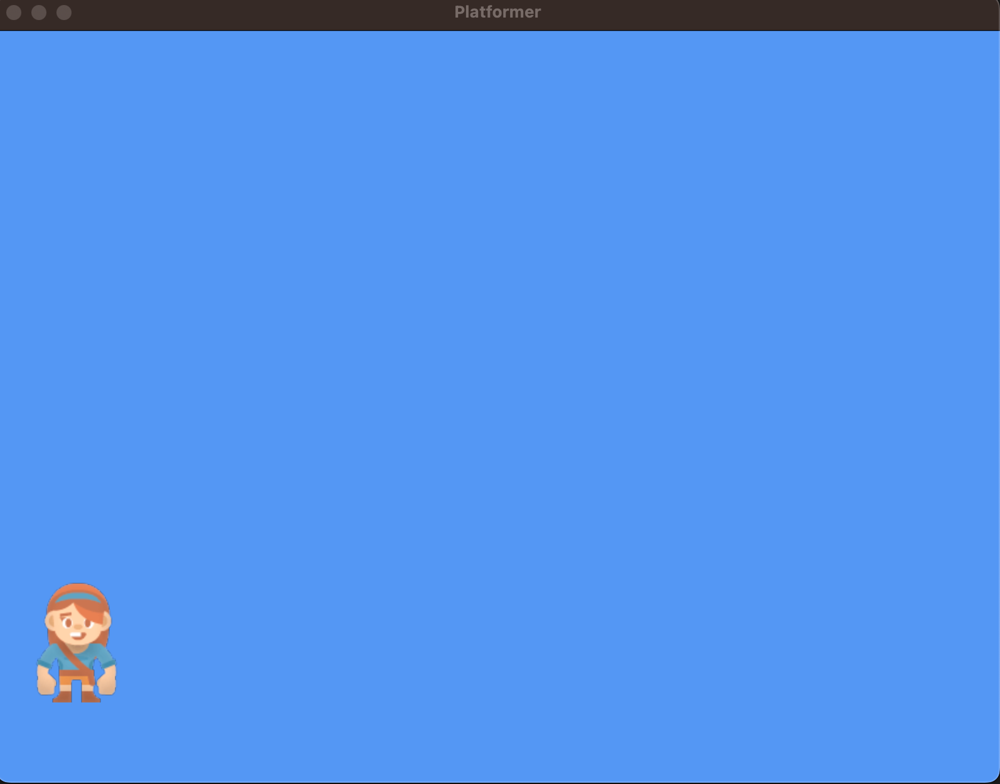

.. _platformer_part_two:

Step 2 - Textures, Sprites, and SpriteLists
-------------------------------------------

Our next step in this tutorial is to draw some things on the Screen. In order to
do that we need to cover a few topics.

In this chapter we'll cover:

* Textures

  * See documentation for :class:`arcade.Texture`

* Sprites

  * See documentation for :class:`arcade.Sprite`

* SpriteLists

  * See documentation for :class:`arcade.SpriteList`

At the end of this chapter, we'll have something that looks like this. It's largely the
same as last chapter, but now we are drawing a character onto the screen:

Textures
~~~~~~~~

Textures are largely just an object to contain image data. Whenever you load an image
file in Arcade, for example a ``.png`` or ``.jpeg`` file. It becomes a Texture.

To do this, internally Arcade uses Pyglet to load the image data, and the texture is
responsible for keeping track of this image data.

We can create a texture with a simple command, this can be done inside of our ``__init__``
function. Go ahead and create a texture that we will use to draw a player.

.. code-block::

    self.player_texture = arcade.load_texture(":resources:images/animated_characters/female_adventurer/femaleAdventurer_idle.png")

.. note::

    You might be wondering where this image file is coming from? And what is ``:resources:`` about?

    The ``:resources:`` section of the string above is what Arcade calls a resource handle.
    You can register your own resource handles to different asset directories. For example you
    might want to have a ``:characters:`` and a ``:objects:`` handle.

    However, you don't have to use a resource handle here, anywhere that you can load files in Arcade will
    accept resource handles, or just strings to filepaths, or ``Path`` objects from ``pathlib``

    Arcade includes the ``:resources:`` handle with a bunch of built-in assets from `kenney <https://kenney.nl>`_.

    For more information checkout :ref:`resources`

Sprites
~~~~~~~

If Textures are an instance of a particular image, then :class:`arcade.Sprite` is an instance of that image
on the screen. Say we have a ground or wall texture. We only have one instance of the texture, but we can create 
multiple instances of Sprite, because we want to have many walls. These will use the same texture, but draw it
in different positions, or even with different scaling, rotation, or colors/post-processing effects.

Creating a Sprite is simple, we can make one for our player in our ``__init__`` function, and then set it's position.

.. code-block::

    self.player_sprite = arcade.Sprite(self.player_texture)
    self.player_sprite.center_x = 64
    self.player_sprite.center_y = 128

.. note::

    You can also skip ``arcade.load_texture`` from the previous step and pass the image file to ``arcade.Sprite`` in place of the Texture object. 
    A Texture will automatically be created for you. However, it may desirable in larger projects to manage your textures directly.

Sprite Lists
~~~~~~~~~~~~

:class:`arcade.SpriteList` exists to draw a collection of Sprites all at once. Let's say for example that you have
100,000 box Sprites that you want to draw. A naive implementation for this might do a for loop over
all of your box sprites and call the ``draw()`` function on each one.

This approach is extremely un-performant. Instead, you can add all of your boxes to a :class:`arcade.SpriteList`
and then draw the SpriteList. Doing this, you are able to draw all 100,000 sprites for approximately the exact
same cost as drawing one sprite.

In this scenario, we would have 1 Texture, which is our image of the box. 100,000 Sprites using that texture, which are
all at different positions, and 1 SpriteList containing the 100,000 Sprites.

.. note::
    This is due to Arcade being a heavily GPU based library. GPUs are really good at doing things in batches.
    This means we can send all the information about our sprites to the GPU, and then tell it to draw them all
    at once. However if we just draw one sprite at a time, then we have to go on a round trip from our CPU to
    our GPU every time.

Even if you are only drawing one Sprite, you should still create a SpriteList for it. Outside of small debugging
it is never better to draw an individual Sprite than it is to add it to a SpriteList.

Let's go ahead and create one for our player inside our ``__init__`` function, and add the player to it.

.. code-block::

    self.player_list = arcade.SpriteList()
    self.player_list.append(self.player_sprite)

Finally in our ``on_draw`` function, we can draw the SpriteList for the player:

.. code-block::

    self.player_list.draw()

Source Code
~~~~~~~~~~~

.. literalinclude:: ../../../arcade/examples/platform_tutorial/02_draw_sprites.py
    :caption: 02_draw_sprites - Draw and Position Sprites
    :linenos:
    :emphasize-lines: 24-34, 48-49

Running this code should result in a character being drawn on the screen, like in
the image at the start of the chapter.

* Documentation for the :class:`arcade.Texture` class
* Documentation for the :class:`arcade.Sprite` class
* Documentation for the :class:`arcade.SpriteList` class

.. note::

    Once the code example is up and working, try adjusting the code for the following:

    * Adjust the code and try putting the sprite in new positions(Try setting the positions using other attributes of Sprite)
    * Use different images for the texture (see :ref:`resources` for the build-in images, or try using your own images.)
    * Practice placing more sprites individually, via a loop, or by a list of coordinates.
