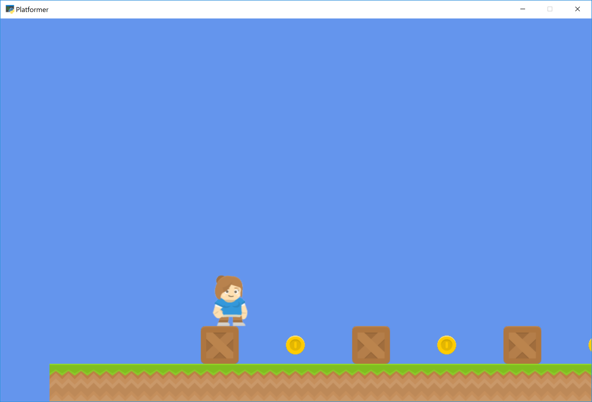

.. _platformer_part_seven:

Step 7 - Add Coins And Sound
----------------------------

Next we will add some coins that the player can pickup. We'll also add a sound to
be played when they pick it up, as well as a sound for when they jump.

Adding Coins to the Scene
~~~~~~~~~~~~~~~~~~~~~~~~~

First we need to add our coins to the scene. Let's start by adding a constant at the
top of our application for the coin sprite scaling, similar to our ``TILE_SCALING`` one.

.. literalinclude:: ../../../arcade/examples/platform_tutorial/07_coins_and_sound.py
    :caption: Add Coins and Sound
    :lines: 14

Next in our ``setup`` function we can create our coins using a for loop like we've done for
the ground previously, and then add them to the scene.

.. literalinclude:: ../../../arcade/examples/platform_tutorial/07_coins_and_sound.py
    :caption: Add Coins and Sound
    :lines: 86-91

Loading Sounds
~~~~~~~~~~~~~~

Now we can load in our sounds for collecting the coin and jumping. Later we will use these
variables to play the sounds when the specific events happen. Add the following to the
``__init__`` function to load the sounds:

.. literalinclude:: ../../../arcade/examples/platform_tutorial/07_coins_and_sound.py
    :caption: Add Coins and Sound
    :lines: 44-46

Then we can play our jump sound when the player jumps, by adding it to the ``on_key_press`` function:

.. literalinclude:: ../../../arcade/examples/platform_tutorial/07_coins_and_sound.py
    :caption: Add Coins and Sound
    :lines: 110-120
    :emphasize-lines: 7

Collision Detection
~~~~~~~~~~~~~~~~~~~

Lastly, we need to find out if the player hit a coin. We can do this in our ``on_update``
function by using the ``arcade.check_for_collision_with_list`` function. We can pass the
player sprite, along with a ``SpriteList`` that holds the coins. The function will return
a list of the coins that the player is currently colliding with. If there are no coins in
contact, the list will be empty.

Then we can use the ``Sprite.remove_from_sprite_lists`` function which will remove a given
sprite from any SpriteLists it belongs to, effectively deleting it from the game.

.. note::

    Notice that any transparent "white-space" around the image counts as the hitbox.
    You can trim the space in a graphics editor, or later on, we'll go over how to customize the
    hitbox of a Sprite.

Add the following to the ``on_update`` function to add collision detection and play a sound
when the player picks up a coin.

.. literalinclude:: ../../../arcade/examples/platform_tutorial/07_coins_and_sound.py
    :caption: Add Coins and Sound
    :lines: 149-159

.. note::

    Spend time placing the coins where you would like them.
    If you have extra time, try adding more than just coins. Also add gems or keys
    from the graphics provided.

    You could also subclass the coin sprite and add an attribute for a score
    value. Then you could have coins worth one point, and gems worth 5, 10, and
    15 points.

Source Code
~~~~~~~~~~~

.. literalinclude:: ../../../arcade/examples/platform_tutorial/07_coins_and_sound.py
    :caption: Add Coins and Sound
    :linenos:
    :emphasize-lines: 14, 44-46, 86-91, 116, 149-159
