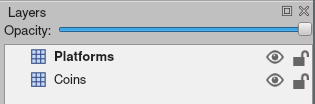

.. _Tiled Map Editor: https://www.mapeditor.org/

.. _platformer_part_nine:

Step 9 - Use Tiled Map Editor
-----------------------------

.. image:: use_tileset.png
    :width: 70%

Create a Map File
~~~~~~~~~~~~~~~~~

For this part, instead of placing the tiles through code using specific points,
we'll use a map editor that we can build maps with and then load in the map files.

To start off with, download and install the `Tiled Map Editor`_. (Think about donating,
as it is a  wonderful project provided for free.)

Tiled already has excellent documentation available at https://doc.mapeditor.org/, so for
this tutorial we'll assume that you're already familiar with how to create maps using Tiled.
If you're not, you can check out the Tiled documentation and come back to here.

From this point on in the tutorial, every chapter will be working with a Tiled map. If you don't
want to create your own yet, Arcade ships a few examples in it's included ``resources`` folder, which
is what these examples pull from, so you don't have to create your own maps yet if you don't want to.

We'll start with a basic ``map.json`` file provided by Arcade. You can open this file in Tiled and look at how it's setup,
but we'll go over some of the basics now. You can save files in either the "JSON" or "TMX" format.

In this map we have two layers named "Platforms" and "Coins". On the platforms layer are all of the blocks
which a player will collide with using the physics engine, and on the coins layer are all the coins
the player can pickup to increase their score. That's pretty much it for this map.

These layers will be automatically loaded by Arcade as SpriteLists that we can access and draw with our scene. Let's look at how
we load in the map, first we'll create a ``tile_map`` object in our init function:

.. literalinclude:: ../../../arcade/examples/platform_tutorial/09_load_map.py
    :caption: Load a map - Create the object
    :lines: 32-33

Then we will do the actual loading in the setup function Our new setup function will look like this:

.. literalinclude:: ../../../arcade/examples/platform_tutorial/09_load_map.py
    :caption: Load a map - Setup the map
    :pyobject: MyGame.setup
    :linenos:
    :emphasize-lines: 8-25, 37-45

This is pretty much all that needs done to load in the Tilemap, we get a Scene created from it and can use it just like we
have been up until now. But let's go through this setup function and look at all the updates.

In the first piece we define the name of map file we want to load, that one is pretty simple.

Next we have a ``layer_options`` variable. This is a dictionary which let's you assign special options to specific layers
in the map. In this example, we're just adding spatial hashing to the "Platforms" layer, but we can do a few other things here.

The available options you can set for a layer are:

* ``use_spatial_hash`` - Make a Layer's SpriteList use spatial hashing
* ``scaling`` - Set per layer scaling of Sprites
* ``hit_box_algorithm`` - Change the hit box algorithm used when doing collision detection with this SpriteList
* ``hit_box_detail`` - Change the hit box detail used when doing collision detection with this SpriteList

Then we actually load in the Tilemap using the ``arcade.load_tilemap`` function. This will return us back an instance of the
``arcade.TileMap`` class. For now, we don't actually need to interact with this object much, but later we will do some more
advanced things like setting enemy spawn points and movement paths from within the map editor.

Finally we use a new way to create our Scene, with the ``arcade.Scene.from_tilemap`` function. This let's you specify a TileMap
object, and will automatically construct a scene with all of the layers in your map, arranged in the proper render order. Then
you can work with the scene exactly like we have up until this point.

The last small piece we changed is when we create the physics engine, we've now have to use "Platforms" as the sprite list name
since that is the name of our Layer in the map file.

And that's all! You should now have a full game loading from a map file created with Tiled.

Some things we will use Tiled for in upcoming chapters are:

* Platforms that you run into (or you can think of them as walls)
* Moving platforms
* Coins or objects to pick up
* Background objects that you don't interact with, but appear behind the player
* Foreground objects that you don't interact with, but appear in front of the player
* Insta-death blocks and zones (like lava)
* Ladders
* Enemy spawn positions
* Enemy movement paths

Source Code
~~~~~~~~~~~

.. literalinclude:: ../../../arcade/examples/platform_tutorial/09_load_map.py
    :caption: Load the Map
    :linenos:
    :emphasize-lines: 32-33,66-67,69-76,78-79,81-83,95-103,114-115