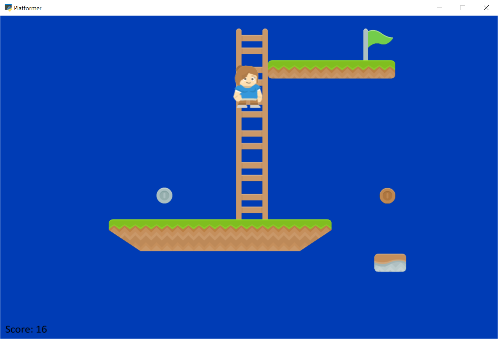
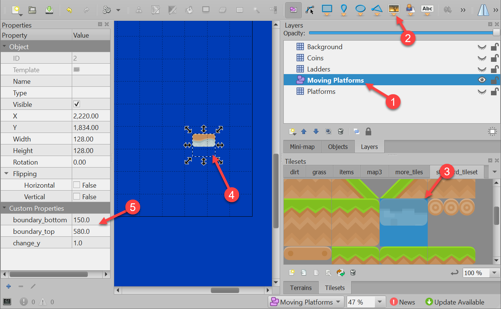

.. _platformer_part_eleven:

Step 11 - Add Ladders, Properties, and a Moving Platform
--------------------------------------------------------

This example shows using:

* Ladders
* Properties to define point value of coins and flags
* Properties and an object layer to define a moving platform.

To create a moving platform using TMX editor, there are a few steps:

1. Define an **object layer** instead of a tile layer.
2. Select **Insert Tile**
3. Select the tile you wish to insert.
4. Place the tile.
5. Add custom properties. You can add:

  * ``change_x``
  * ``change_y``
  * ``boundary_bottom``
  * ``boundary_top``
  * ``boundary_left``
  * ``boundary_right``

.. literalinclude:: ../../../arcade/examples/platform_tutorial/11_ladders_and_more.py
    :caption: Ladders, Animated Tiles, and Moving Platforms
    :linenos:

Source Code
~~~~~~~~~~~

.. literalinclude:: ../../../arcade/examples/platform_tutorial/11_ladders_and_more.py
    :caption: Ladders and More
    :linenos:

..
    * :ref:`11_ladders_and_more`
    * :ref:`11_ladders_and_more_diff`