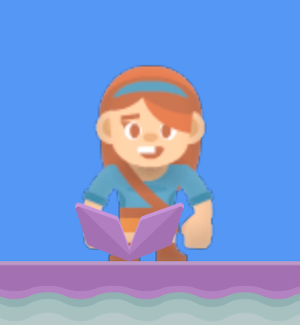
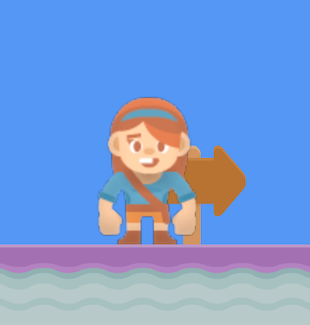

.. _platformer_part_thirteen:

Step 13 - More Types of Layers
------------------------------

For this example, we'll switch to a different built-in map that has more layers we can do things with.

In our setup function, load this map instead of the one from Chapter 12:

.. code-block::

    self.tile_map = arcade.load_tilemap(":resources:tiled_maps/map2_level_1.json", scaling=TILE_SCALING, layer_options=layer_options)

You can run this and check out the map we will be working with this chapter. You'll notice in addition
to the normal platforms and coins we've had. We now have some extra signs and decoration objects, as well
as a pit of lava.

Back in chapter 6 we made use of our ``setup`` function to reset the game. Let's go ahead and use that
system here to reset the game when the player touches the lava pit. You can remove the section for resetting
when the Escape key is pressed if you want, or you can leave it in place. We can also play a game over sound
when this happens.

Let's first add a new sound to our ``__init__`` function for this:

.. code-block::

    self.gameover_sound = arcade.load_sound(":resources:sounds/gameover1.wav")

In order to do this, we'll add this code in our ``on_update`` function:

.. code-block::

    if arcade.check_for_collision_with_list(
        self.player_sprite, self.scene["Don't Touch"]
    ):
        arcade.play_sound(self.gameover_sound)
        self.setup()

The map we are using here has some extra layers in it we haven't used yet. In the code above we made use of
the ``Don't Touch`` to reset the game when the player touches it. In this section we will make use of two
other layers in our new map, ``Background`` and ``Foreground``.

We will use these layers as a way to separate objects that should be drawn in front of our player, and objects
that should be drawn behind the player. In our ``setup`` function, before we create the player sprite, add this code.

.. code-block::

    self.scene.add_sprite_list_after("Player", "Foreground")

This code will cause our player spritelist to be inserted at a specific point in the Scene. Causing spritelists
which are in front of it to be drawn before it, and ones behind it to be drawn after. By doing this we can make
objects appear to be in front of or behind our player like the images below:

Source Code
~~~~~~~~~~~

.. literalinclude:: ../../../arcade/examples/platform_tutorial/13_more_layers.py
    :caption: More Layers
    :linenos:
    :emphasize-lines: 70-71, 78-83, 152-156
