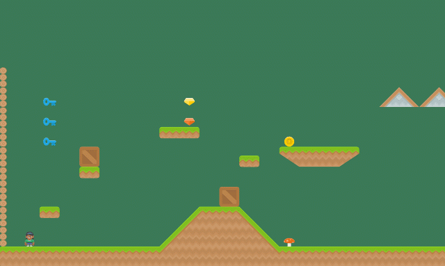
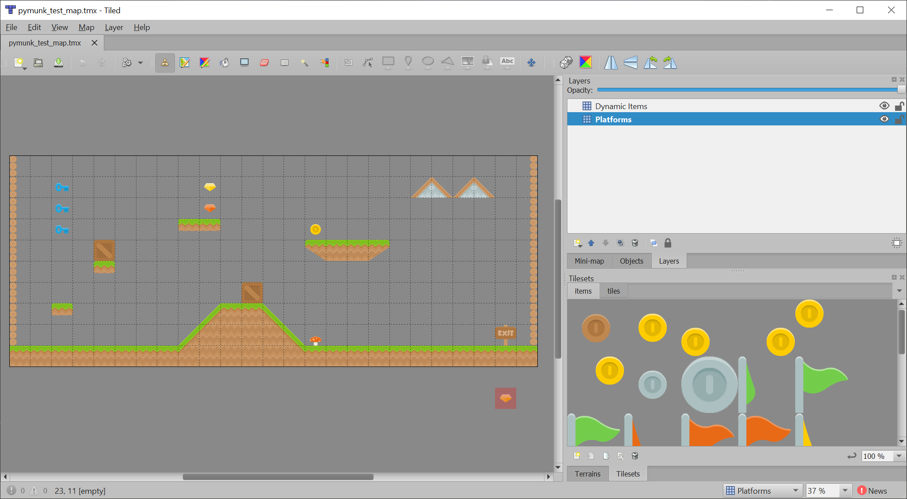
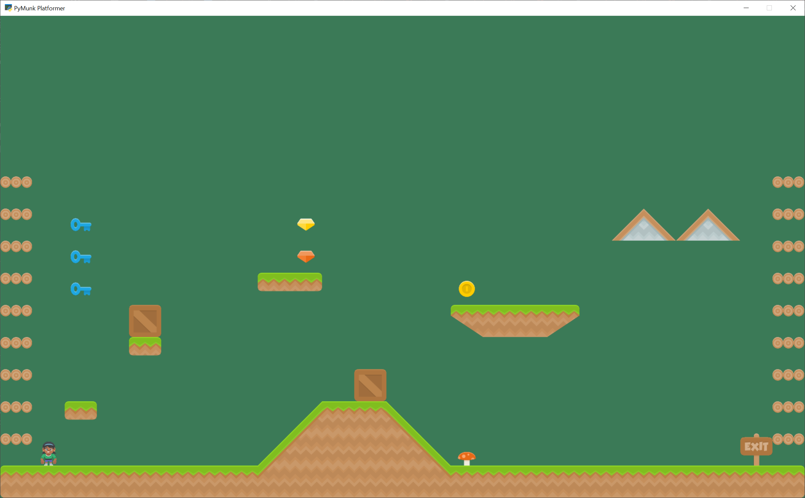
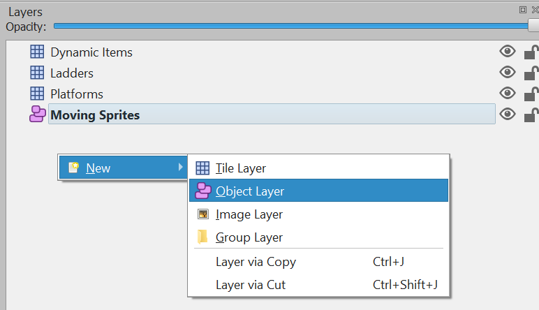
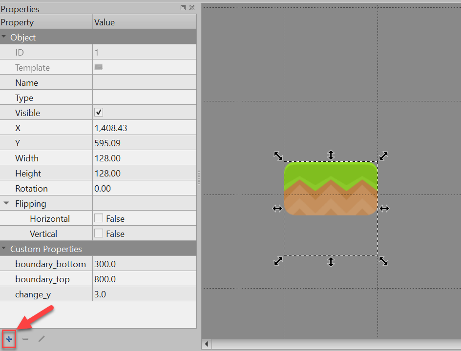

.. _pymunk_platformer_tutorial:

Pymunk Platformer
=================

This tutorial covers how to write a platformer using Arcade and its Pymunk API.
This tutorial assumes the you are somewhat familiar with Python, Arcade, and
the `Tiled Map Editor`_.

.. _Tiled Map Editor: https://www.mapeditor.org/

* If you aren't familiar with programming in Python, check out https://learn.arcade.academy
* If you aren't familiar with the Arcade library, work through the :ref:`platformer_tutorial`.
* If you aren't familiar with the Tiled Map Editor, the :ref:`platformer_tutorial`
  also introduces how to create a map with the Tiled Map Editor.

Common Issues
-------------

There are a few items with the Pymunk physics engine that should be pointed out
before you get started:

* Object overlap - A fast moving object is allowed to overlap with the object it
  collides with, and Pymunk will push them apart later. See
  `collision bias <http://www.pymunk.org/en/latest/pymunk.html#pymunk.Space.collision_bias>`_
  for more information.
* Pass-through - A fast moving object can pass through another object if its
  speed is so quick it never overlaps the other object between frames. See
  `object tunneling <http://www.pymunk.org/en/latest/overview.html#object-tunneling>`_.
* When stepping the physics engine forward in time, the default is to move forward
  1/60th of a second. Whatever increment is picked, increments should always be
  kept the same. Don't use the variable delta_time from the ``update`` method as
  a unit, or results will be unstable and unpredictable. For a more accurate
  simulation, you can step forward 1/120th of a second twice per frame. This increases
  the time required, but takes more time to calculate.
* A sprite moving across a floor made up of many rectangles can get "caught"
  on the edges. The corner of the player sprite can get caught the corner of the
  floor sprite. To get around this, make sure the hit box for the bottom of the
  player sprite is rounded. Also, look into the possibility of merging horizontal
  rows of sprites.

Open a Window
-------------

To begin with, let's start with a program that will use Arcade to open a blank
window. It also has stubs for methods we'll fill in later. Try this code and make
sure you can run it. It should pop open a black window.

.. literalinclude:: pymunk_demo_platformer_01.py
    :caption: Starting Program
    :linenos:

Create Constants
----------------

Now let's set up the ``import`` statements, and define the constants we are going
to use. In this case, we've got sprite tiles that are 128x128 pixels. They are
scaled down to 50% of the width and 50% of the height (scale of 0.5). The screen
size is set to 25x15 grid.

To keep things simple, this example will not scroll the screen with the player.
See :ref:`platformer_tutorial` or :ref:`sprite_move_scrolling`.

When you run this program, the screen should be larger.

.. literalinclude:: pymunk_demo_platformer_02.py
    :caption: Adding some constants
    :linenos:
    :lines: 1-29
    :emphasize-lines: 4-26

* :ref:`pymunk_demo_platformer_02`
* :ref:`pymunk_demo_platformer_02_diff`

Create Instance Variables
-------------------------

Next, let's create instance variables we are going to use, and set a background
color that's green: ``arcade.color.AMAZON``

If you aren't familiar with type-casting on Python, you might not be familiar with
lines of code like this:

.. code-block:: python

    self.player_list: Optional[arcade.SpriteList] = None

This means the ``player_list`` attribute is going to be an instance of
``SpriteList`` or ``None``. If you don't want to mess with typing, then
this code also works just as well:

.. code-block::

    self.player_list = None

Running this program should show the same window, but with a green background.

.. literalinclude:: pymunk_demo_platformer_03.py
    :caption: Create instance variables
    :linenos:
    :lines: 29-52
    :emphasize-lines: 10-24

* :ref:`pymunk_demo_platformer_03`
* :ref:`pymunk_demo_platformer_03_diff`

Load and Display Map
--------------------

To get started, create a map with the Tiled Map Editor. Place items that
you don't want to move, and to act as platforms in a layer named "Platforms".
Place items you want to push around in a layer called "Dynamic Items". Name the
file "pymunk_test_map.tmx" and place in the exact same directory as your code.

If you aren't sure how to use the Tiled Map Editor, see :ref:`platformer_part_eight`.

Now, in the ``setup`` function, we are going add code to:

* Create instances of ``SpriteList`` for each group of sprites we are doing
  to work with.
* Create the player sprite.
* Read in the tiled map.
* Make sprites from the layers in the tiled map.

.. note::

    When making sprites from the tiled map layer, the name of the layer you
    load must match **exactly** with the layer created in the tiled map editor.
    It is case-sensitive.

.. literalinclude:: pymunk_demo_platformer_04.py
    :caption: Creating our sprites
    :linenos:
    :pyobject: GameWindow.setup

There's no point in having sprites if we don't draw them, so in the ``on_draw``
method, let's draw out sprite lists.

.. literalinclude:: pymunk_demo_platformer_04.py
    :caption: Drawing our sprites
    :linenos:
    :pyobject: GameWindow.on_draw

With the additions in the program below, running your program should show the
tiled map you created:

* :ref:`pymunk_demo_platformer_04`
* :ref:`pymunk_demo_platformer_04_diff`

.. _pymunk_platformer_tutorial-add_physics_engine:

Add Physics Engine
------------------

The next step is to add in the physics engine.

First, add some constants for our physics. Here we are setting:

* A constant for the force of gravity.
* Values for "damping". A damping of 1.0 will cause an item to lose all it's
  velocity once a force no longer applies to it. A damping of 0.5 causes 50% of
  speed to be lost in 1 second. A value of 0 is free-fall.
* Values for friction. 0.0 is ice, 1.0 is like rubber.
* Mass. Item default to 1. We make the player 2, so she can push items around
  easier.
* Limits are the players horizontal and vertical speed. It is easier to play if
  the player is limited to a constant speed. And more realistic, because they
  aren't on wheels.

.. literalinclude:: pymunk_demo_platformer_05.py
    :caption: Add Constants for Physics
    :linenos:
    :lines: 27-46

Second, add the following attributer in the ``__init__`` method to hold our
physics engine:

.. literalinclude:: pymunk_demo_platformer_05.py
    :caption: Add Physics Engine Attribute
    :linenos:
    :lines: 71-72

Third, in the ``setup`` method we create the physics engine and add the sprites.
The player, walls, and dynamic items all have different properties so they are
added individually.

.. literalinclude:: pymunk_demo_platformer_05.py
    :caption: Add Sprites to Physics Engine in 'setup' Method
    :linenos:
    :lines: 102-152

Fourth, in the ``on_update`` method we call the physics engine's ``step`` method.

.. literalinclude:: pymunk_demo_platformer_05.py
    :caption: Add Sprites to Physics Engine in 'setup' Method
    :linenos:
    :lines: 165-167

If you run the program, and you have dynamic items that are up in the air, you
should see them fall when the game starts.

* :ref:`pymunk_demo_platformer_05`
* :ref:`pymunk_demo_platformer_05_diff`

Add Player Movement
-------------------

Next step is to get the player moving. In this section we'll cover how
to move left and right. In the next section we'll show how to jump.

The force that we will move the player is defined as ``PLAYER_MOVE_FORCE_ON_GROUND``.
We'll apply a different force later, if the player happens to be airborne.

.. literalinclude:: pymunk_demo_platformer_06.py
    :caption: Add Player Movement - Constants and Attributes
    :linenos:
    :lines: 48-71
    :emphasize-lines: 1-2, 22-24

We need to track if the left/right keys are held down. To do this we define
instance variables ``left_pressed`` and ``right_pressed``. These are set to
appropriate values in the key press and release handlers.

.. literalinclude:: pymunk_demo_platformer_06.py
    :caption: Handle Key Up and Down Events
    :linenos:
    :lines: 159-173
    :emphasize-lines: 4-7, 12-15

Finally, we need to apply the correct force in ``on_update``. Force is specified
in a tuple with horizontal force first, and vertical force second.

We also set the friction when we are moving to zero, and when we are not moving to
1. This is important to get realistic movement.

.. literalinclude:: pymunk_demo_platformer_06.py
    :caption: Apply Force to Move Player
    :linenos:
    :lines: 175-196
    :emphasize-lines: 4-19

* :ref:`pymunk_demo_platformer_06`
* :ref:`pymunk_demo_platformer_06_diff`

Add Player Jumping
------------------

To get the player to jump we need to:

* Make sure the player is on the ground.
* Apply an impulse force to the player upward.
* Change the left/right force to the player while they are in the air.

We can see if a sprite has a sprite below it with the ``is_on_ground`` function.
Otherwise we'll be able to jump while we are in the air.
(Double-jumps would allow this once.)

If we don't allow the player to move left-right while in the air, they player
will be very hard to control. If we allow them to move left/right with the same
force as on the ground, that's typically too much. So we've got a different
left/right force depending if we are in the air or not.

For the code changes, first we'll define some constants:

.. literalinclude:: pymunk_demo_platformer_07.py
    :caption: Add Player Jumping - Constants
    :linenos:
    :lines: 51-55

We'll add logic that will apply the impulse force when we jump:

.. literalinclude:: pymunk_demo_platformer_07.py
    :caption: Add Player Jumping - Jump Force
    :linenos:
    :lines: 166-178
    :emphasize-lines: 8-13

Then we will adjust the left/right force depending on if we are grounded or not:

.. literalinclude:: pymunk_demo_platformer_07.py
    :caption: Add Player Jumping - Left/Right Force Selection
    :linenos:
    :lines: 188-214
    :emphasize-lines: 4, 7-11, 16-20

* :ref:`pymunk_demo_platformer_07`
* :ref:`pymunk_demo_platformer_07_diff`

Add Player Animation
--------------------

To create a player animation, we make a custom child class of ``Sprite``.
We load each frame of animation that we need, including a mirror image of it.

We will flip the player to face left or right. If the player is in the air, we'll
also change between a jump up and a falling graphics.

Because the physics engine works with small floating point numbers, it often
flips above and below zero by small amounts.
It is a good idea *not* to change the animation as the x and y float around zero.
For that reason, in this code we have a "dead zone."
We don't change the animation until it gets outside of that zone.

We also need to control how far the player moves before we change the walking
animation, so that the feet appear in-sync with the ground.

.. literalinclude:: pymunk_demo_platformer_08.py
    :caption: Add Player Animation - Constants
    :linenos:
    :lines: 58-66

Next, we create a ``Player`` class that is a child to ``arcade.Sprite``. This
class will update the player animation.

The ``__init__`` method loads all of the textures. Here we use Kenney.nl's
`Toon Characters 1 <https://www.kenney.nl/assets/toon-characters-1>`_ pack.
It has six different characters you can choose from with the same layout, so
it makes changing as simple as changing which line is enabled. There are
eight textures for walking, and textures for idle, jumping, and falling.

As the character can face left or right, we use ``arcade.load_texture_pair``
which will load both a regular image, and one that's mirrored.

For the multi-frame walking animation, we use an "odometer." We need to move
a certain number of pixels before changing the animation. If this value is too
small our character moves her legs like Fred Flintstone, too large and it looks
like you are ice skating. We keep track of the index of our current texture,
0-7 since there are eight of them.

Any sprite moved by the Pymunk engine will have its ``pymunk_moved`` method
called. This can be used to update the animation.

.. literalinclude:: pymunk_demo_platformer_08.py
    :caption: Add Player Animation - Player Class
    :linenos:
    :pyobject: PlayerSprite

Important! At this point, we are still creating an instance of ``arcade.Sprite``
and **not** ``PlayerSprite``. We need to go back to the ``setup`` method and
replace the line that creates the ``player`` instance with:

.. literalinclude:: pymunk_demo_platformer_08.py
    :caption: Add Player Animation - Creating the Player Class
    :lines: 195-196

A really common mistake I've seen programmers make (and made myself) is to forget
that last part. Then you can spend a lot of time looking at the player class when
the error is in the setup.

We also need to go back and change the data type for the player sprite attribute
in our ``__init__`` method:

.. literalinclude:: pymunk_demo_platformer_08.py
    :caption: Add Player Animation - Creating the Player Class
    :lines: 159-160

* :ref:`pymunk_demo_platformer_08`
* :ref:`pymunk_demo_platformer_08_diff`

Shoot Bullets
-------------

Getting the player to shoot something can add a lot to our game. To begin
with we'll define a few constants to use. How much force to shoot the bullet
with, the bullet's mass, and the gravity to use for the bullet.

If we use the same gravity for the bullet as everything else, it tends to drop
too fast. We could set this to zero if we wanted it to not drop at all.

.. literalinclude:: pymunk_demo_platformer_09.py
    :caption: Shoot Bullets - Constants
    :linenos:
    :lines: 68-75

Next, we'll put in a mouse press handler to put in the bullet shooting code.

We need to:

* Create the bullet sprite
* We need to calculate the angle from the player to the mouse click
* Create the bullet away from the player in the proper direction, as spawning it
  inside the player will confuse the physics engine
* Add the bullet to the physics engine
* Apply the force to the bullet to make if move. Note that as we angled the bullet
  we don't need to angle the force.

.. warning:: Does your platformer scroll?

    If your window scrolls, you need to add in the coordinate off-set or else
    the angle calculation will be incorrect.

.. warning:: Bullets don't disappear yet!

    If the bullet flies off-screen, it doesn't go away and the physics engine
    still has to track it.

.. literalinclude:: pymunk_demo_platformer_09.py
    :caption: Shoot Bullets - Mouse Press
    :linenos:
    :pyobject: GameWindow.on_mouse_press

* :ref:`pymunk_demo_platformer_09`
* :ref:`pymunk_demo_platformer_09_diff`

Destroy Bullets and Items
-------------------------

This section has two goals:

* Get rid of the bullet if it flies off-screen
* Handle collisions of the bullet and other items

Destroy Bullet If It Goes Off-Screen
~~~~~~~~~~~~~~~~~~~~~~~~~~~~~~~~~~~~

First, we'll create a custom bullet class. This class will define the
``pymunk_moved`` method, and check our location each time the bullet moves.
If our y value is too low, we'll remove the bullet.

.. literalinclude:: pymunk_demo_platformer_10.py
    :caption: Destroy Bullets - Bullet Sprite
    :linenos:
    :pyobject: BulletSprite

And, of course, once we create the bullet we have to update our code to use
it instead of the plain ``arcade.Sprite`` class.

.. literalinclude:: pymunk_demo_platformer_10.py
    :caption: Destroy Bullets - Bullet Sprite
    :linenos:
    :lines: 315-320
    :emphasize-lines: 1

Handle Collisions
~~~~~~~~~~~~~~~~~

To handle collisions, we can add custom collision handler call-backs. If you'll
remember when we added items to the physics engine, we gave each item a collision
type, such as "wall" or "bullet" or "item". We can write a function and register
it to handle all bullet/wall collisions.

In this case, bullets that hit a wall go away. Bullets that hit items cause
both the item and the bullet to go away. We could also add code to track damage
to a sprite, only removing it after so much damage was applied. Even changing
the texture depending on its health.

.. literalinclude:: pymunk_demo_platformer_10.py
    :caption: Destroy Bullets - Collision Handlers
    :linenos:
    :lines: 242-253

* :ref:`pymunk_demo_platformer_10`
* :ref:`pymunk_demo_platformer_10_diff`

Add Moving Platforms
--------------------

We can add support for moving platforms. Platforms can be added in an object
layer. An object layer allows platforms to be placed anywhere, and not just on
exact grid locations. Object layers also allow us to add custom properties for
each tile we place.

    Adding an object layer.

Once we have the tile placed, we can add custom properties for it. Click the
'+' icon and add properties for all or some of:

* ``change_x``
* ``change_y``
* ``left_boundary``
* ``right_boundary``
* ``top_boundary``
* ``bottom_boundary``

If these are named exact matches, they'll automatically copy their values into
the sprite attributes of the same name.

    Adding custom properties.

Now we need to update our code. In ``GameWindow.__init__`` add a line to create
an attribute for ``moving_sprites_list``:

.. literalinclude:: pymunk_demo_platformer_11.py
    :caption: Moving Platforms - Adding the sprite list
    :lines: 186

In the ``setup`` method, load in the sprite list from the tmx layer.

.. literalinclude:: pymunk_demo_platformer_11.py
    :caption: Moving Platforms - Adding the sprite list
    :lines: 230-231

Also in the ``setup`` method, we need to add these sprites to the physics engine.
In this case we'll add the sprites as ``KINEMATIC``. Static sprites don't move.
Dynamic sprites move, and can have forces applied to them by other objects.
Kinematic sprites do move, but aren't affected by other objects.

.. literalinclude:: pymunk_demo_platformer_11.py
    :caption: Moving Platforms - Loading the sprites
    :lines: 294-296

We need to draw the moving platform sprites. After adding this line, you should
be able to run the program and see the sprites from this layer, even if they don't
move yet.

.. literalinclude:: pymunk_demo_platformer_11.py
    :caption: Moving Platforms - Draw the sprites
    :linenos:
    :pyobject: GameWindow.on_draw
    :emphasize-lines: 5

Next up, we need to get the sprites moving. First, we'll check to see if there
are any boundaries set, and if we need to reverse our direction.

After that we'll create a velocity vector. Velocity is in pixels per second. In this
case, I'm assuming the user set the velocity in pixels per frame in Tiled instead,
so we'll convert.

.. warning::

    Changing center_x and center_y will not move the sprite. If you want to change
    a sprite's position, use the physics engine's ``set_position`` method.

    Also, setting an item's position "teleports" it there. The physics engine
    will happily move the object right into another object. Setting the item's
    velocity instead will cause the physics engine to move the item, pushing
    any dynamic items out of the way.

.. literalinclude:: pymunk_demo_platformer_11.py
    :caption: Moving Platforms - Moving the sprites
    :lines: 404-428

* :ref:`pymunk_demo_platformer_11`
* :ref:`pymunk_demo_platformer_11_diff`

Add Ladders
-----------

The first step to adding ladders to our platformer is modify the ``__init__``
to track some more items:

* Have a reference to a list of ladder sprites
* Add textures for a climbing animation
* Keep track of our movement in the y direction
* Add a boolean to track if we are on/off a ladder

.. literalinclude:: pymunk_demo_platformer_12.py
    :caption: Add Ladders - PlayerSprite class
    :linenos:
    :pyobject: PlayerSprite.__init__
    :emphasize-lines: 2, 33-36, 51-52

Next, in our ``pymunk_moved`` method we need to change physics when we are
on a ladder, and to update our player texture.

When we are on a ladder, we'll turn off gravity, turn up damping, and turn down
our max vertical velocity. If we are off the ladder, reset those attributes.

When we are on a ladder, but not on the ground, we'll alternate between a couple
climbing textures.

.. literalinclude:: pymunk_demo_platformer_12.py
    :caption: Add Ladders - PlayerSprite class
    :linenos:
    :pyobject: PlayerSprite.pymunk_moved
    :emphasize-lines: 12-24, 28-43

Then we just need to add a few variables to the ``__init__`` to track ladders:

.. literalinclude:: pymunk_demo_platformer_12.py
    :caption: Add Ladders - Game Window Init
    :linenos:
    :pyobject: GameWindow.__init__
    :emphasize-lines: 16, 21-22

Then load the ladder layer in ``setup``:

.. literalinclude:: pymunk_demo_platformer_12.py
    :caption: Add Ladders - Game Window Setup
    :lines: 256-260
    :emphasize-lines: 4

Also, pass the ladder list to the player class:

.. literalinclude:: pymunk_demo_platformer_12.py
    :caption: Add Ladders - Game Window Setup
    :lines: 262-263

Then change the jump button so that we don't jump if we are on a ladder. Also,
we want to track if the up key, or down key are pressed.

.. literalinclude:: pymunk_demo_platformer_12.py
    :caption: Add Ladders - Game Window Key Down
    :linenos:
    :pyobject: GameWindow.on_key_press
    :emphasize-lines: 8-17

Add to the key up handler tracking for which key is pressed.

.. literalinclude:: pymunk_demo_platformer_12.py
    :caption: Add Ladders - Game Window Key Up
    :linenos:
    :pyobject: GameWindow.on_key_release
    :emphasize-lines: 8-11

Next, change our update with new updates for the ladder.

.. literalinclude:: pymunk_demo_platformer_12.py
    :caption: Add Ladders - Game Window On Update
    :linenos:
    :lines: 426-462
    :emphasize-lines: 7, 16, 23-36

And, of course, don't forget to draw the ladders:

.. literalinclude:: pymunk_demo_platformer_12.py
    :caption: Add Ladders - Game Window Key Down
    :linenos:
    :pyobject: GameWindow.on_draw
    :emphasize-lines: 5

* :ref:`pymunk_demo_platformer_12`
* :ref:`pymunk_demo_platformer_12_diff`
