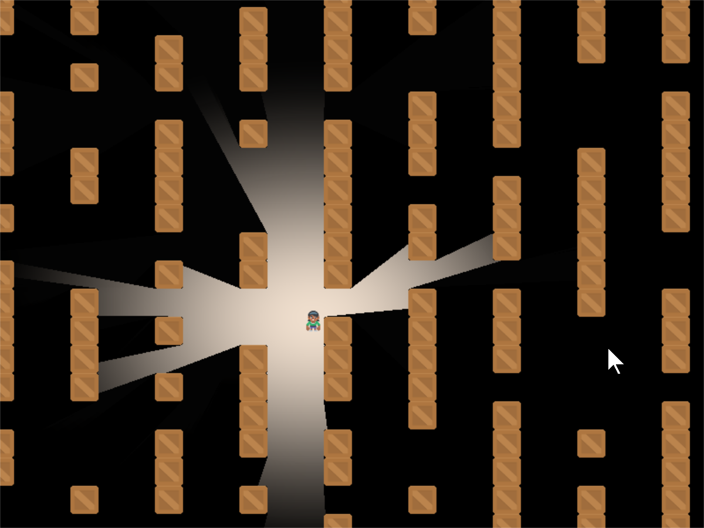
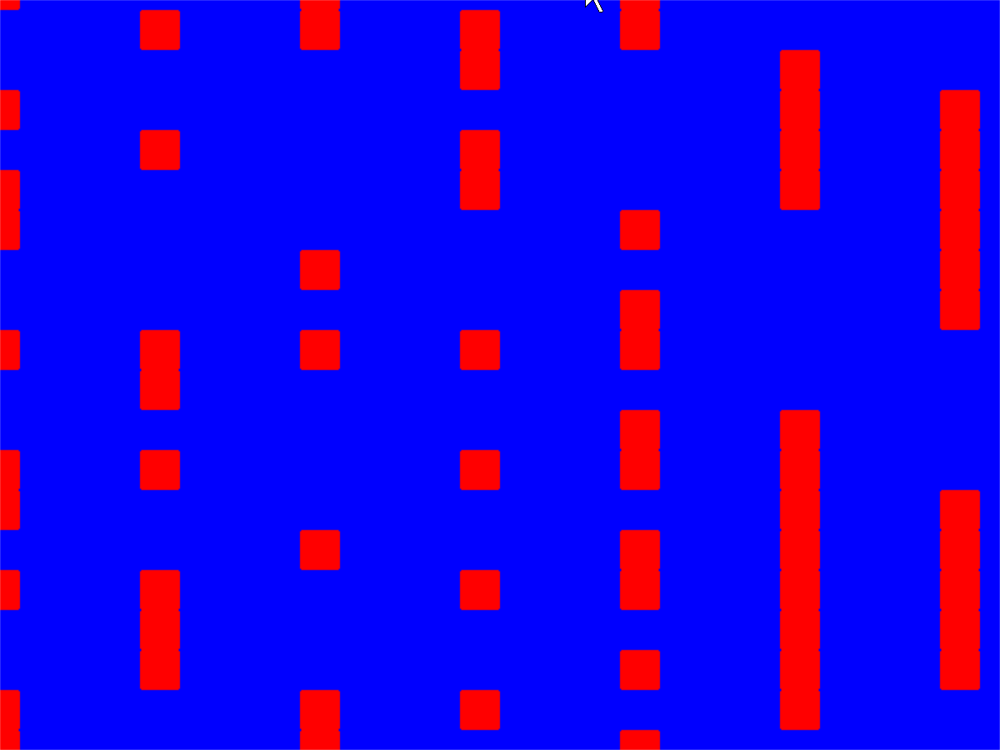
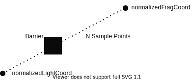
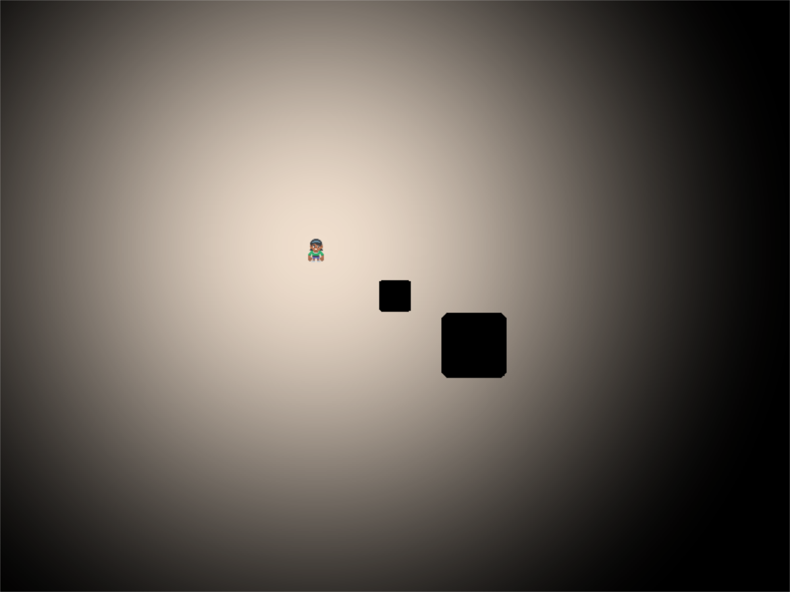
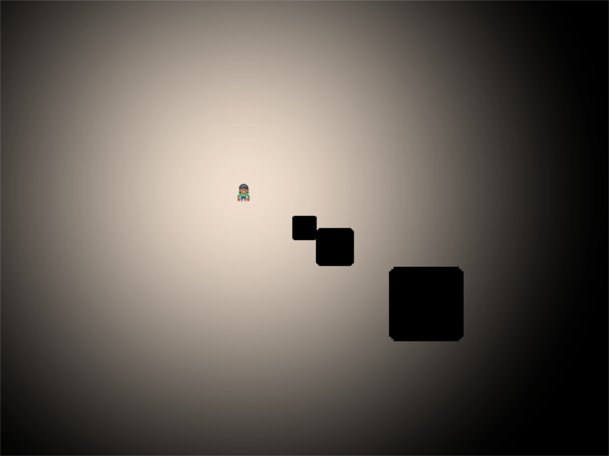
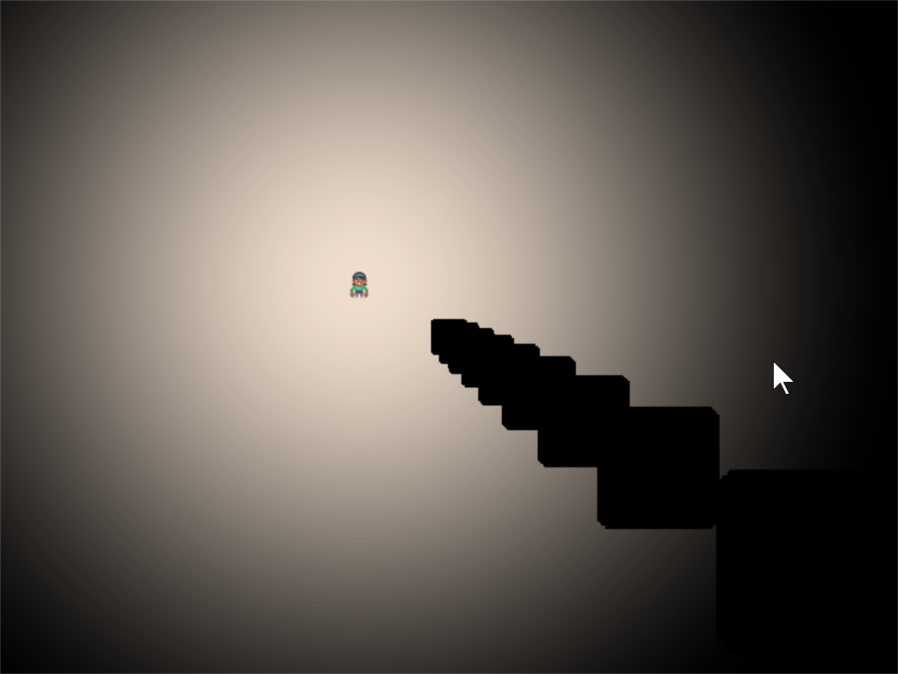
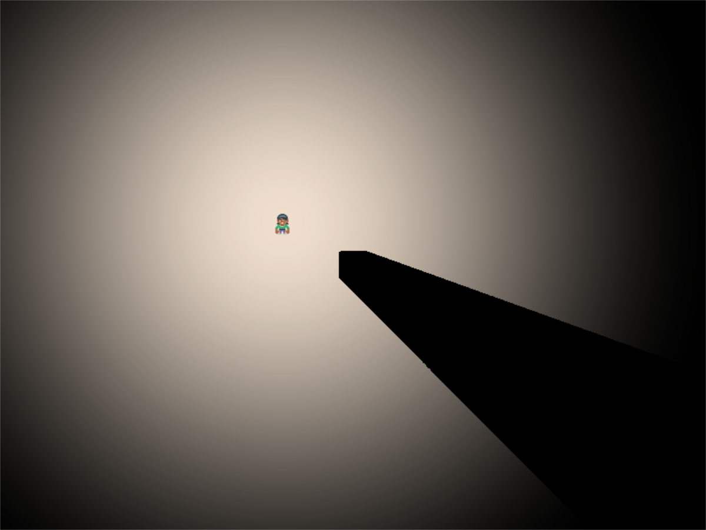

.. include:: <isonum.txt>

.. _raycasting_tutorial:

Ray-casting Shadows
===================

A common effect for many games is **ray-casting**. Having the user only be able to see
what is directly in their line-of-sight.

This can be done quickly using **shaders**. These are small programs that run on the graphics
card. They can take advantage of the **Graphics Processing Unit**. The GPU has a lot of mini-CPUs
dedicated to processing graphics much faster than your main computer's CPU can.

Starting Program
----------------

Before we start adding shadows, we need a good starting program.
Let's create some crates to block our vision,
some bombs to hide in them, and a player character:

.. image:: start.png
   :width: 50%

The listing for this starting program is available at :ref:`raycasting_start`.

Step 1: Add-In the Shadertoy
----------------------------

.. sidebar:: What is Shadertoy?

    Where does the name Shadertoy come from?
    This class is designed to mimic the `Shadertoy <https://www.shadertoy.com/>`_ website.
    The website makes it easy to experiment with shaders, and those shaders can be run
    using the Arcade library.

Now, let's create a shader. We can program shaders using Arcade's ``arcade.experimental.Shadertoy``

We'll modify our prior program to import the Shadertoy class:

.. literalinclude:: step_01.py
    :caption: Import Shadertoy
    :lines: 4

Next, we'll need some shader-related variables. In addition to a variable to hold the shader, we are also
going to need to keep track of a couple **frame buffer objects** (FBOs). You can store image data in an
FBO and send it to the shader program. An FBO is held on the graphics card. Manipulating an FBO there
is much faster than working with one in loaded into main memory.

.. sidebar:: Not just for images!

   FBOs can hold more than just image-related data, but for now, just think of them as images.

Shadertoy has four built-in **channels** that our shader programs can work with.
Channels can be mapped to FBOs.
This allows us to pass image data to our shader program for it to process.
The four channels are numbered 0 to 3.

We'll be using two channels to cast shadows.
We will use the ``channel0`` variable to hold our barriers that can cast shadows.
We will use the ``channel1`` variable to hold the
ground, bombs, or anything we want to be hidden by shadows.

.. literalinclude:: step_01.py
    :caption: Create & initialize shader variables
    :pyobject: MyGame.__init__
    :emphasize-lines: 4-8

These are just empty place-holders. We'll load our shader and create FBOs to hold the image data we send
the shader in a ``load_shader`` method: This code creates the shader and the FBOs:

.. literalinclude:: step_01.py
    :caption: Create the shader, and the FBOs
    :pyobject: MyGame.load_shader

As you'll note, the method loads a "glsl" program from another file.
Our ray-casting program will be made of two files. One file will hold our Python
program, and one file will hold our Shader program.
Shader programs are written in a language
called OpenGL Shading Language (GLSL). This language's syntax is similar to C, Java, or C#.

Our first shader will be straight-forward. It will just take input from channel 0 and copy it to the
output.

.. literalinclude:: step_01.glsl
    :caption: GLSL Program for Step 1
    :language: glsl

How does this shader work?
For each point in our output, this ``mainImage`` function runs and
calculates our output color. For a window that is 800x600 pixels, this function runs
480,000 times for each frame. Modern GPUs can have anywhere between 500-5,000 "threads"
that can calculate these points in parallel for faster processing.

Our current coordinate we are calculating we've brought in as a parameter called ``fragCoord``.
The function needs to calculate a color for this coordinate and store it the output
variable ``fragColor``.
You can see both the input and output variables in the parameters for the ``mainImage``
function. Note that the input data is labeled ``in`` and the output data is labeled
``out``. This may be a bit different than what you are used to.

The ``vec2`` data type is an array of two numbers. Likewise there are ``vec3`` and ``vec4``
data types. These can be used to store coordinates, and also colors.

Or first step is to normalize the x, y coordinate to a number between 0.0 and 1.0.
This normalized two-number x/y vector we store in ``normalizedFragCoord``.

.. code-block:: glsl

    vec2 p = fragCoord/iResolution.xy;

We need to grab the color at this point ``curPoint`` from the channel 0 FBO. We can do this
with the built-in ``texture`` function:

.. code-block:: glsl

    texture(iChannel0, curPoint)

Then we store it to our "out" ``fragColor`` variable and we are done:

.. code-block:: glsl

    fragColor = texture(iChannel0, normalizedCoord);

Now that we have our shader, a couple FBOs, and our initial GLSL program, we can flip back
to our Python program and update the drawing code to use them:

.. literalinclude:: step_01.py
    :caption: Drawing using the shader
    :pyobject: MyGame.on_draw

When we run ``self.channel0.use()``, all subsequent drawing commands will draw not to the
screen, but our FBO image buffer. When we run ``self.use()`` we'll go back to drawing on our
window.

Running the program, our output should look like:

.. image:: step_01.png
   :width: 50%

* :ref:`raycasting_step_01` |larr| Full listing of where we are right now
* :ref:`raycasting_step_01_diff` |larr| What we changed to get here

Step 2: Simple Shader Experiment
--------------------------------

How do we know our shader is really working? As it is just straight copying everything across,
it is hard to tell.

We can modify our shader to get the current texture color and store it in the variable ``inColor``.
A color has four components, red-green-blue and alpha. If the alpha is above zero, we can output
a red color. If the alpha is zero, we output a blue color.

.. note::

    Colors in OpenGL are specified in RGB or RGBA format. But instead of numbers going from 0-255, each
    component is a floating point number from 0.0 to 1.0.

.. literalinclude:: step_02.glsl
    :caption: GLSL Program for Step 2
    :language: glsl

Giving us a resulting image that looks like:

Step 3: Creating a Light
------------------------

Our next step is to create a light. We'll be fading between no light (black) and whatever we draw
in Channel 1.

.. image:: step_03.png
   :width: 50%

In this step, we won't worry about drawing the walls yet.

This step will require us to pass additional data into our shader. We'll do this using **uniforms**.
We will pass in *where* the light is, and the light *size*.

We first declare and use the variables in our shader program.

.. literalinclude:: step_03.glsl
    :caption: GLSL Program for Step 3
    :language: glsl
    :lines: 1-4

Next, we need to know how far away this point is from the light. We do that
by subtracting this point from the light position. We can perform mathematical
operations on vectors, so we just subtract. Then we use the build-in
``length`` function to get a floating point number of how long the length of this
vector is.

.. literalinclude:: step_03.glsl
    :caption: GLSL Program for Step 3
    :language: glsl
    :lines: 8-9

Next, we need to get the coordinate of the pixel we are calculating, but
**normalized**. The coordinates will range from 0.0 to 1.0, with the left
bottom of the window at (0,0), and the top right at (1,1). Normalized coordinates
are used in shaders to make scaling up and down easy.

.. literalinclude:: step_03.glsl
    :caption: GLSL Program for Step 3
    :language: glsl
    :lines: 11-12

Then we need to calculate how much light is falling on this coordinate.
This number will also be normalized.
A number of 0.0 will be in complete shadow, and 1.0 will be fully lit.

.. sidebar:: Linear or Squared?

    The smoothstep function scales linearly. (Well, actually is uses
    Hermite interpolation, but mostly linear.)
    In reality,
    the intensity of light is inversely proportional to the square of the
    distance in reality. The implementation of this is left up to the reader.

We will use the built-in ``smoothstep`` function that will take how large
our light size is, and how far we are from the light. Then scale it from a
number 0.0 to 1.0.

If we are 0.0 pixels from the light, we'll get a 0.0 back. If we are halfway
to the light we'll get 0.5. If we are at the light's edge, we'll get 1.0. If
we are beyond the light's edge we'll get 1.0.

Unfortunately this is backwards from what we want. We want 1.0 at the center,
and 0.0 outside the light. So a simple subtraction from 1.0 will solve this issue.

.. literalinclude:: step_03.glsl
    :caption: GLSL Program for Step 3
    :language: glsl
    :lines: 14-18

Next, we are going to use the built-in ``mix`` function and the ``lightAmount``
variable to alternate between whatever is in channel 1, and a black shadow color.

.. literalinclude:: step_03.glsl
    :caption: GLSL Program for Step 3
    :language: glsl
    :lines: 20-25

Finally we'll go back to the Python program and update our ``on_draw`` method to:

* Draw the bombs into channel 1.
* Send the player position and the size of the light using the uniform.
* Draw the player character on the window.

.. literalinclude:: step_03.py
    :caption: Drawing using the shader
    :pyobject: MyGame.on_draw
    :emphasize-lines: 8-11, 17-22

.. note::

   If you set a uniform variable using ``program``, that variable has to exist in the
   glsl program, *and be used* or you'll get an error. The glsl compiler will automatically
   drop unused variables, causing a confusing error when the program says a variable
   is missing even if you've declared it.

* :ref:`raycasting_step_03` |larr| Full listing of where we are right now with the Python program
* :ref:`raycasting_step_03_diff` |larr| What we changed to get here
* :ref:`raycasting_step_03_gl` |larr| Full listing of where we are right now with the GLSL program
* :ref:`raycasting_step_03_gl_diff` |larr| What we changed to get here

Step 4: Make the Walls Shadowed
-------------------------------

.. image:: step_04.png
   :width: 50%

In addition to the light, we want the walls to show up in shadow for this step.
We don't need to change our Python program at all for this, just the GLSL program.

First, we'll add to our GLSL program a ``terrain`` function. This will sample channel
0. If the pixel there has an alpha of 0.1 or greater (a barrier to our light),
we'll use the ``step`` function and get 1.0. Otherwise we'll get 0.0.
Then, since we want this reversed, (0.0 for barriers, 1.0 for no barrier)
we'll subtract from 1.0:

.. literalinclude:: step_04.glsl
    :caption: GLSL Program for Step 4
    :language: glsl
    :lines: 6-13

Next, we'll factor in this barrier to our light. So our light amount will be a
combination of the distance from the light, and if there's a barrier object on
this pixel.

.. literalinclude:: step_04.glsl
    :caption: GLSL Program for Step 4
    :language: glsl
    :lines: 23-30
    :emphasize-lines: 4-5

* :ref:`raycasting_step_04_gl` |larr| Full listing of where we are right now with the GLSL program
* :ref:`raycasting_step_04_gl_diff` |larr| What we changed to get here

Step 5: Cast the Shadows
------------------------

.. image:: step_05.png
   :width: 75%

Now it is time to cast the shadows.

This involves a lot of "sampling". We start at our current point and draw a line to where the
light is. We will sample "N" times along that line. If we spot a barrier, our coordinate must
be in shadow.

How many times do we sample? If we don't sample enough times, we miss barriers and
end up with weird shadows. This first image
is if we only sample twice. Once where we are, and once in the middle:

If N is three, we end up with three copies of the shadow:

With an N of 10:

We can use an N of 500 to get a good quality shadow. We might need more if
your barriers are small, and the light range is large. Note that the effect
gets increasingly expensive the higher N is. Some tweaks are likely needed
to find the lowest N that still looks good.

Keep in mind there is a speed trade-off. With 800x600 pixels, we have 480,000 pixels to calculate.
If each of those pixels has a loop that does 500 samples, we are sampling 480,000x500 = 240,000 sample
per frame, or 14.4 million samples per second, still very do-able with modern graphics cards.

But what if you scale up? A 4k monitor would need 247 billion samples per second!
There are optimizations that would be done, such as exiting out of the ``for`` loop once we
are in shadow, and not calculating for points beyond the light's range.
We aren't covering that here, but even with 2D, it will be important to
understand what the shader is doing to keep reasonable performance.

* :ref:`raycasting_step_05_gl` |larr| Full listing of where we are right now with the GLSL program
* :ref:`raycasting_step_05_gl_diff` |larr| What we changed to get here

Step 6: Soft Shadows and Wall Drawing
-------------------------------------

.. image:: step_06.png
   :width: 75%

With one more line of code, we can soften up the shadows so they don't have
such a "hard" edge to them.

To do this, modify the ``terrain`` function in our GLSL program.
Rather than return 0.0 or 1.0, we'll return 0.0 or 0.98.
This allows edges to only partially block the light.

.. literalinclude:: step_06.glsl
    :caption: GLSL Program for Step 6
    :language: glsl
    :lines: 8-16
    :emphasize-lines: 7-9

And then we can go ahead and draw the barriers back on the screen so we can
see what is casting the shadows.

.. literalinclude:: step_06.py
    :caption: Step 6, Draw the Barriers
    :pyobject: MyGame.on_draw
    :emphasize-lines: 22-23

* :ref:`raycasting_step_06` |larr| Full listing of where we are right now with the Python program
* :ref:`raycasting_step_06_gl` |larr| Full listing of where we are right now with the GLSL program
* :ref:`raycasting_step_06_gl_diff` |larr| What we changed to get here

Step 7 - Support window resizing
--------------------------------

What if you need to resize the window? First enable resizing:

You'll need to enable resizing in the window's ``__init__``:

.. literalinclude:: step_07.py
    :pyobject: MyGame.__init__
    :caption: Enable resizing
    :language: python
    :lines: 1-2
    :emphasize-lines: 2

Then we need to override the ``Window.resize`` method to also resize the shadertoy:

.. literalinclude:: step_07.py
    :caption: Resizing the window
    :pyobject: MyGame.on_resize

* :ref:`raycasting_step_07` |larr| Full listing of where we are right now with the Python program
* :ref:`raycasting_step_07_diff` |larr| What we changed to get here

Step 8 - Support scrolling
--------------------------

What if we want to scroll around the screen? Have a GUI that doesn't scroll?

First, we'll add a camera for the scrolling parts of the screen (sprites) and another
camera for the non-scrolling GUI bits. Also, we'll create some text to toss on the
screen as something for the GUI.

.. literalinclude:: step_08.py
    :caption: MyGame.__init__
    :pyobject: MyGame.__init__
    :linenos:
    :emphasize-lines: 17-19, 23-24

Next up, we need to draw and use the cameras. This complicates our shader as it doesn't
care about the scrolling, so we have to pass it a position not affected by the camera position.
Therefore, we subtract it out.

.. literalinclude:: step_08.py
    :caption: MyGame.on_draw
    :pyobject: MyGame.on_draw
    :linenos:
    :emphasize-lines: 2-3, 21-27, 39-42

When we update, we need to scroll the camera to where the user is:

.. literalinclude:: step_08.py
    :caption: MyGame.on_update
    :pyobject: MyGame.on_update
    :linenos:
    :emphasize-lines: 7-8

We need to implement the ``scroll_to_player`` method ourselves.

First, we import pyglet's :class:`~pyglet.math.Vec2` class to
make the math faster to implement:

.. literalinclude:: step_08.py
    :caption: Import pyglet's 2D vector class to help with math
    :lines: 1-5
    :emphasize-lines: 2

Then, we implement the ``MyGame.scroll_to_player`` method:

.. literalinclude:: step_08.py
    :caption: MyGame.scroll_to_player
    :pyobject: MyGame.scroll_to_player
    :linenos:

Finally, when we resize the window, we have to resize our cameras:

.. literalinclude:: step_08.py
    :caption: MyGame.on_resize
    :pyobject: MyGame.on_resize
    :linenos:
    :emphasize-lines: 3-4

* :ref:`raycasting_step_08` |larr| Full listing of where we are right now with the Python program
* :ref:`raycasting_step_08_diff` |larr| What we changed to get here

Bibliography
------------

Before I wrote this tutorial I did not know how these shadows were made. I
found the sample code
`Simple 2d Ray-Cast Shadow <https://www.shadertoy.com/view/tddXzj>`_ by jt
which allowed me to very slowly figure out how to cast shadows.
