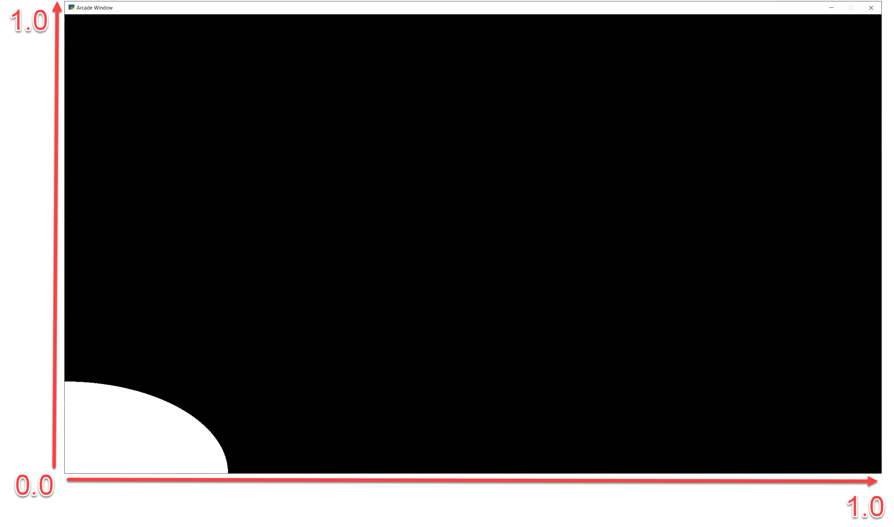
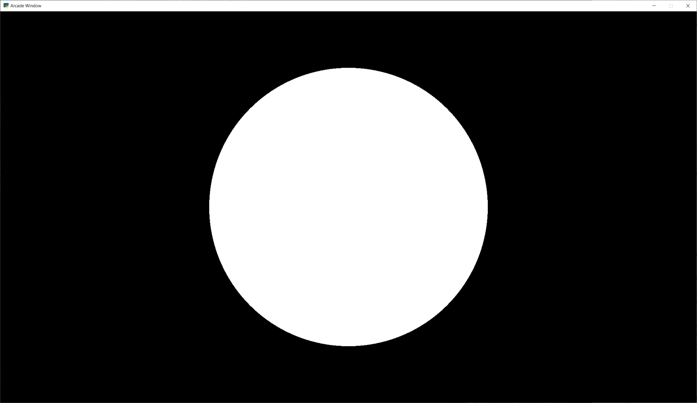
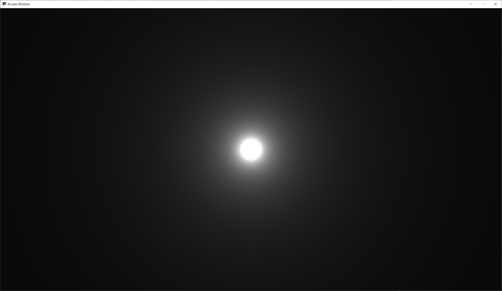
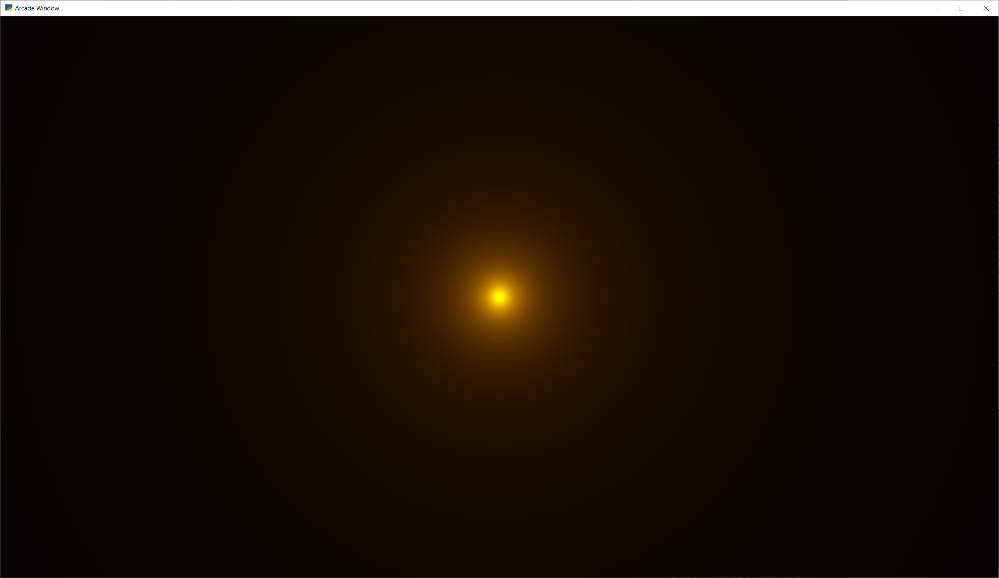
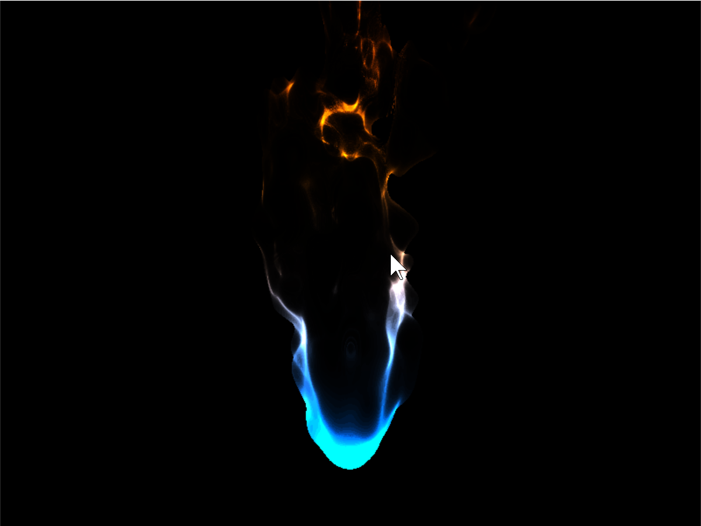

.. _shader_toy_tutorial:

Shader Toy Tutorial
===================

.. contents::

.. figure:: cyber_fuji_2020.png
   :width: 60%

   :ref:`cyber_fuji_2020`

Graphics cards can run programs written in the C-like language OpenGL Shading Language, or GLSL for short.
These programs can be easily parallelized and run across the processors of the
graphics card GPU.

Shaders take a bit of set-up to write. The ShaderToy website has standardized some
of these and made it easier to experiment with writing shaders. The website is at:

https://www.shadertoy.com/

Arcade includes additional code making it easier to run these ShaderToy shaders
in an Arcade program. This tutorial helps you get started.

Step 1: Open a window
---------------------

This is simple program that just opens a basic Arcade window. We'll add a shader in the next step.

.. literalinclude:: shadertoy_demo_1.py
    :caption: Open a window
    :linenos:

Step 2: Load and display a shader
---------------------------------

This program will load a GLSL program and display it.

.. literalinclude:: shadertoy_demo_2.py
    :caption: Run a shader
    :linenos:
    :emphasize-lines: 2, 11-16, 20

Next, let's create a simple first GLSL program. Our program will:

* Normalize the coordinates. Instead of 0 to 1024, we'll go 0.0 to 1.0. This is standard
  practice, and allows us to work independently of resolution.
  Resolution is already stored for us in a standardized variable named ``iResolution``.
* Next, we'll use a white color as default. Colors are four floating point RGBA values, ranging
  from 0.0 to 1.0. To start with, we'll set just RGB and use 1.0 for alpha.
* If we are greater that 0.2 for our coordinate (20% of screen size) we'll use black instead.
* Set our output color, standardized with the variable name ``fracColor``.

.. literalinclude:: circle_1.glsl
    :caption: GLSL code for creating a shader.
    :language: glsl
    :linenos:

The output of the program looks like this:

Other default variables you can use:

.. code-block:: glsl

    uniform vec3 iResolution;
    uniform float iTime;
    uniform float iTimeDelta;
    uniform float iFrame;
    uniform float iChannelTime[4];
    uniform vec4 iMouse;
    uniform vec4 iDate;
    uniform float iSampleRate;
    uniform vec3 iChannelResolution[4];
    uniform samplerXX iChanneli;

"Uniform" means the data is the same for each pixel the GLSL program runs on.

Step 3: Move origin to center of screen, adjust for aspect
----------------------------------------------------------

Next up, we'd like to center our circle, and adjust for the
aspect ratio. This will give us a (0, 0) in the middle of the screen
and a perfect circle.

.. literalinclude:: circle_2.glsl
    :caption: Center the origin
    :language: glsl
    :linenos:
    :emphasize-lines: 6-9

Step 4: Add a fade effect
-------------------------

We can take colors, like our white (1.0, 1.0, 1.0) and adjust their
intensity by multiplying them times a float. Multiplying white times
0.5 will give us gray (0.5, 0.5, 0.5).

We can use this to create a fade effect around our circle.
The inverse of the distance :math:`\frac{1}{d}` gives us a good curve.
However the numbers are too large to adjust our white color. We can solve
this by scaling it down. Run this, and adjust the scale value to see how
it changes.

.. literalinclude:: circle_3.glsl
    :caption: Add fade effect
    :language: glsl
    :linenos:
    :emphasize-lines: 11-18

Step 5: Adjust how fast we fade
-------------------------------

We can use an exponent to adjust how steep or shallow that curve is.
If we use 1.0 it will be the same, 0.5 will cause it to fade out slower, 1.5
will fade faster.

We can also change our color to orange.

.. literalinclude:: circle_4.glsl
    :caption: Adjusts fade speed
    :language: glsl
    :linenos:
    :emphasize-lines: 15-16, 18-19

.. image:: circle_4.png
   :width: 60%

Step 6: Tone mapping
--------------------

Once we add color, the glow looks a bit off.
We can do "tone mapping" with a bit of math if you like the
look better.

.. literalinclude:: circle_5.glsl
    :caption: Tone mapping
    :language: glsl
    :linenos:
    :emphasize-lines: 21-22

Step 7: Positioning the glow
----------------------------

What if we want to position the glow at a certain spot? Send an x, y to
center on? What if we want to control the color of the glow too?

We can send data to our shader using *uniforms*. Those can easily be set in our
Python program:

.. literalinclude:: shadertoy_demo_3.py
    :caption: Run a shader
    :linenos:
    :emphasize-lines: 19-21

Then we can use those uniforms in our shader:

.. literalinclude:: circle_6.glsl
    :caption: Glow follows mouse, and color can be changed.
    :language: glsl
    :linenos:
    :emphasize-lines: 1-2, 8, 11, 23

.. image:: circle_6.png
   :width: 60%

Other examples
--------------

Here's another Python program that loads a GLSL file and displays it:

.. literalinclude:: shadertoy_demo.py
    :caption: Shader Toy Demo
    :linenos:

You can use this demo with any of the sample code below.
Click on the caption below the example shaders here to see the source
code for the shader.

Some other sample shaders:

.. figure:: star_nest.png
   :width: 60%

   :ref:`star_nest`

   :ref:`flame`

.. figure:: fractal_pyramid.png
   :width: 60%

   :ref:`fractal_pyramid`

Additional learning
-------------------

On this site:

* Learn how to ray-cast shadows in the :ref:`raycasting_tutorial`.
* Make your screen look like an 80s monitor in :ref:`crt_filter`.
* Read more about using OpenGL in Arcade with :ref:`open_gl_notes`.
* Learn to do a compute shader in :ref:`compute_shader_tutorial`.

On other sites:

* Here is a decent learn-by-example tutorial for making shaders: https://www.shadertoy.com/view/Md23DV
* Here's a video tutorial that steps through how to do an explosion: https://www.youtube.com/watch?v=xDxAnguEOn8

