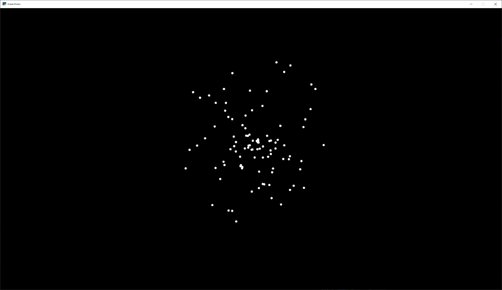
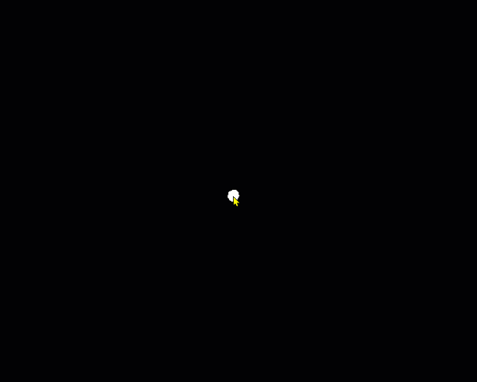
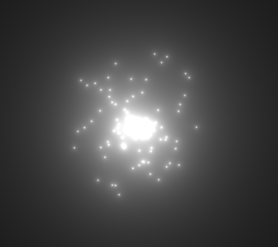

.. _shader_toy_tutorial_particles:

Shader Toy - Particles
======================

.. contents::

.. raw:: html

    <iframe width="560" height="315" src="https://www.youtube.com/embed/99AAAzf5ndY" title="YouTube video player" frameborder="0" allow="accelerometer; autoplay; clipboard-write; encrypted-media; gyroscope; picture-in-picture" allowfullscreen></iframe>

This tutorial assumes you are already familiar with the material in :ref:`shader_toy_tutorial_glow`.
In this tutorial,
we take a look at adding animated particles. These particles can be used for an explosion
effect.

The "trick" to
this example, is the use of pseudo-random numbers to generate each particle's angle and speed from
the initial explosion point. Why "pseudo-random"? This allows each processor on the GPU
to independently calculate each particle's position at any point and time. We can then
allow the GPU to calculate in parallel.

Load the shader
---------------

First, we need a program that will load a shader. This program is also keeping track
of how much time has elapsed. This is necessary for us to calculate how far along the animation
sequence we are.

.. literalinclude:: shadertoy_demo_1.py
   :linenos:

Initial shader with particles
-----------------------------

.. literalinclude:: explosion_1.glsl
   :linenos:
   :language: glsl

Add particle movement
---------------------

.. literalinclude:: explosion_2.glsl
   :linenos:
   :language: glsl
   :emphasize-lines: 13-14, 50-51

Fade-out
--------

.. literalinclude:: explosion_3.glsl
   :linenos:
   :language: glsl
   :emphasize-lines: 59

Glowing Particles
-----------------

.. literalinclude:: explosion_4.glsl
   :linenos:
   :language: glsl
   :emphasize-lines: 15-16, 57-58

Twinkling Particles
-------------------

.. literalinclude:: explosion_5.glsl
   :linenos:
   :language: glsl
   :emphasize-lines: 60
