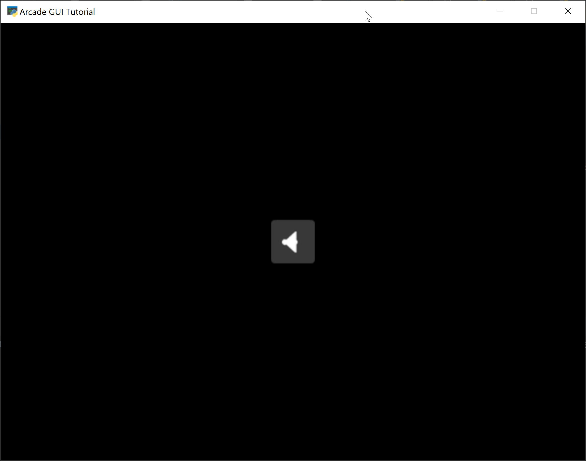

.. _image-button:

Image Buttons
=============

Image buttons are great when you want a more visual interface.
You can create a :py:class:`UIImageButton` and specify a normal texture,
and optionally textures for hover and press.

Images can be scaled with the `scale` parameter.

This code below creates a centered button with a speaker icon:

.. literalinclude:: image_button.py
    :caption: Image Button Example
    :pyobject: MyView.__init__
    :emphasize-lines: 10-28
    :linenos:

The button textures can be changed. With this code, we flip between speaker on/off icons:

.. literalinclude:: image_button.py
    :caption: Image Button Example
    :pyobject: MyView.on_button_click
    :linenos:

For a full program listing, see :ref:`image_button`.
