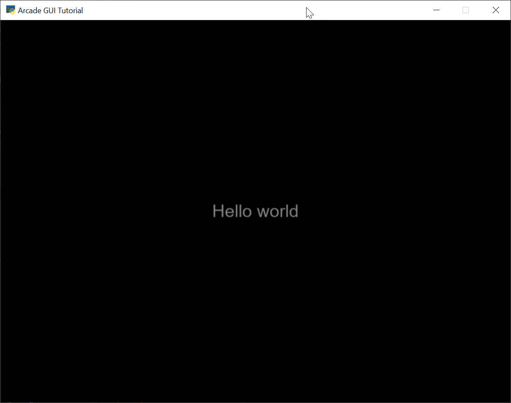
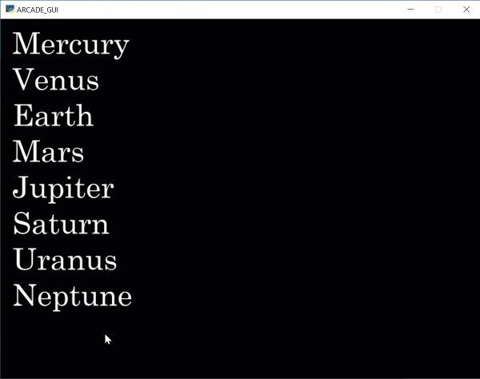

.. _using-gui-labels:

Using GUI Labels
================

One of the most basic elements in the GUI library is the ``UILabel``, a class that allows us to put a text
message up on the screen.

   Simple GUI label on a window.

The two new classes we'll be using in this section of the tutorial are:

* :py:meth:`arcade.gui.UIManager` - A **User Interface Manager** is needed with any GUI. It manages the back-end
  duties of drawing all the elements, responding to mouse clicks, etc.
* :py:meth:`arcade.gui.UILabel` - The **User Interface Label** that contains the text we want to display.

This tutorial will also assume we are using **views**. If you aren't familiar with using Arcade's view system,
you may wish to first look at the :ref:`view-tutorial`.

Our starting code, before we add in the labels, looks like this:

.. literalinclude:: starting_views.py
    :caption: Starting program using views
    :linenos:

First, we'll need to import the GUI package:

.. literalinclude:: labels_01.py
    :caption: Importing the GUI package
    :lines: 2

Next, we need to create a UI manager that will handle our GUI for us. We need to tell it what
window the GUI will be in, and we'll also set ``attach_callbacks`` to ``False``. That parameter, if true,
will automatically call ``register_callbacks``. We'll do that ourselves instead.

Then, also in the init, we'll create our first label and put it in the center of the screen.
We'll show how to style the label later.

.. literalinclude:: labels_01.py
    :caption: Creating the UI manager
    :pyobject: MyView.__init__
    :emphasize-lines: 4-5, 7-14

Next, we need to draw the GUI. A GUI should be on top, so you'll want to draw all your sprites
before drawing the GUI.

.. literalinclude:: labels_01.py
    :caption: Drawing the GUI
    :pyobject: MyView.on_draw
    :emphasize-lines: 4-5

When our view is shown, we need to register our mouse event handlers.
When the view is hidden, we need to unregister the those mouse handlers.

.. literalinclude:: labels_01.py
    :caption: Show the view
    :pyobject: MyView.on_show_view
    :emphasize-lines: 4-6

.. literalinclude:: labels_01.py
    :caption: Hide the view
    :pyobject: MyView.on_hide_view
    :emphasize-lines: 2-4

For the full listing see :ref:`labels_01`.

Styling GUI Labels
------------------

   Styled GUI labels

You can override the default styles for the text labels. Default styles are held in the `.yaml`
file here:

https://github.com/pythonarcade/arcade/blob/development/arcade/resources/style/default.yml

You can either create your own ``.yaml`` file, or a dictionary with the new style information.
The dictionary would look like this:

.. code-block:: python

    style_data = {"label": {"font_size": 40,
                            "font_color": arcade.color.WHITE,
                            "font_color_hover": arcade.color.YELLOW,
                            "font_color_press": arcade.color.RED,
                            "font_name": ["CENSCBK", "Arial"]
                            },
                  }

For fonts, you need to use the actual file name. Unfortunately "Century Schoolbook" won't work if
the actual file name is ``CENSCBK.TTF``.
You can use a list with "fall-back" fonts, and the computer will start at the front of the list and
keep going until if finds a font.

Colors can be specified for mouse over and hover as well.

Once you have the styles set up the way you want in a dictionary,
create a ``UIStyle`` object out of the dictionary.

.. code-block:: python

    style = arcade.gui.UIStyle(style_data)

Then pass it to the label when you create it:

.. code-block:: python

    self.ui_manager.add_ui_element(
        arcade.gui.UILabel(
            text=text,
            align="left",
            width=LABEL_WIDTH,
            center_x=center_x,
            center_y=center_y,
            style=style
        )
    )

You can also specify text alignment of left or right, but you'll need to then also specify the width
of the text field.

For a full program listing of styled example, see :ref:`labels_02`.