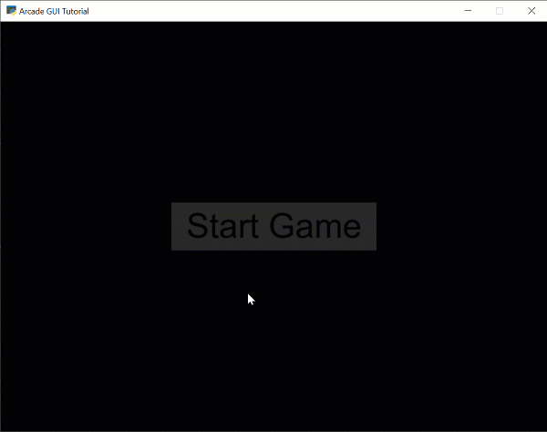

Responding to GUI Mouse Clicks
==============================

GUI elements can respond to user mouse clicks. The GUI elements that can do this:

* :py:meth:`arcade.gui.UILabel`
* :py:meth:`arcade.gui.UIInputBox`
* :py:meth:`arcade.gui.UIImageButton`
* :py:meth:`arcade.gui.UIFlatButton`
* :py:meth:`arcade.gui.UIGhostFlatButton`
* :py:meth:`arcade.gui.UIToggle`

There are two ways a program can attach code to run when the GUI element is clicked.

* :ref:`create_a_child_class`
* :ref:`set_on_click`

.. _create_a_child_class:

Create a Child Class
--------------------

The first way is to create your own child class that derives from the element
you are interested in.

.. literalinclude:: clicks_01.py
    :caption: Creating the UI manager
    :pyobject: MyButton

Next, just make sure to add in your custom class, rather than the generic GUI element:

.. code-block:: python
   :emphasize-lines: 2

    self.ui_manager.add_ui_element(
        MyButton(
            text="Start Game",
            center_x=self.window.width / 2,
            center_y=self.window.height / 2,
            style=style,
            width=300,
            height=70
        )
    )

For a full listing, see :ref:`clicks_01`.

.. _set_on_click:

Specify the on_click Method
---------------------------

Having a separate class can complicate the data-flow a bit. As an
alternative, a program can specify what function to call. That call could
exist in the view, making data management easier.

To do this, create your button and assign it to a variable.
Then set that button's ``on_click`` method to the method of your choice:

.. code-block:: python

      # Create our button
      my_button = arcade.gui.UIFlatButton(
         text="Start Game",
         center_x=self.window.width / 2,
         center_y=self.window.height / 2,
         style=style,
         width=300,
         height=70
      )

      # Map that button's on_click method to this view's on_button_click method.
      my_button.on_click = self.on_button_click

      # Add in our element.
      self.ui_manager.add_ui_element(my_button)

   def on_button_click(self):
      print("Button has been clicked!")

For a full listing, see :ref:`clicks_02`.