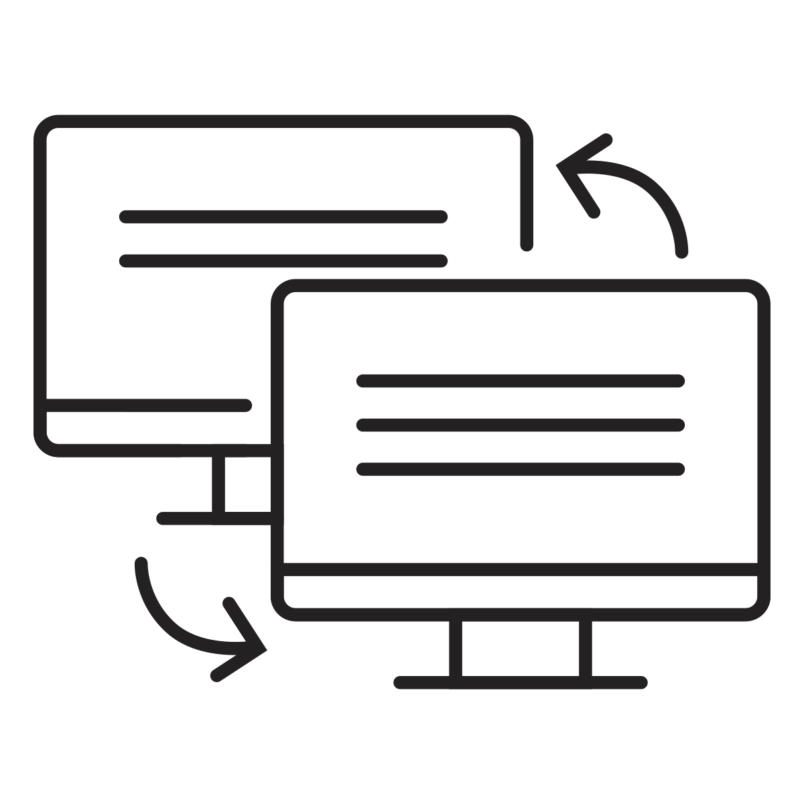
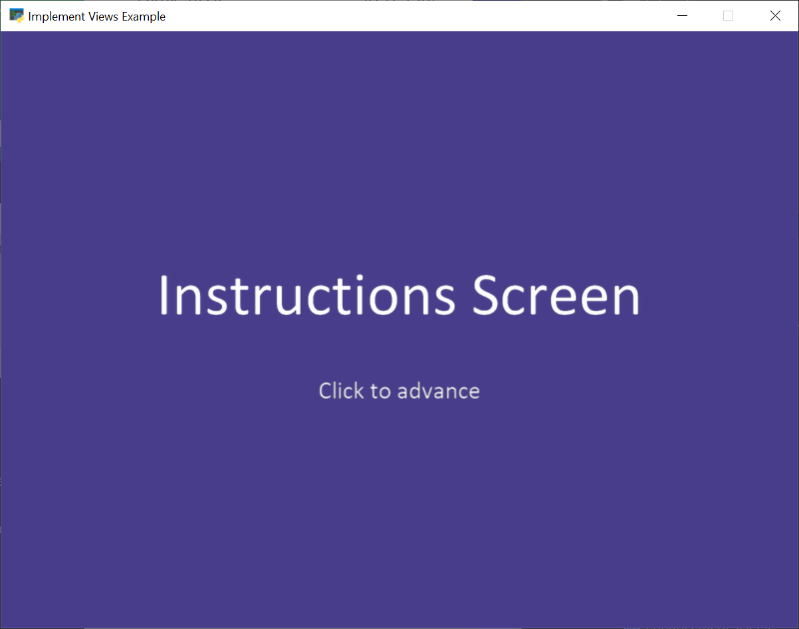
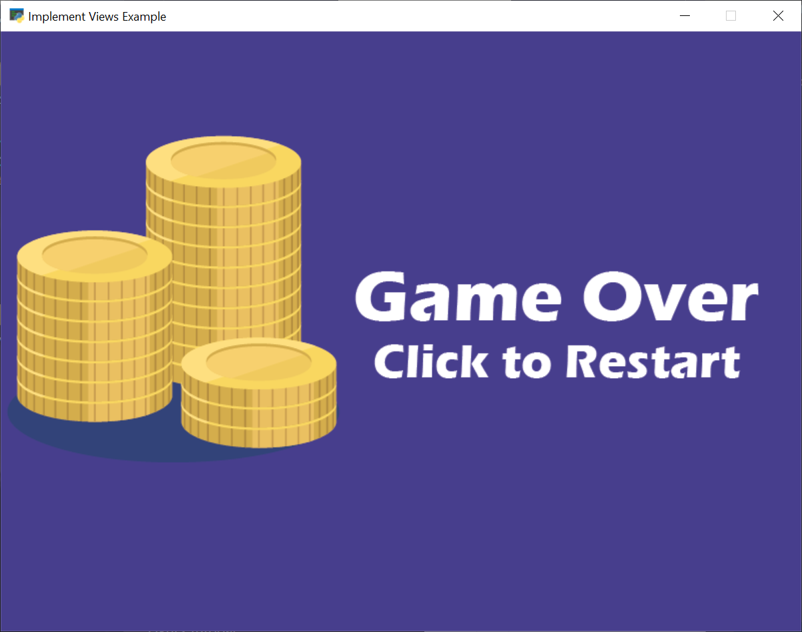

.. include:: <isonum.txt>

.. _view-tutorial:

Using Views for Start/End Screens
=================================

Views allow you to easily switch "views" for what you are showing on the window.
You can use this to support adding screens such as:

* Start screens
* Instruction screens
* Game over screens
* Pause screens

The ``View`` class is a lot like the ``Window`` class that you are already used
to. The ``View`` class has methods for ``on_update`` and ``on_draw`` just like
``Window``. We can change the current view to quickly change the code that is
managing what is drawn on the window and handling user input.

If you know ahead of time you want to use views, you can build your code around
the :ref:`view_examples`. However, typically a programmer wants to add these
items to a game that already exists.

This tutorial steps you through how to do just that.

Change Main Program to Use a View
---------------------------------

.. image:: collect-coins-game.png
    :width: 40%
    :class: right-image

First, we'll start with a simple collect coins example: :ref:`01_views`

Then we'll move our game into a game view. Take the code where we define our window
class:

.. code-block:: python

    class MyGame(arcade.Window):

Change it to derive from ``arcade.View`` instead of ``arcade.Window``.
I also suggest using "View" as part of the name:

.. code-block:: python

    class GameView(arcade.View):

This will require a couple other updates. The ``View`` class does not control
the size of the window, so we'll need to take that out of the call to the
parent class. Change:

.. code-block:: python

    super().__init__(SCREEN_WIDTH, SCREEN_HEIGHT, SCREEN_TITLE)

to:

.. code-block:: python

    super().__init__()

The ``Window`` class still controls if the mouse is visible or not, so to hide
the mouse, we'll need to use the ``window`` attribute that is part of the ``View``
class. Change:

.. code-block:: python

    self.set_mouse_visible(False)

to:

.. code-block:: python

    self.window.set_mouse_visible(False)

Now in the ``main`` function, instead of just creating a window, we'll create
a window, a view, and then show that view.

.. literalinclude:: 02_views.py
    :caption: Add views - Main function
    :linenos:
    :pyobject: main

At this point, run your game and make sure that it still operates properly.
It should run just like it did before, but now we are set up to add additional
views.

* :ref:`02_views` |larr| Full listing of where we are right now
* :ref:`02_views_diff` |larr| What we changed to get here

Add Instruction Screen
----------------------

Now we are ready to add in our instruction screen as a view. Create a class for
it:

.. code-block:: python

    class InstructionView(arcade.View):

Then we need to define the ``on_show_view`` method that will be run once when we
switch to this view. In this case, we don't need to do much, just set the
background color. If the game is one that scrolls, we'll also need to reset
the viewport so that (0, 0) is back to the lower-left coordinate.

.. literalinclude:: 03_views.py
    :caption: Add views - on_show_view
    :pyobject: InstructionView.on_show_view

The ``on_draw`` method works just like the window class's method, but it will
only be called when this view is active.

In this case, we'll just draw some text for the instruction screen. Another
alternative is to make a graphic in a paint program, and show that image. We'll
do that below where we show the Game Over screen.

.. literalinclude:: 03_views.py
    :caption: Add views - on_draw
    :pyobject: InstructionView.on_draw

Then we'll put in a method to respond to a mouse click. Here we'll create our
``GameView`` and call the setup method.

.. literalinclude:: 03_views.py
    :caption: Add views - on_mouse_press
    :pyobject: InstructionView.on_mouse_press

Now we need to go back to the ``main`` function. Instead of creating a
``GameView`` it needs to now create an ``InstructionView``.

.. literalinclude:: 03_views.py
    :caption: Add views - Main function
    :linenos:
    :pyobject: main

* :ref:`03_views` |larr| Full listing of where we are right now
* :ref:`03_views_diff` |larr| What we changed to get here

Game Over Screen
----------------

Another way of doing instruction, pause, and game over screens is with a graphic.
In this example, we've created a separate image with the same size as our
window (800x600) and saved it as ``game_over.png``. You can use the Windows "Paint"
app or get an app for your Mac to make images in order to do this yourself.

The new ``GameOverView`` view that we are adding loads in the game over screen
image as a texture in its ``__init__``. The ``on_draw`` method draws that texture
to the screen. By using an image, we can fancy up the game over screen using an
image editor as much as we want, while keeping the code simple.

When the user clicks the mouse button, we just start the game over.

.. literalinclude:: 04_views.py
    :caption: Add views - Game Over View
    :linenos:
    :pyobject: GameOverView

The last thing we need, is to trigger the "Game Over" view. In our ``GameView.on_update``
method, we can check the list length. As soon as it hits zero, we'll change
our view.

.. literalinclude:: 04_views.py
    :caption: Add views - Game Over View
    :pyobject: GameView.on_update
    :linenos:
    :emphasize-lines: 16-20

* :ref:`04_views` |larr| Full listing of where we are right now
* :ref:`04_views_diff` |larr| What we changed to get here
