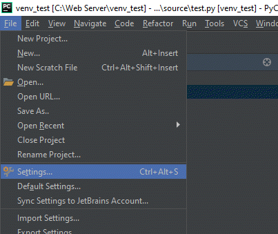

Setting Up a Virtual Environment In PyCharm
===========================================

A Python virtual environment (venv) allows libraries to be installed for just a single
project, rather than shared across everyone using the computer. It also does
not require administrator privilages to install.

Assuming you already have a project, follow these steps to create a venv:

Step 1: Select File...Settings

Step 2: Click "Project Interpreter". Then find the gear icon in the upper right.
click on it and select "Add"

.. image:: click_gear.png

Step 3: Select Virtualenv Environment from the left. Then create a new
environment. Usually it should be in a folder called ``venv`` in your main
project. PyCharm does not always select the correct location by default, so
carefully look at the path to make sure it is correct, then select "Ok".

.. image:: name_venv.png

Now a virtual environment has been set up. The standard in Python projects
is to create a file called ``requirements.txt`` and list the packages you
want in there.

PyCharm will automatically ask if you want to install those packages as
soon as you type them in. Go ahead and let it.

.. image:: requirements.png
